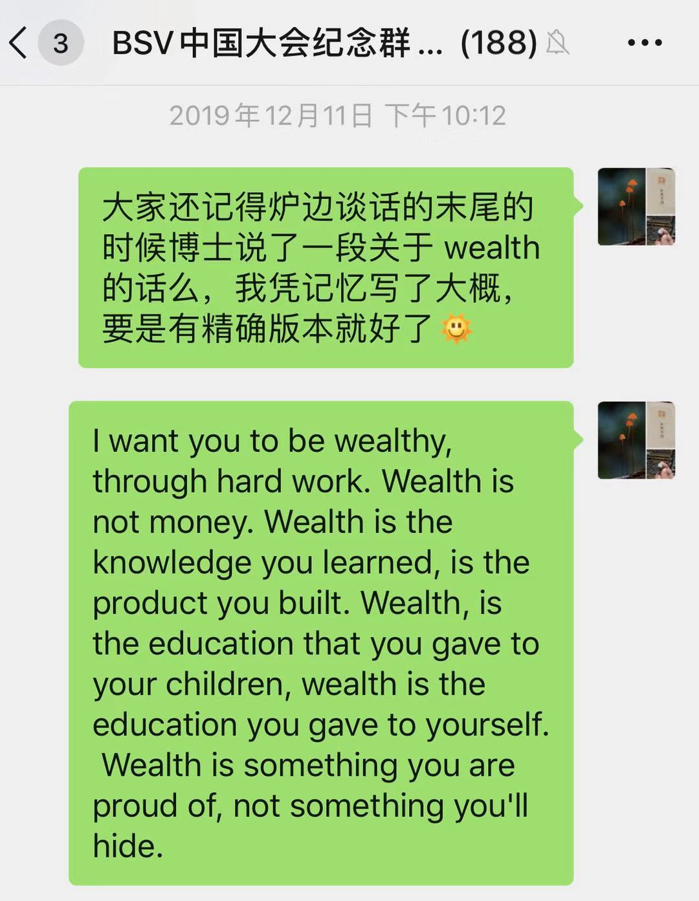

## (2020.01) BSV 中国大会的动容一刻

2019年12月8日，BSV China Conference 现场。

-----

在 Craig 和 Jimmy 的炉边谈话末尾，Jimmy 问 Craig 有什么想对从中国各地赶来的 bsv 开发者想说的 (在前一天，大家已经有了不少深入的交流，我也当面请教了博士关于 onchain-gaming 的一些细节)，Craig 说了一段 very touching 的话。当时我在现场，深受触动，回珠海的飞机上，在手机的记事本上凭回忆记下了这段话。

> I want you to be wealthy, through hard work. Wealth is not money. Wealth is the knowledge you learned, is the product you built. Wealth, is the education that you gave to your children, wealth is the education you gave to yourself. Wealth is something you are proud of, not something you'll hide.



2020年01月31日，因为新冠病毒肆虐无法外出，我在 [Youtube 上](https://youtu.be/mqWm6Kwf0KY) 找到了那天炉边谈话的视频，翻到了最后，摘下了博士所说的全文。

> I want to see you all create something that makes you wealthy. not get rich quickly. Wealth. Wealth is not just money, wealth is goods, wealth is services, wealth is things we consume, wealth is the education we give our children, wealth is the education we give ourselves. Wealth is holidays, being able to take time off, have a new car, go to a dentist, whatever. I want you to create a system that will make you wealthy, not because you hodl coins that someone else making you wealthy. I want you to build a system you can be proud of. I want you to build on top of Bitcoin and be wealthy because of your hard work. So that your family, your kids will look at you and go, "I'm proud. That's my dad. I'm proud. That's my mum. I'm proud. That's my brother. I'm proud. That's my sister, my son, my daughter, etc.". I want you to build a system with those who love you do it. not because you were lucky but because you worked, and you strove, and you created something that made the world proud.

```
我希望能看到你们通过创造价值而 (变得) 富有，而不是 (因) 投机赚到快钱 (而自得)。财富。财富，不只是钱，财富是产品，是服务，是可供消费之物，是可给予孩子的教育，是可给予自己的教育。财富是 (能稍事歇息的) 假日，(工作之余) 休憩的时光，(为家人购置的) 崭新的汽车，(开始有余力照顾自己而) 预约的牙医，所有这些。 我希望你能有机会去构造一个系统 (小则项目，大则事业) 而变得富有，而不是只会牢牢攥紧手里的币 (所谓的 HODL)，靠掠夺那些后来者的血汗而暴富。我希望能看到你为自己构造的系统而骄傲，我希望能看到你在 Bitcoin 的基础上，通过艰辛的努力而有所收获。只有如此，你的家庭，你的孩子，在提到你的时候才会说，“这就是那个让我骄傲到不行的老爹/老妈/老哥/老姐。” 为这些在乎你的人去工作，不靠运气，靠努力，挣扎，奋斗，去创造那个让整个世界脱帽致敬的东西。
```

不知道其他人听到后什么感受，这是一段令我非常动容的话。

谨记于此，深自勉之。

（全文完）

- Gu Lu, 2020-01-31 于免成居 (公众号：**免成居**) 
- 本文遵循 [Creative Commons BY-NC-ND 4.0 许可协议](http://creativecommons.org/licenses/by-nc-nd/4.0/)。
- 永久链接 [https://gulu-dev.com/post/2020/2020-01-31-bsv-beijing-touching-moment](https://gulu-dev.com/post/2020/2020-01-31-bsv-beijing-touching-moment)
- 2020-06-16 新增编号 `B-003-2001` 并入库
