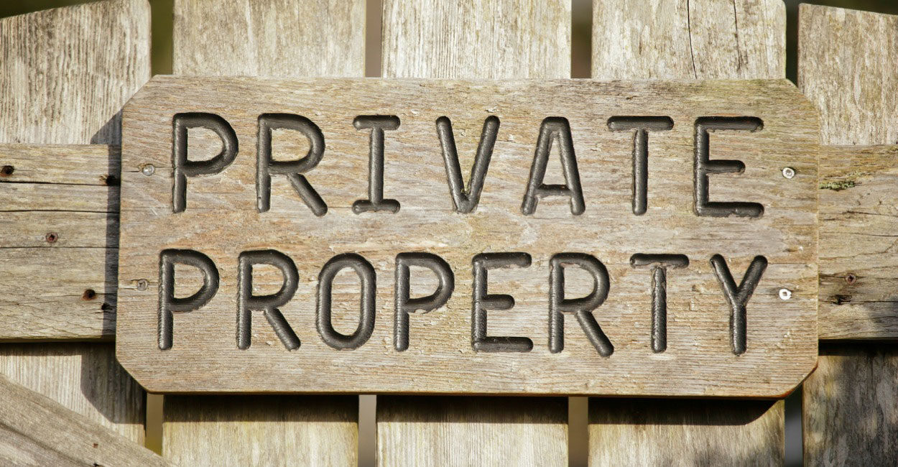

# (2020.05) Craig 关于财产权的说明 (2015) 

我在翻阅旧材料的时候，偶然发现——在2015年11月的一次开放论坛上，Craig 关于财产权有一些值得一读的叙述。这里首先摘录了提问 (来自台下的 Steven) 和 Craig 现场即兴的回答，然后是我的简单评述，最后是完整的视频链接。



## 问答部分

提问: (来自彩云小译) 你最近一直在推特上讨论财产，财产的性质，财产权，所以我想请你详细解释一下，也许比特币在其中扮演了一个角色。

```
You've been tweeting recently about property, the nature of property, property rights and so I'd like to maybe ask you to elaborate a little bit on that, maybe have bitcoin plays a role in that. 
```

(再次说明下，这是2015年11月的材料) 

Craig 的回答：

```
"One of the most fundamental rights of being human is the ability to own and trade property. Every other thing that we do, other than trade, is done by animals, plants, or combinations of the above. There are tool building animals, there are all sorts of things. But what we do that is really unique is we trade. To do that fairly needs property. We need to be able to control our own freedoms and the only way to do that is to basically have the right to property, to ownership, to transfer -- to decide what we want to do. That also means not telling people what we have. If we don't want to go out there and say I am a billionaire or I am running xyz or this is my life... I shouldn't have to tell people that. I should have the right to live frugally if I want to and to invest in business without telling people I am a billionaire... or that I am whatever -- like some people have to these days because governments try to make us. We should be able to choose how we live and that is the fundamental right of property. That means being able to dispose of property as we want; to be able to share it, to take it -- and that is what it is all about. Once we get things to where we have redeemable contracts and we link them to the blockchain. Where we can link money, and goods, digital rights and ownership into something that can't be changed. A fundamental open, honest, truthful asset -- the blockchain. That's when we are going to see real freedom in the world."
```

(来自彩云小译)

“人类最基本的权利之一是拥有和交易财产的能力。除了贸易，我们所做的其他任何事情都是由动物、植物或者以上几种的组合来完成的。有制造工具的动物，还有各种各样的东西。但是我们所做的真正独特的是我们交易。要做到这一点，就需要财产。

我们需要能够控制我们自己的自由，唯一的方法就是基本上拥有财产权、所有权、转让权——决定我们想做什么。这也意味着不要告诉别人我们拥有什么。如果我们不想出去说我是个亿万富翁，或者我在经营某某公司，或者这就是我的生活... ... 我不应该告诉别人这些。我应该有权过节俭的生活，如果我想的话，我应该有权投资商业而不告诉人们我是亿万富翁... 或者我是什么人---- 就像现在有些人不得不这样做，因为政府试图让我们这样做。我们应该能够选择我们的生活方式，这是财产的基本权利。这意味着我们可以随心所欲地处置财产，可以分享财产，可以占有财产---- 这就是财产的意义所在。

一旦我们得到的东西，我们有可赎回的合同，我们把他们连接到区块链。我们可以把货币、商品、数字权利和所有权联系起来，变成不可改变的东西。一个基本的开放，诚实，真实的资产---- 区块链。这就是我们在世界上看到真正自由的时刻。”

## 评述部分

这个即兴的回答是远程视频的，有一小部分听不太清，但应该不影响原意。Craig 说到以下几点：

- 交易是人区别于动物的显著特征之一，而财产权是交易得以进行的基础，因此对于人类社会的个体而言，**财产权是根本性的权利**。
- 作为人类的个体 (这里我们以小A为代号)，财产权的意义主要表现为下面两点：
    1. 小A是否可以自由地与他人交易，很大程度上取决于小A是否能掌控和支配他自身财富的所有权 (**可支配的财产才可交易**)
    2. 在掌控和支配的基础上，小A有权利保密，在需要的时候，不让其他的人或组织知晓他财产的具体情况 (**可控的隐私保护**)
- 区块链构造了一种开放，可信的机制，把货币，商品及对应的所有权联系起来，允许个体享有更好的支配权，(在不损失必要的可追溯性的前提下) 享有更好的隐私，从而更强有力地保障了财产权。(**区块链作为不可变证据序列的用途和意义**)

----

## 完整视频

最后是完整的视频链接 ([这段回复位于第 48 分 18 秒](https://www.youtube.com/watch?v=LdvQTwjVmrE&t=2898s))：

```
标题：All-Star Panel: Ed Moy, Joseph VaughnPerling, Trace Mayer, Nick Szabo, Dr. Craig Wright
链接：https://www.youtube.com/watch?v=LdvQTwjVmrE
```

（全文完）

- Gu Lu, 2020-05-16, 于免成居 (公众号：**免成居**) 
- 本文遵循 [Creative Commons BY-NC-ND 4.0 许可协议](http://creativecommons.org/licenses/by-nc-nd/4.0/)。
- 永久链接 [https://gulu-dev.com/post/2020/2020-05-16-craig-about-property-right](https://gulu-dev.com/post/2020/2020-05-16-craig-about-property-right)
- 2020-06-16 新增编号 `B-004-2005` 并入库
