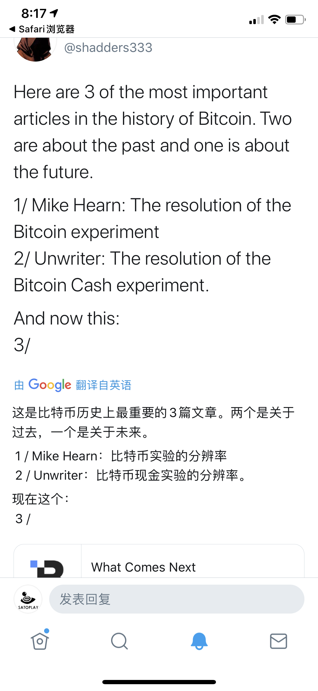

# 2020.09 [译] "接下来会如何" (What Comes Next)

看到这篇文章是因为 [Shadders 的 Twitter](https://twitter.com/shadders333/status/1308490268212162560)：

---------

["What Comes Next" 原文链接](https://bit.sv/post/499dec5108b14e99d28b48b0c0dfcd5fe06edef43ad738d41f18264151aaf30d)

用彩云小译翻了下，然后修了点语气什么的~ 

---------

I took some space to clear my head. I'd been building on Bitcoin for 18 months straight, and my original plan wasn't working.

我腾出一些空间来清醒一下头脑。我已经花了18个月在比特币上建设，但我最初的计划没有成功。

What did I get wrong?

我哪里做错了？

Timing really is everything, and being early to the party is the same thing as not showing up.

时机就是一切，提前参加派对和不出席派对是一回事。

My original goal with Bit.sv was to enable creators to make a full-time living using Bitcoin.

我最初使用 Bit.sv 的目标是让创作者能够全职使用比特币谋生。

I had an "aha moment" when building Open Directory, a Reddit-style link aggregator on Bitcoin. At scale, Open Directory wouldn't just replace Reddit, but Patreon too.

在构建开放目录(Open Directory)时，我有一个“顿悟时刻” ，这是一个类似 reddit 的比特币链接聚合器。从规模的角度，开放目录不仅仅取代了 Reddit，还取代了 Patreon。

This was a major wake up call. I realized the Internet had been playing with one hand tied behind it's back. The Internet was broken, in a way that not many people understood, but suprisingly almost everybody in BSV did.

这是一个重要的警钟。我意识到互联网的问题所在，一只手被绑在背后。互联网被破坏了，以一种不是很多人都能理解的方式，但令人惊讶的是几乎每个 BSV 的人都能理解。

I ran as fast as I could in the direction I thought best. I built Bit.sv in a way that's still underappreciated today. Bit.sv solves de-platforming. It solves owning your data. It enables a federated service provider model, where customers get to decide which provider they use with 1-click. Everything is encrypted. Bit.sv is the only consumer application on the Metanet.

我以最快的速度向我认为最好的方向跑去。我创建 Bit.sv 的方式，在今天仍然没有得到充分的重视。 Bit.sv 解决了去平台化问题。它解决了拥有你的数据的问题。它支持联合服务提供者模型，客户可以通过单击一次来决定使用哪个提供者。所有东西都加密了。 Bit.sv 是 Metanet 上唯一的面向消费者的应用。

It turns out, none of this matters.... at least not yet.

事实证明，这些都不重要... ... 至少现在还不重要。

I built for a world where there are a dozen Twetch's, a dozen Bit.sv's, and a dozen PowPings — all competing on the same protocols to give the customer the best experience.

我建立的世界里，有十几家 Twetch’s、十几家 Bit.sv’s 和十几家 power---- 它们都在同一个协议上竞争，以给客户提供最佳体验。

What I got wrong is we don't live in that world yet.

我错了，我们还没有生活在那个世界里。

Almost nobody knows about BSV. Even fewer have BSV they can spend. Onboarding is still a significant problem.

几乎没有人知道 BSV，有 BSV 可以拿来花的就更少了。 “上车” 仍然是一个重要的问题。

The BSV ecosystem debates endlessly consumer vs prosumer vs enterprise adoption — but the reality is after 12 years Bitcoin still hasn't had a breakout app. If we're being fair, a store of value is the closest thing, and DeFi is the second.

BSV 生态系统无休止地争论消费者、生产者和企业采用的问题ーー但现实是，12年过去了，比特币仍然没有突破性的应用。如果我们是公平的，价值储存是最接近的东西，DeFi 是第二。

But people in BSV know better, they understand what an entire world running on Bitcoin would look like, a better, more fair world.

但是 BSV 的人知道的更多，他们知道整个世界运行在比特币上会是什么样子，一个更好，更公平的世界。

Which is why I've been so excited to be a part of what's happening in BSV.

这就是为什么我如此兴奋能够成为 BSV 的一份子。

From the outside, people think BSVers are scammers. They think by supporting BSV, they're supporting Craig's claim to Satoshi, and they're enabling him. They're complicit. They think everybody is being financially supported by Calvin (this one might actually be true 😜).

从表面上看，人们认为 bsver 是骗子。他们认为，这些支持 BSV 的人，是在支持 “Craig 是 Satoshi” 的主张，而且正是他们“激活”了 Craig。他们是同谋。他们认为每个人都得到了加尔文的经济支持(这个可能是真的，嘻嘻)。

What those people don't understand is you can have two completely different opinions about Craig/Calvin and Bitcoin, and they don't need to intersect. After all, Bitcoin enables you to work with people you don't trust.

这些人不明白的是，你可以对克雷格/卡尔文和比特币有两种完全不同的看法，而且他们不需要交叉。毕竟，比特币可以让你和你不信任的人一起工作。

If people had to be accountable for everybody using their favorite blockchain....we'd be in trouble.

如果人们因为认可某个区块链，就必须对那条链上的每个使用者负责......我们就麻烦了。

The reality many don't want to accept is, Craig is pitch-perfect on Bitcoin. You may not like it, but I bet you couldn't steelman his view. Almost nobody outside BSV understands BSV, because if they did, they'd instantly join once they understood the implications.

许多人不愿接受的现实是，克雷格对比特币的理解完美无缺。你也许不喜欢，但我敢打赌你不能 (steelman 含义存疑) 他的观点。几乎没有 BSV 以外的人理解 BSV，因为如果他们理解了，一旦他们理解了其中的含义，他们就会立即加入。

There's this big debate whether Calvin saved Bitcoin. Does it matter? I'd say so, if he did, he should get the credit. Would Bitcoin have survived without him? Definitely. Would we be in a far worse off spot? Definitely. Calvin has made a significant contribution to Bitcoin, and that's super respectable.

关于 Calvin 是否拯救了比特币，有很大的争论。这重要吗？我会这么说，如果他这么做了，他应该得到荣誉。如果没有他，比特币还能存活吗？当然。我们会不会处于一个更糟糕的境地？当然。卡尔文对比特币做出了重大贡献，这是非常值得尊敬的。

There's a lot of people building incredible things on Bitcoin. Bitcoin really does bring out the dreamers.

有很多人在用比特币创造不可思议的东西。比特币确实能激发梦想家。

And for the dreamers, Bitcoin is packed full of surprises.

对于梦想者来说，比特币充满了惊喜。

It's a software meme that every app evolves until it's a social network that supports messaging and money — but with Bitcoin, you start there.

这是一种软件模因，每一个应用都会往“成为一个支持信息传递和货币的社交网络”的方向发展ーー但是有了比特币，你就可以直接从那里开始。

A stable protocol is the single most underrated feature of any distributed blockchain. Decentralization is about the decentralization of power, which means removing control from everyone, especially developers. Segwit and Replace-By-Fee fundamentally broke Bitcoin, and if you don't understand why, you don't understand Bitcoin. Bitcoin is a balanced economic incentive system, if you change the economic incentives, you've changed the system.

稳定的协议是任何分布式块环链中最被低估的特性。去中心化是关于权力的去中心化，这意味着从每个人手中剥夺控制权，尤其是开发者。Segwit 和 Replace-By-Fee 从根本上破坏了比特币，如果你不知道为什么，你就不会理解比特币。比特币是一个平衡的经济激励系统，如果你改变了经济激励，你就改变了系统。

0-confirmation is safe and works so well it forces you to readjust your mental model for how global connectivity will evolve when the networking layer is incentivized. Payment channels provide additional off-chain scalability techniques. Instant & realtime Bitcoin is a solved problem. And unlike Lightning, 0-conf helps reduce fees over time, doesn't reduce the security model of the network, isn't a strangle fig, doesn't turn you into an unauthorized money transmitter, doesn't erase the trail of money laundering, doesn't need custodial apps, never "fails to route" transactions—it actually works. Lightning was never needed.

零确认是安全的，并且工作得很好，它迫使你重新调整你的心智模型，当网络层被激励时，是如何使得全球连通性得到改善的。支付通道提供了额外的离链可伸缩性技术。即时和实时比特币是一个已解决的问题。与闪电网络不同的是，零确认不会随着时间的推移而降低费用，不会降低网络的安全模型，不会扼杀信息，不会把你变成一个未经授权的金钱传输器，不会抹去洗钱的踪迹，不需要保管应用程序，从来不会产生“路由失败”的交易ーー它无需任何外力就能有效地工作。从来不需要闪电。

The fairest way to scale Bitcoin is to say the market should determine the block size, not a tiny group of developers. Welcome to BSV, happy to have you. Bitcoin scales like nothing you've seen before. In 10 years, it bootstrapped a mining industry out of thin air. Creating profit motives to optimize miner performance is something Bitcoin does extremely well.

最公平的扩容方案就是，由市场决定区块的大小，而不是一小群开发者。欢迎来到 BSV，欢迎您的到来。比特币以一种闻所未闻的方式扩容。10年间，它凭空创造了一个采矿业。通过创造利润激励来优化矿工的性能是比特币的有效特性。

On BSV, almost all wallets support privacy features like "no address re-use" and some even support more advanced features like "Output Bills coin-splitting", ways to legally keep your privacy while using Bitcoin without mingling your funds with criminals (what do you think mixers do? or where do you think DeFi yields are coming from?). For a privacy-conscious bunch, BTC sure doesn't take many measures to protect the privacy of its customers. It's common to have a single Bitcoin address you re-use over and over, revealing your entire transaction history publicly, and many don't have any of the privacy features supported by most BSV wallets.

在 BSV 上，几乎所有的钱包都支持“不重用地址”等隐私功能，有些甚至支持“输出硬币分割”等更高级的功能，这些功能可以合法地保护你的隐私，同时使用比特币而不会让你的资金与犯罪分子混在一起(你认为混合器会做什么？或者你认为 DeFi 的收益来自哪里?).作为一个注重隐私的群体，BTC 并没有采取很多措施来保护其客户的隐私。有一个单一的比特币地址是很常见的，你重复使用一遍又一遍，公开披露你的整个交易历史，许多 BSV 钱包 (此处疑为 BTC) 并没有支持什么像样的隐私功能。

Bitcoin is Turing complete (Craig, right again), which means Bitcoin can run any computation, any smart contract, anything. We never needed Ethereum. Bitcoin is the World Computer. Hope you've been brushing up on your Forth.

比特币是图灵完整的(Craig 又是对的) ，这意味着比特币可以运行任何计算，任何智能合同，任何东西。我们从来不需要以太。比特币是世界电脑。希望你一直在温习你的 Forth 技能。

UTXOs are a brilliant software design that allows Bitcoin transactions (scripts) to be processed in parallel. Ethereum's global state means every action needs to be performed on every node. Bitcoin could always scale from day one. It initially had a block limit because satoshis didn't have any value, which made market-based block sizes a DDoS attack vector. This hasn't been a problem for over 10 years, but it took BSV to push the system (aka use the damn thing).

UTXOs 是一个出色的软件设计，允许比特币交易(脚本)并行处理。Ethereum 的全局状态意味着每个操作都需要在每个节点上执行。比特币的扩容从第一天起就是成立的。区块最初的上限是因为，在这些币还没有价值的时候，由市场决定的区块尺寸是一个 DDoS 攻击向量。10年来这都不是一个问题，直至其由 BSV 来推动的那一刻。

Proof-of-Work is a consensus model where winners must continually reinvest profits to stay at the bleeding edge to stay competitive. It ensures anybody can join the system, with any consensus changes happening through hard-fork. Proof-of-Stake is a consensus model where winners with the most money determine the rules of the system. As the basis for a global system, one of those sounds fair and one of those doesn't.

工作证明是一个共识模型，在这个模型中，赢家必须不断地将利润进行再投资，以保持最新的竞争优势。它确保任何人都可以加入系统，只能通过硬分叉来改变共识。POS是一个共识模型，在这个模型中，金钱最多的赢家决定系统的规则。作为一个（目标是成为）全球体系的系统，其中一个听起来公平，另一个则不公平。

Whatever your political affiliation, Bitcoin has something for you, it's the socialism that capitalist want and the capitalism that socialist want. It's a fair system, that enables free trade between private citizens, with the ability to solve the tragedy of the commons-style game theory problems commonly associated with public goods. Bitcoin adds an Oracle to humanity.

无论你的政治倾向如何，比特币都能满足你的需求，它是资本主义想要的社会主义，也是社会主义想要的资本主义。这是一个公平的制度，能够促进公民之间的自由贸易，有能力解决公共物品，通常与公共物品有关的，公共物品式的博弈理论问题。比特币是送给人类的神谕。

Everybody in cryptocurrency is talking about incentivized social media, de-platforming, fair news, scaling, low tx fees, world computers — hello, wake up. It's 2020 and Bitcoin is not what your grandma thinks it is. Actually, respect to grandma, she has a better chance of understanding Bitcoin in 2020 than most crypto investors. It's a global optimization machine that sucks energy wherever it's least useful and provides a socially scalable way for humanity to connect, collaborate and level up.

加密货币领域的每个人都在谈论激励社交媒体、去平台化、公平新闻、扩展、低 tx 费用、全球计算机——喂，醒醒吧。现在是2020年，比特币并不是你奶奶所认为的那样。事实上，对于老奶奶来说，她比大多数加密投资者更有机会在2020年理解比特币。它是一个全球性的优化机器，通过吮吸那些利用率最低的能量，为人类提供一个社会可扩展的连接、协作和升级的方式。

Bitcoin is a fair playing field.

比特币是一个公平的竞争环境。

BSV is the best place to be building, anywhere in the world. Any country. Any platform. Any blockchain. Anywhere.

BSV 是世界上最好的建筑场所，任何国家，任何平台，任何区块链，任何地方。

Despite this overwhelming promise and Bitcoin still being a multi-disciplinary breakthrough, some of my idealism has faded. Maybe the shine has started to wear, or maybe it's just being on the field for 18 months without a win.

尽管有着压倒性的前景，而且比特币仍然是一个多学科的突破，我的一些理想主义已经褪色了。也许光芒已经开始消失，也许只是在球场上18个月没有胜利。

But there are many hidden corners and sacred cows of Bitcoin, like:

但是比特币有很多隐藏的角落和神圣的东西，比如:

The stable protocol narrative builds as people whisper of hard forks.

稳定的协议叙事旁，各种硬分叉落了一地。

Storing data on-chain is still a hotly debated topic.

在链上存储数据仍然是一个热烈讨论的话题。

VC vs Bootstrap vs Angel Investors (with LPs?) funding models ....who cares? put up or shut up

VC vs Bootstrap vs 天使投资者(有限合伙人)融资模式... ... 谁在乎呢? 要么行动，要么闭嘴

"Bitcoin Incentivizes Connectivity" but almost no apps work together

“比特币激励连通性” ，但几乎没有任何应用程序协同工作

"Open Collaboration" turns to patent farming, land grabs and memetic competition

“开放合作”转变为专利开垦、土地掠夺和模因竞争

Platforms trying to commoditize you rather than supply chains trying to magnify you, meet the new boss, same as the old boss

平台试图商品化你，而不是供应链试图放大你。转角遇到的新老板，其实跟旧老板没什么区别。

BSV decoupling is great for the ecosystem until the rest of crypto starts pumping then FOMO

在加密空间的其他地方开始拉盘和 FOMO 时，BSV 解耦并孕育出独立的生态系统。

Tokenmania. Suddenly we need scammy ICO projects

Token 热浪。突然之间我们似乎需要骗子项目了。

Championing weird Bitcoin projects turns resentful as devs don't pump the price and don't break the law.

由于支持怪异的比特币项目而变得不爽，因为开发者既不拉盘，也不乱搞。

BSV consumers are actually investors looking to primarily increase the price of BSV, not use your app

眼下 BSV 的消费者实际上是主要希望提高 BSV 价格的投资者，而不是使用你的应用程序（的用户）。

Traditional commerce is disincentivized while BSV price is low, for HODLing, and the opportunity to pump price with free content rather than sell it and explore new monetization models.

价格太低，传统的商业模型就被抑制了，只剩持币待拉的人，而不是卖币换钱来探索新的商业模式。

Every app is running into The Onboarding but nobody is solving The Onboarding because we are all building the killer app that will make customers jump through hoops ...except, that's not how it works, especially when you're decoupled from major on-ramps.

每个应用都陷入了“上车”问题，但是没有人去专心拉人上车，因为我们都跑去构建一个杀手级应用程序，它能让客户跳过各种障碍... ... 但是，这不是它的工作原理，特别是当你跟币圈主流脱钩的时候。

Along the way I realized despite my interest in Bitcoin, there are some significant hurdles to building the kinds of apps that I think can make a lot of money and change the world, without dipping into scammy ICO style mania (or worse, Enterprise 😜 I kid I kid)

在这个过程中，我意识到尽管我对比特币很感兴趣，但是在开发我认为可以赚很多钱并且改变世界的应用程序的过程中，我还是遇到了一些重大的障碍

I grew tired of always having to say positive things about Bitcoin. Yes it's great, yes it's going to change the world, but there are some bumps along the way.

我已经厌倦了总是说比特币的好话。是的，这是伟大的，是的，它将改变世界，但是在前进的道路上有一些颠簸。

People on Twitter say "the market will figure it out" while they're watching the market trying to figure it out.

人们在推特上说，“市场会发现的” ，而他们正在观察市场，试图发现它。

I understood better what Quarterbacks go through on Monday morning.

我比较了解四分卫在周一早上的经历。

People who have never started a business, never created a product, never written a line of code, never talked to a customer, never made a sale, are "investment and product strategy experts" because they invest in shit coins — welcome to the Internet.

那些从未创业、从未创造过产品、从未写过一行代码、从未与客户交谈、从未做过销售的人，是“投资和产品战略专家” ，因为他们投资的是垃圾货币——欢迎来到互联网。

As a bootstrapper, it is very difficult to simultaneously bootstrap a network like Bitcoin while building your own company. It takes an incredibly long-term approach, especially if you're trying to grow a new market rather than building for an established one that happens to use Bitcoin.

作为一个引导者，在建立自己的公司的同时引导像比特币这样的网络是非常困难的。这是一个难以置信的长期任务，尤其是如果你试图开发一个新的市场，而不是在一个已经建立的市场里恰好使用了比特币。

This is one area VC shines today, being able to remain in markets full-time while they’re still developing.

这是风险投资今天闪耀的一个领域，当市场还在发展的时候，风险投资就能够一直留在市场中。

The reality is despite all the promise, as a bootstrapper, Bitcoin is not a good market to build for, yet. Cashflow is King, and Bitcoin doesn't have a lot of wallets yet. But things could quickly change.

现实是，尽管有这么多的承诺，但作为一个引导者，比特币还不是一个好的市场。现金流是王道，而比特币还没有很多钱包。但情况可能会很快改变。

A few major improvements could break Bitcoin into the mainstream. The three biggest are:

一些主要的改进可能会让比特币成为主流。三个最大的改进是:

Threshold Signatures — Never write down a mnemonic again. Never worry about losing your keys. Still non-custodial.

门槛签名ー永远不要再写助记符。永远不要担心丢失你的钥匙。仍然是非保管的。

Stable Coins — Use your local currency digitally, without worrying about Bitcoin price swings.

稳定的硬币ーー以数码方式使用本地货币，不必担心比特币的价格波动。

Fiat On-Ramps — Buy Bitcoin as easily as Stripe, Apple Pay, Google Pay or using the App Store — anything less is a significant disadvantage for Bitcoin apps.

法币通道 ——购买比特币就像购买 Stripe、苹果支付(Apple Pay)、谷歌支付(Google Pay)或使用应用商店一样容易——对于比特币应用程序而言，只要弱一点都会造成明显的劣势。

This is "all" it will take for mainstream Bitcoin adoption.

这就是比特币被主流化所需要的“一切”。

The good news is, it's coming. I know a lot of teams are working hard on these problems.

好消息是，它来了。我知道很多团队正在努力解决这些问题。

Of all the solutions, I'm most excited about HandCash.

在所有的解决方案中，我最兴奋的是 HandCash。

I've been pretty vocal about HandCash's vertically integrated approach. If they are Apple, there is an Android waiting. I lean open-source with Bitcoin and the Planaria model fits with how I want to build apps. The Linux/WordPress of Bitcoin is coming.

对于 HandCash 的垂直整合方法，我一直直言不讳。如果他们是苹果公司，那么还有一个安卓系统在等着他们。我倾向于比特币的开源模式，而 Planaria 模式符合我构建应用程序的方式。比特币的 Linux/WordPress 即将问世。

But make no doubt, HandCash is going to crush it. They've put together an incredible team, and if they can build an ecosystem that solves the three problems above, devs will flock to the platform. I will.

但毫无疑问，HandCash 将会击败它。他们已经组建了一个令人难以置信的团队，如果他们能够建立一个生态系统来解决上述三个问题，开发人员将会蜂拥而至。我会的。

Here's a free idea (since some of you like taking liberal inspiration without giving credit 😜 🔥) — Stripe for Bitcoin, a credit card field in a few lines of JavaScript where you accept payment, and auto-convert to a threshold signature-enabled local-currency stable-coin using 0-conf and you charge a small fee for accepting the risk. In one service you've solved all three problems for developers. While this is a technological innovation, it's primarily a legal/finance one.

这里有一个免费的想法(既然你们中的一些人喜欢听免费想法)ーー Bitcoin 上的 Stripe，这是一个信用卡字段，在 JavaScript 的几行代码中，你可以接受支付，并且使用零确认自动转换为阈值签名支持的本币稳定币，你可以承担风险并收取一点费用。在一个服务中，您已经为开发人员解决了所有三个问题。虽然这是一项技术创新，但它主要是一项法律/金融创新。

Bitcoin in 2020 is like the Internet in 1995.

2020年的比特币就像1995年的互联网。

I was optimistic that we can fast-forward the infrastructure phase. The formerly-great VC known as Union Square Ventures (before they became a central bank) had a good theory: because blockchain apps are based on open infrastructure, we're simultaneously creating the app and infrastructure layers at the same time.

我乐观地认为，我们可以快速推进基础设施阶段。曾经伟大的风险投资家联合广场风险投资公司(在他们成为中央银行之前)有一个很好的理论: 因为区块链应用程序是基于开放的基础设施，我们同时创建应用程序和基础设施层。

But I don't think this is true.

但我不认为这是真的。

In this case the "infrastructure layer" isn't the servers, networking, software or even the smart contracts — it's the key management and financing layer.

在这种情况下，“基础设施层”不是服务器、网络、软件，甚至不是智能合同，而是私钥管理和财务层。

To that end, and I hate to say it, price pumps and DeFi have a legitimate shot at attracting consumer adoption.

为了达到这个目的，我讨厌这么说，拉盘和 DeFi 对于吸引消费者的接受来说没什么不好。

One of the biggest things people get wrong in BSV is how they dismiss things that look like toys.

在 BSV 中，人们最容易犯的错误之一就是他们忽略了那些看起来像玩具的东西。

PHP was a toy, now it powers 80% of the web.

PHP 曾经是一个玩具，现在它为80% 的网络提供动力。

JavaScript was a toy, now it's the most popular language in the world.

JS 曾经是一个玩具，现在它是世界上最流行的语言。

Ruby on Rails was a toy that "didn't scale", now it's used in countless successful startups and Enterprises.

Ruby on Rails 曾经是一个“缺乏伸缩性”的玩具，现在它被无数成功的创业公司和企业使用。

Drones were a toy, now they're flying themselves and delivering groceries.

无人机曾经只是一个玩具，现在它们可以自己飞行和运送食品杂货。

3d printers were a toy, now they're printing guns.

3d 打印机曾经是玩具，现在他们在打印枪支。

GPUs were for toys, now they're training Artificial Intelligence.

图形处理器曾被用来打游戏，现在他们正在训练人工智能。

Game engines were toys, now they're modeling our whole world, and increasingly spending more and more of our time in them

游戏引擎曾经是玩具，现在它们正在塑造我们的整个世界，并且越来越多地花费我们的时间在它们上面

YouTube was a toy, now A-list Hollywood stars chase YouTube subscribers

YouTube 曾经是一个玩具，现在一线好莱坞明星追逐着 YouTube 的订阅者

SoundCloud was a toy, but launched the careers of more rappers than any other platform.

SoundCloud 是一个玩具，但比其他任何平台推出了更多饶舌歌手的职业生涯。

Twitter was a toy, but the President of the United States uses it as his primary communication method.

推特是一个玩具，但是美国总统把它作为他的主要交流方式。

Both ICOs and DeFi have a legitimate shot at cleaning up their act and becoming something truly transformative.

ICOs 和 DeFi 都有合法的机会清理他们的行为，成为真正的变革者。

"Worse is better" is a phenomenon that happens over and over again. What hackers are working on nights and weekends will be mainstream in 10 years.

“越糟越好”是一种反复出现的现象。黑客们在晚上和周末的工作将在10年内成为主流。

Bitcoin is many things. But because it's been restricted, there's been an explosion of creativity on other blockchains.

比特币有很多东西，但是因为它受到限制，其他区块链的创造力爆发了。

What it will take to attract significant attention is people making serious money.

要吸引人们的注意力，就要让人们赚大钱。

What that will take, is getting as many people through The Onboarding as possible, using the 3 issues above as the wedge.

我们需要做的，就是让尽可能多的人赶紧上车，使用上面提到的3个问题作为楔子。

The people in BSV are the strangest, weirdest, most ambitious, talented, idealistic people I've ever worked alongside.

BSV 里的人是我曾共事过的最奇怪、最古怪、最有野心、最有才华、最理想主义的人。

Bitcoin offers a once-in-a-lifetime chance to make an impact in the areas you care about most while making a ton of money.

比特币提供了一个一生只有一次的机会，可以在你最关心的领域产生影响，同时赚大钱。

It allows our world to be more connected while empowering the individual like never before. It makes it profitable to do the right thing.

它让我们的世界变得更加紧密联系，同时赋予个人前所未有的权力。做正确的事情是有利可图的。

And despite all my criticisms, I remain incredibly bullish. Bitcoin really does have the power to change the world.

尽管我批评了这么多，但我仍然非常乐观。比特币确实有能力改变世界。

Sometimes criticism can be considered as negativity in BSV, because it muddies the narratives. It's hard enough to get people inside, so we shouldn't make that job any harder.

有时批评可以被认为是否定 BSV，因为它混淆叙事。让人们进去已经够难的了，所以我们不应该让这项工作变得更难。

But for people building at the edge of Bitcoin, they need to be able to throw problems around openly. This isn't negativity, it's the way to find solutions.

但是对于那些在比特币边缘构建的人来说，他们需要能够公开地抛出问题。这不是消极，而是找到解决方法的途径。

After I wrote my piece on the problems with Storing data on Bitcoin SV, Attila announced MatterCloud will support archiving Bitcoin TXs as a service. No contracts. No phone calls. No sales meetings. No future plans. An API and a credit card field — exactly what hackers want.

在我写完关于在比特币 SV 上存储数据的问题的文章后，Attila 宣布 MatterCloud 将支持将比特币交易作为服务进行存档。没有合同。没有电话。没有销售会议。没有未来计划。一个 API 和一个信用卡字段——这正是黑客们想要的。

Bitcoin has a healthy culture of proof of work, where you don't talk too much, you just do. If you believe something could be better, you go create that solution and make a bunch of money.

比特币有一种健康的工作证明文化，在这种文化中，你不需要说太多，你只需要做就行了。如果你相信有些东西可以变得更好，你就去创造那个解决方案，然后赚一大笔钱。

I love it. The only thing I'd add is that if Bitcoin actually incentivizes connectivity, we are all headed towards doing what we do best.

我喜欢这样。我唯一要补充的是，如果比特币真的能够激励互联互通，我们都会朝着自己最擅长的方向前进。

To that end, we still need to communicate. Constructively criticizing Bitcoin is a significant value add to the ecosystem, as businesses and developers can spot new opportunities for solving problems the market is demanding.

为了达到这个目的，我们仍然需要沟通。建设性地批评比特币是对生态系统的重大增值，因为企业和开发者可以发现解决市场需求的问题的新机会。

If Bitcoin is what I think it is, what comes next is not just a technological, financial, software, marketplace and information system revolution — but a social one where the best aspects of humanity are magnified by people who have realized what Nakamoto Consensus really means.

如果比特币是我所认为的那样，那么接下来发生的不仅仅是一场技术、金融、软件、市场和信息系统革命，而是一场社会革命，在这场革命中，人类最美好的一面被那些认识到中本聪共识真正含义的人们放大了。

A group of people are headed to the high-ground. To join them, you just have to stand up, declare yourself a Byzantine General, and take the power already given to you.

一群人向高地走去。要加入他们，你只需要站起来，宣布自己是拜占庭将军，接受已经赋予你的权力。

Craig Voice The power is in Bitcoin.

(Craig的声音在耳边回响) 比特币的力量蕴含在它的内部。

Bitcoin enables an explosion of creativity larger than the original Internet.

比特币比原始互联网更能激发创造力。

And if you're not paying attention, you might not be anticipating what comes next.

如果你没有注意，你可能没有预料到接下来会发生什么。

（原文完）

[完]  

----------

- 顾露 (Gu Lu) 于免成居
- 时间: 2020-09-24
- 编号: B-006-2009
- 本文遵循 [Creative Commons BY-NC-ND 4.0 许可协议](http://creativecommons.org/licenses/by-nc-nd/4.0/)。
- 永久链接 [https://gulu-dev.com/post/2020/2020-09-24-what-comes-next](https://gulu-dev.com/post/2020/2020-09-24-what-comes-next)
