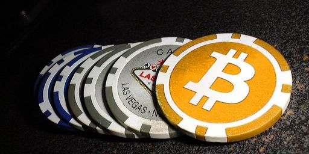
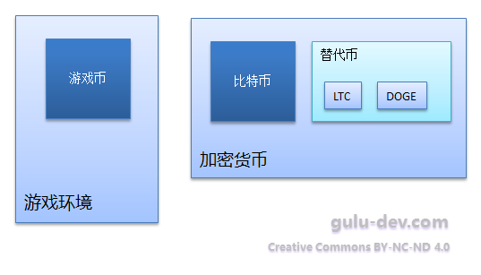
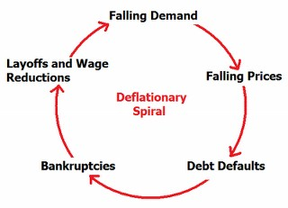
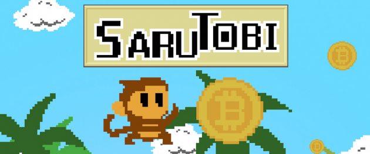
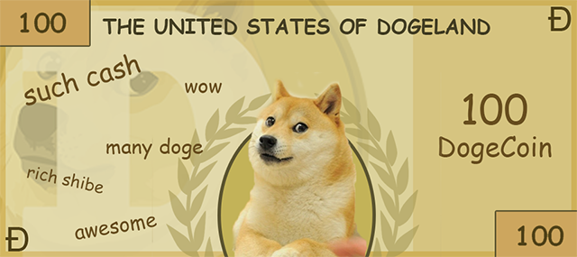
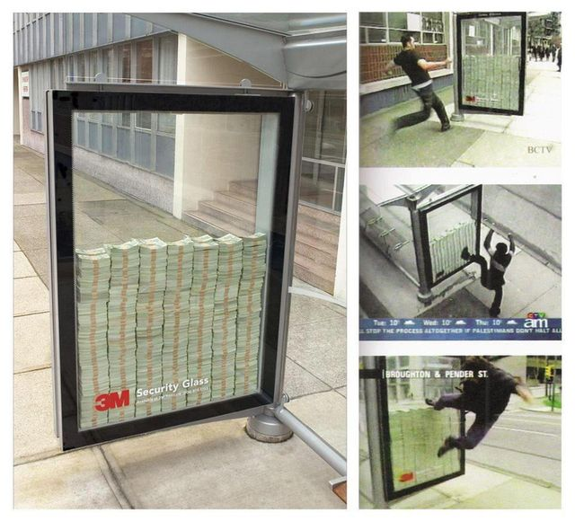
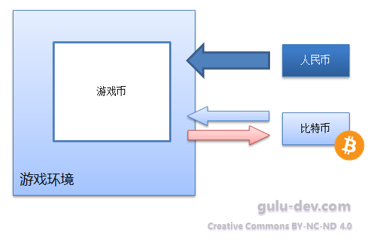
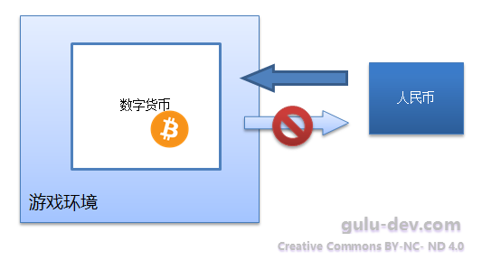
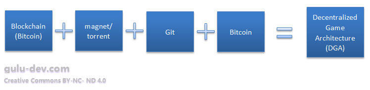

-------------------------------

-------------------------------

# 玩的就是资产! - 比特币与游戏货币体系

上个月在知乎上看到一个问题：

[如果使用电子加密貨幣來充當遊戲貨幣體系的一環，會對遊戲有什麽影響？](http://www.zhihu.com/question/27621853)

这个问题很有意思，当时我就随手点了关注。趁着春节假期还没结束，今天俺就写几段来抛砖引玉吧:) 如有偏颇之处，还请大牛指正。

这篇文章里，俺先探讨一下已经出现了的几个观点，然后再聊聊已有的游戏与比特币结合的各种情况，最后无责任地开几个脑洞，过年嘛，图个一乐:)

-------------------------------

    It's not about the money - it's about the game.
    - Wall Street: Money Never Sleeps

-------------------------------

## 预先的约定和探讨

### 约定

为了消除一些歧义和模糊，讨论前我们先做一些约定。也就是说本文提到前面的这些字眼的时候，实际上指代的是后面这一长串内容。

- **游戏币** - 为了实现网络游戏内的物品和价值流动，由开发商在游戏内发行的虚拟货币。
- **加密货币** - 电子货币的一种，特点是借助加密技术实现，发行和交易过程由算法定义和保证。 
- **比特币** - 目前应用最广泛的加密货币，由中本聪发明，特点主要是去中心化和匿名性。
- **替代币** - 为了某些特定需求或特性，依据比特币的参考实现，定制化后得到的一些特定版本。俗称“山寨币”。

他们之间的关系见下图：

-------------------------------

在已有的答案里，我看到了一些个值得一说的观点，这里先逐个探讨一下：

### 讨论：(观点1) 产出和产量的问题

**使用比特币做游戏货币，游戏公司没法控制产出和产量，“游戏内货币流通处于无法控制的局面”，这样能行得通吗？**

看到有不少同学纠结于控制权的问题，那么我们就先聊一下这个吧。

- 首先，对于拿加密货币来做游戏币的游戏，假如希望完全控制游戏内的货币产出和流通，是完全可能而且技术上并不复杂的。只需要发行一种针对该游戏特别定制的替代币就好了，比如魔兽世界可以定制一下比特币的代码，发行一种“魔兽币”，仅在魔兽世界的游戏内有效。有需要的话，游戏也可以提供与比特币的单向或双向兑换接口。
- 其次，假如直接使用比特币，也问题不大。原因有二：
    1. 游戏虽然无法直接发行货币(除非自己掏钱)，但可以产出各种虚拟资源(如能量，矿石等) 这些资源，根据其稀缺程度，也能被用来调整游戏内的流通情况。
    2. 需要明确的是，游戏内货币体系控制的关键在于控制**消耗**而非产出。怎么样通过消耗的差异性，去平衡不同消费能力的玩家的游戏体验，从而维持和保护整个系统的**相对**平衡，这才是最紧要的问题。实际流通的货币是由游戏机制(官方)产出，还是由外部世界注入，其实影响相对较小。
- 但是这也并不意味着全无问题，对于这后一种情况，游戏公司需要注意的是**外部币值大幅波动**带来的运营风险。如果币值短期内变化太剧烈，而系统又缺乏足够的弹性，就会导致玩家各种抱怨，比如同样的奖励前后价值不一的问题，伤害游戏体验的风险会很大。

-------------------------------

### 讨论：(观点2) 总量有限导致的通缩问题

**“很可能，最初的一个铜板可以买到一瓶可以回满血的小型体力药水，而后来100个金币也不能让我的血量回满...在比特币环境下，玩家打怪收益越来越少，怎么也爽不起来。数量有限性和通缩性质决定了这种货币无法应用于游戏。”**

这实际上是一个有意义的问题。由于比特币数量有限，游戏内的货币总量越大，交易越活跃，受众越广泛，其实际价格就越高，同样面额的一个单位就越值钱，相应的交易单位就越小。从比特币面世的这几年历史来看也的确如此，从第一次交易的“一万个比特币购买了一个25美元的披萨优惠券”，到后来的“0.13个比特币结算了一笔650元的餐费”，可以想见，如果价格持续上涨，迟早有一天得要 0.000025 BTC 这样的方式去交易。

这个通缩的问题，主要是由于产出的稀缺性和应用的广泛性的矛盾引起的。而且由于比特币的产量每四年减半，沉积在遗失或遗忘的私钥中的钱也会越积越多，然而(按照目前正常的节奏)应用却会越来越广泛，随着时间的推移，通缩问题会逐渐被放大。

那么通缩具体会带来什么问题呢？

    “通缩螺旋”
    （凯恩斯学派的经济学家们认为，物价持续下跌会让人们倾向于推迟消费，因为同样一块钱明天就能买到更多的东西。消费意愿的降低又进一步导致了需求萎缩、商品滞销，使物价变得更低，步入“通缩螺旋”的恶性循环。同样，通缩货币哪怕不存入银行本身也能升值（购买力越来越强），人们的投资意愿也会升高，社会生产也会陷入低迷。）

总得来说，通缩不单单是货币本身的事，是一个社会化的问题，从历史上看，急剧的通胀和通缩几乎总是很危险的。由于俺没有系统地学习经济学，这一点就不多嘴了。

-------------------------------

实践中看，由于大部分游戏的大部分时间里总是处于通胀状态(不少网络游戏到了后期钱甚至失去了一般等价物的意义)，适度的系统性通缩是有好处的。然而也可能会有下面的问题：

1. 首先是**技术可行性**的问题。虽说比特币理论上是可以任意拆分到最小单位—— 1 Satoshi，也就是 0.00000001 BTC，但实际上为了与价格波动相匹配，游戏内与货币挂钩的系统大多需要某种程度上的动态化，也就是**根据 btc 的实际价值动态调整数值**的能力。从工程角度讲，这非常显著地增加了系统的实现复杂度，而且并不是所有的游戏类型都适合动态化的。
2. 其次是玩家心理上的影响。玩家的游戏内财富总体趋势是积少成多的，但由于前面说的通缩，光看绝对值反而是越来越低的，感觉上可能会有点怪怪的（因为我们已经习惯了随着年复一年的通货膨胀，手上的钱的面额越来越大却越来越不值钱），而对这种心理上的不适，通过改单位 (如大家都换用 mBTC 或 μBTC) 也很难消除。嗯，大家可能会觉得谈玩家心理有点小题大做了，可是在游戏行业的体验让我明白，小看了玩家的直观感受对整体游戏体验的影响，是会吃大亏的，呵呵。

总得来说，缓慢的通缩不是坏事，而相对急剧的通缩也几乎总是可以采取一些措施去协调，要么可以**使用系统内非货币资源来刺激消费和流动**，要么可以在游戏内**实现一些风险各异的投资/投机渠道**，同时也可作为系统回收货币的一个途径。

-------------------------------

其他的几个问题相对浅显，俺也就不再一一细说了。接下来开始正面地回答原问题 :)

-------------------------------

## 网络游戏与数字货币的几种结合方式

### 第一种，小打小闹型的游戏类应用

所谓小打小闹，是从游戏规模角度来说的。有不少休闲类的游戏，尤其是在移动设备上，由于游戏本身就非常简单，游戏内实际上是没有流通的货币体系的。这类游戏里，加密货币可以用来充当纯粹的激励用途。比如前段时间在 iOS 上架的 [SaruTobi](https://itunes.apple.com/us/app/sarutobi/id932194840)，玩家在玩的同时，可以获得系统按某个规则零星分发的比特币，而系统用于激励玩家的比特币，则来自于游戏的广告收入和内购。

对这一类游戏，有一个适合小额支付的加密货币叫狗狗币(Dogecoin)，这个币的特点是确认速度快，单位非常小（按目前的价格一万狗狗币只值人民币9元左右），很适合用在这种单向的绝大部分都是小额交易的游戏环境里。

前两天还看到一个网站叫 [BTC Piñata](http://ownme.ipredator.se/) 很有意思，也可以算在俺说的这种现金激励型的分类里头。
这网站为了强调自己的安全性很强，把一个含有10个btc的钱包的私钥放在服务器上，宣称谁能攻破服务器就能拿到这笔奖励。很眼熟吧，是不是想起了下面这货？

看了这图的文件名我知道这玻璃为什么叫 3M Security Glass 了——因为里面放了 “3 Million Dollars”。

其实游戏内这样的手段可以更多，比如首杀得私钥什么的，呵呵。

### 第二种，允许使用比特币充值，游戏内仍保留自身的货币体系

这是最传统的模式（交易所模式），比特币仅仅作为法币的另一个替代品和支付手段存在。

这一种模式本身没什么好说的，要点在于是否允许把游戏币转回比特币，也就是提现。我的看法是完全封死，仅保留单向的输入，游戏乐趣会失去不少，而完全开放的话，对游戏本身的素质和安全性的要求又会高出很多，折衷的办法是可以允许每日限额提现，当日充值越多，或VIP等级越高，这个额度就会相应的高一些。系统也可以通过调整兑换汇率去调控。

另外，从政策角度看，国家现阶段对加密货币的定位主要是**“虚拟商品”**，因此转入转出本身不仅合法，而且是相对符合政策精神的。大家可能会觉得加密货币是具有一定风险的新鲜事物，而且又有一定的自由主义的精神，国家未必会在短期接受，但实际上的情况是政策的拟定者显然已经对加密货币有了相当深入的了解和评估，他们的评价总得来说是到位和中肯的，既具有一定的前瞻性和现实性，亦不失温和与理性。

    “算法货币只解决了信用问题，但如果没有适用经济需求的供给调节机制，就无法解决币值的波动问题，它可以成为金融产品，金融资产，却无法成为一个好的货币。但是，法定货币与私人货币的共存是人类社会的常态，数字形态的私人货币可与法定的电子货币共存。开源共享的分布式信息技术创造了信息的互联网，我们也可以用这个技术传递数字货币，低成本高效率地完成价值传递。”
    - 原央行副行长、现全国人大常委会常委、财经委副主任吴晓灵

    “以互联网公司为主的互联网清算体系逐步形成，阿里双12已冲击传统清算体系。当谈及超主权货币的探索时，王永利表示，如比特币，瑞波币这样的互联网货币体系有待验证，值得探讨，未来的货币发展趋势可能会是超主权虚拟货币。”
    - 中国银行原副行长王永利

### 第三种，直接使用数字货币作为游戏的流通货币，不再实现游戏专属的游戏币

**链上交易vs链下交易**

如果是刚刚说过的传统的交易所模式，除了充值以外，正常的游戏内活动通常是链下交易的。但链下交易由于资金都在服务器端，风险比较大。虽然一般来讲，这些资金是由官方离线储存在冷钱包里的，安全系数理论上比一般的游戏服务器上的数据要高。但不像法币有成熟的金融机构做依托，加密货币的所有安全都需要自行打理，一旦因为内部原因或社会工程的原因发生事故，后果不堪设想。

那么如果在游戏内采用链上交易呢，风险都转移到了客户端。由于与官方相比，玩家大部分是缺乏足够安全意识的，很容易造成私钥丢失或被盗。其实可以考虑官方送硬件钱包，这样虽然安全了，不过感觉麻烦一点，每次花钱还需要扫一扫。

**私钥的所有权问题**

这个问题天然的答案是每个玩家的私钥由该玩家自己所有。但是问题在于，不管私钥在物理上存储于服务器还是客户端，如果游戏宣称“私钥的所有权是玩家（通俗的说就是口袋里的钱是玩家自主支配的）”，那么理论上严格来讲，游戏的官方实际上是不能动用该私钥去签名的（也就是不能从玩家口袋里转移财富的）这样的话，跟传统的游戏货币相比，官方实际上失去了一部分控制能力，比如盗号销赃，利用bug刷钱等等，在传统游戏来讲，可以直接改数据库甚至全服回档，但如私钥的所有权是玩家，官方就无法这么直截了当了(但随时冻结/解冻问题应该不大)，因为（法理上）私有财产是不容侵犯的。

**是否使用定制的替代币**

使用定制的替代币是一个折衷，损失一部分与外界原生的流通性，来隔离和保护游戏内的各种机制，尽量少受外部市场的干扰。这个前面已经讨论过，就不再多说了。

-------------------------------

## 花式脑洞展览会

前面介绍的都是相对正统的应用，后面咱们放松一点，开几个脑洞乐一下吧 :)

### 游戏内的组织运作

这里咱们先介绍两个概念，然后再讲讲对游戏来说这两个概念意味着什么。

有一个跟比特币关系比较密切的术语叫做 DAC (Decentralized Autonomous Corporation 或 Distributed Autonomous Community) 直译过来叫做去中心化自主社团或分布式自治社区 (写着写着有种共产主义的感觉)。这种组织的关键在于它不依赖于某个个体的判断和决定 (因为人可能会过于主观，或独裁，或被收买)，而是依赖于某种公之于众的机制(或算法)来运作和做出选择（It can be thought of as a corporation run without any human involvement under the control of an incorruptible set of business rules.）。举两个俺认为比较符合 DAC 的例子吧，一个是互联网本身，一个是比特币的支付网络，当然它们也不算是严格意义上的社区。俺的理解是，理想中的 DAC 可以看做是开源运动(代码自主协作)，Wikipedia (知识自主协作)和众筹(财富自主协作)的增强版——当然现在大多数宣称自己是 DAC 的组织实际上仍有明确的主导者，正如 Linux 开源社区沐浴在 Linus 的光环下那样。说到这里俺想起来 Linus 曾在自传中提到过他之所以相信并选择了 Linux 的开源开发模式，不知道是不是受到了身为共产主义者的父亲的影响。呃，扯得有点远……

除了 DAC 外还有一个比特币专属概念叫多重签名 (multisig，也就是 “n-of-m”)，接触过比特币的同学可能大多都听说过。所谓多重签名，俺这里简单介绍一下，就是同样一笔交易，需要多个私钥的签名才会有效。举个例子，假定我们有 5 个人，每人有一把钥匙，而所有的钱都放在一个上了把锁的箱子里。当需要发生交易行为的时候，总是需要至少 3 个人的钥匙才能共同打开这把锁。这对于咱们刚说过的 DAC 来讲天然是一个好的用于“共同保管”和“纷争处理”的工具。

有了 DAC 和 multisig 的帮助，我们在游戏里能做的事儿可就多了。比如说玩家可以在游戏里找合伙人开公司，与参与者分红，或者发起众筹组团去刷 boss ，然后按地址发奖励等等。当然这些事情现在也都能做，只是原先必要的某些信任或交情，现在可以交给机制来保证了，并且所有的资金流动全部有据可查，降低了这些社会活动的门槛。

### 由玩家发行的自主货币

是的，正如在加密货币的领域已经发生的那样，自主发行货币不是啥难事。现在要去 GitHub 上 fork 比特币的代码下来，改成自己的山寨币，还需要一些程序方面的知识，即使这样，在 [coinmarketcap.com](http://coinmarketcap.com/) 上列出的山寨币都已经有近六百种了。以后随着行业的成熟，可以期待的是，发行新币比现在要简单的多，差不多就像给一个游戏做 MOD 那样。如果允许玩家发行货币，并可与游戏内的主体货币双向兑换，就是相对成熟和完整的体系了。可参考目前比特币和一众山寨币之间的关系。

    明朝有个很有趣的货币史记载：一名将军克扣军饷过重，在他的治下每名士兵只能领到300文等于1两银子的军饷；由于他的军队是附近地区最主要的采购者，于是在整个地区之内，铜钱和银两的兑换关系也都变成300文等于一两了。另外一个有趣的例子在明末的福建地区。福建地区原本使用嘉靖钱，兑换比例是3两=1000文；然后康熙朝建立统治之后发行了康熙钱，官方汇率是1两=1000文。为了满足当地人民存钱不贬值的需求，就出现了1嘉靖钱=3康熙钱的情况，并维持了十余年之久，当地人民甚至私自铸造明钱来满足交易的需求……在宋朝的笔记记载之中，更是指出，东京汴梁的每一个行业都有自己的交易贯，没有一个是足额的，各自分别用不同的数百枚钱币设定为一贯钱进行结算。这个贯就是一个自我调整的通货单位，有时以铜钱形式出现，有时以储藏的形式出现，有时又以记账的形式出现，十分多变。
                       -- 摘自 旗舰评论——战略航空军元帅的旗舰 
                          “构建通货：游戏世界的货币史——从流亡之路（Path of Exile）谈起”

如果游戏官方发行了一个定制版的加密货币，那么完全可以通过提供一些接口，来方便玩家在官方版本的基础上扩展出自己的货币(正如给魔兽世界做插件那样)。大家小时候都做过大富翁里的“银行家”吧，跟玩得好的小伙伴都曾有过一个“秘密市场”来交换小玩意儿吧，如果能在游戏里发行货币的话，就能玩出很多花样。上学的时候曾经用食堂的鸡腿换过同桌的作业抄，这下方便多了。

而且一旦降低了自主发行货币的门槛，反而会减少官方货币的复杂度和运作风险。一方面，一些奇奇怪怪的小需求就可以交给自主货币去实现了，另一方面，很多实验性的功能可以放在自主发行货币中去做，成熟了再合并回去，从这个角度来说，甚至可以允许发行一些一次性的为了处理某种特殊情况的货币，用过即焚。

### 去中心化的虚拟世界

好吧，这个脑洞开得更大了。大家知道现在的网络游戏基本上全是客户端/服务器架构的。很自然会有同学问，为什么没有 P2P (也就是不需要服务器) 的大型网络游戏呢？

#### P2P 游戏的困难和应对之道

这个问题细究起来实际上有很多原因，但其中最重要的问题，是 P2P 类的游戏缺乏**合法性认证 (authorization)** 的能力，通俗的说就是没法区分普通客户端和非法客户端。还有一个问题，就是如何保存每个玩家的游戏进度，完全去中心化的分布式存储是个相对复杂的问题，这个跟大家熟知的企业内的分布式存储是两码事。

其实，这两个问题本质上是一个问题，就是**唯一性**的问题，而比特币的区块链 (Blockchain) 技术，恰恰就是用来解决去中心化网络内的一致性问题的完美解决方案。下面我们分别来看这两个问题。

1. 反作弊这个问题，即使在有服务器辅助校验的情况下，都很难彻底解决。但是只要玩家的操作信息保留下来了，还是相对比较容易分辨其行为是否为非法的。我们可以周期性地把活跃用户的关键动作采集并打包成一次交易 (transaction) 提交到网络。这样每个玩家的关键操作均以交易形式保存在区块链上。当某个玩家被举报时，系统可以通过分析链上与该地址有关的所有历史操作，来确认该玩家的合法性，未通过合法性校验的玩家均会被系统以特定交易的形式标记到黑名单中。
2. 进度保存在传统的网络游戏中是通过服务器端的数据库来完成的。正如在前面的反作弊话题中提到的那样，我们完全可以以特定交易的形式把玩家的进度保存在链上。这样可能会有匿名性失效的风险，也就是通过给定的地址可以查到对应的玩家的进度。不过相应地，也可以通过地址池(同一个玩家同时维护大量有效地址)的技术来降低暴露的风险。而且正如普通交易的原则那样，每次交易总是使用一个新地址即可。

#### 数据同步和更新

为了丰富的游戏细节，完全去中心化的游戏同样也会是需要一个胖客户端的，可以使用 torrent 或 magnet 技术来实现这一点。通过在创世区块 (Genesis Block) 中包含官方客户端的 magnet 链接，我们可以保证同一个游戏的客户端总是衍生自同一个源。每次客户端的更新，都可以通过一个包含增量更新包的 magnet 链接的更新交易来实现。这样我们不仅保证了更新的唯一性，跟传统的网游更新相比，还通过区块链消除了可能存在的篡改客户端植入木马等风险。此外，用区块链作为游戏的唯一官方认证的历史记录，还有一些好玩的用途，比如可以写个扫描脚本，自动生成游戏世界的编年史，呵呵。

#### 非关键数据的本地化

前面我们提到玩家的进度可以保存在区块链上，然而有大量的数据很有价值却并非关键性数据 (如玩家的成就和邮件，也包括崩溃时的诊断信息等)，这一类不影响游戏公平性的数据，我们可以从玩家进度中剥离出来，用 Git 存在本地，这也减轻了区块链的负担。用 Git 的好处是，我们可以很方便地整合一些基础的 Git 命令在客户端里，不费太大力气就有了 p2p 的推送功能。对于开发人员或 GM，能够随时直接在游戏内 git pull 任意一个玩家的诊断信息，是非常非常方便和高效的。

#### 运营特点

在运营方面，基于 P2P 的游戏，与服务器客户端的结构相比，有很多显而易见的好处，比如省去了维护服务器硬件(或租云服务器)的成本，也不会因为服务器宕机导致全服游戏中断。充值内购都可以直接以普通交易的形式来实现，不再需要与渠道分成。

#### Decentralized Game Architecture (DGA)

把前面说的这些串起来，就是下面的这个等式：

好了，俺的手也敲累了，这次就先这样吧。喜欢这篇文章就到知乎上为[这个答案](http://www.zhihu.com/question/27621853/answer/40488719)点个赞吧 :)

(完)
Gu Lu
[2015-02-24]

-------------------------------

[2015-02-27] 补：谢谢[@长铗](http://weibo.com/changjia)君的[勉励](http://weibo.com/1232750075/C5VXljaz8)：

    “这篇文章是我见过的探讨游戏与数字货币结合的研究最深的，比如比特币作为游戏币，链上交易，玩家自行发行数字币，我想最现实的一个应用是，私钥绑定游戏用户账号，解决游戏开发商新游戏上线后难以找回种子用户的痛点。”

长铗君提到的很有趣的一点是**“私钥与用户而非特定的游戏绑定”**，也就是类似传统游戏中通行证的概念了。这个俺想了一下，比较直接的解决方案就是游戏厂商送硬件钱包，相当于招商银行一卡通，使用这张卡就能在该厂商的所有游戏里通存通兑。单一的私钥能定位到独立用户，每个新发行的游戏都生成一个对应的新地址，对账也很方便。

安全方面，每次使用时先验证手机上的6位数字令牌，再用硬件钱包上的私钥签名。这样的话，如果硬件钱包遗失，可以通过手机找回；如果手机遗失或被植木马，没有私钥也无法动用资金。除非手机和硬件钱包同时丢失，否则应该问题不大。

-------------------------------

## 修订历史

- 2015-02-24 原文发布链接：https://gulu-dev.com/post/2015-02-24-bitcoin-and-online-game-economics
- 2015-02-25 本文同时发于我在巴比特的[专栏](http://www.8btc.com/author/5666)，谢谢 [@巴比特资讯](http://weibo.com/8BTC) 帮助编辑。
- 2015-03-21 本文已授权 GameRes 发布在[游戏策划](http://www.gameres.com/327830.html)栏和[3月20日的公众号推送](https://mp.weixin.qq.com/s/DNN86AoELZa1247R1E8Iug)。
- 2015-02-27 本文遵循 [Creative Commons BY-NC-ND 4.0](http://creativecommons.org/licenses/by-nc-nd/4.0/) 许可协议。
- 2020-06-16 新增编号 `Bg-001-1502`，修整图片资源和链接，放入统一文档库

