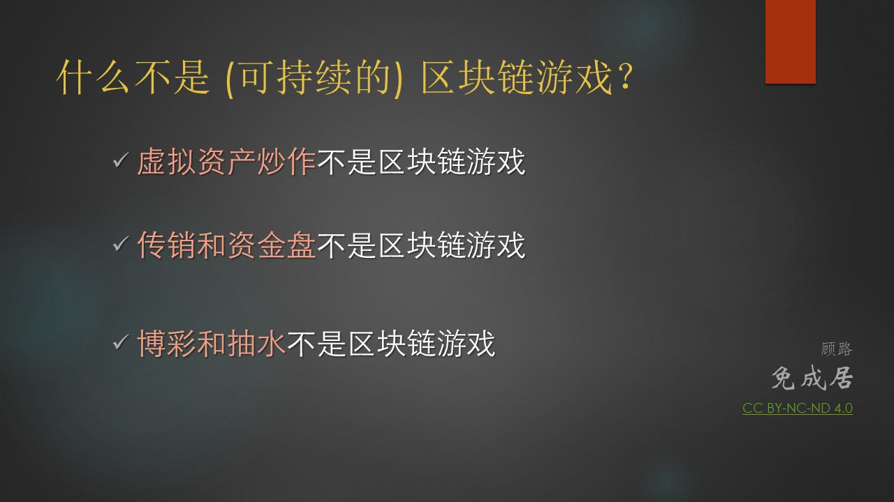
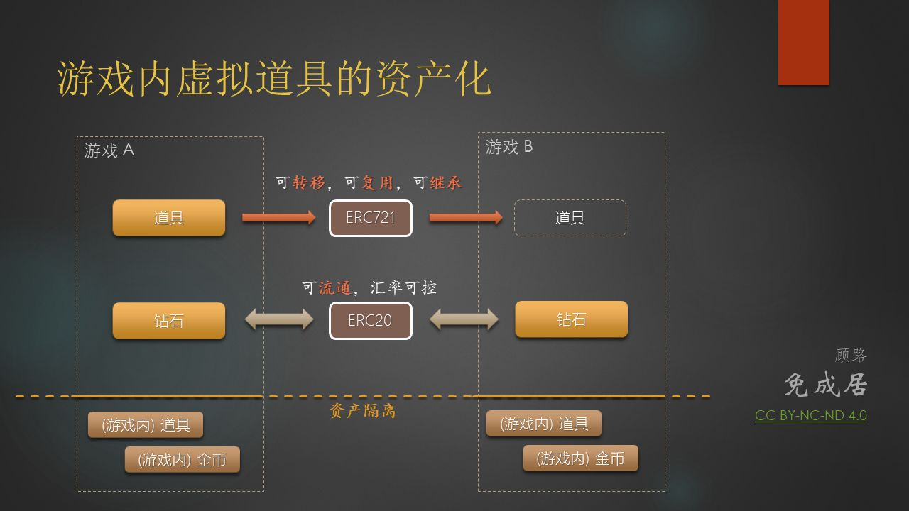
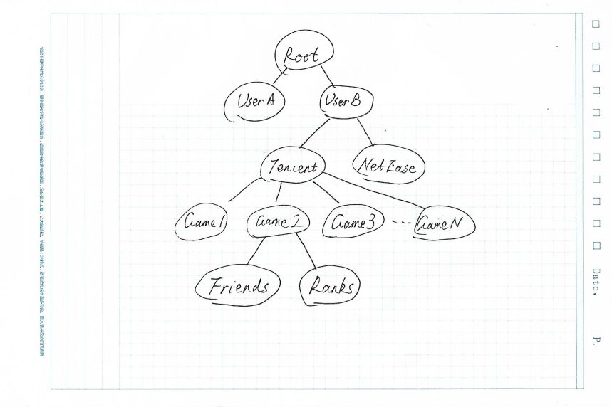

# 区块链与游戏结合的再思考

2015年2月份，我在知乎上回答了一个问题：[如果使用电子加密貨幣來充當遊戲貨幣體系的一環，會對遊戲有什麽影響？](https://www.zhihu.com/question/27621853/answer/40488719) 限于我本人当时的认识，那篇文章只是浅尝辄止了一下各种可能性。在文章的“花式脑洞展览会”一节，我设想了几种理想化场景，如更丰富和方便的玩家自治机制，玩家自主发行游戏内货币，甚至于完全的链上去中心化游戏的开发和运营，等等。这些设想和目标，以当时眼光看颇有调侃之意，然而相比4年前，现如今已经有了更好的基础设施，一些脑洞也逐渐地变得可能。

这一年中，我在区块链游戏上做了一些尝试和实践，也见证了链游在这一年间的激荡和起落。与4年前相比，区块链和游戏的结合这块，我也有了新的理解和认识。

---

## 什么不是区块链游戏？

在继续探讨之前，我想先来聊聊——**什么不是区块链游戏**。

且待我一一说来。

### 虚拟资产炒作不是区块链游戏

17年底，加密猫 (CryptoKitty) 火了一阵子。眼见一只虚拟猫咪卖出十二万美元的天价，不少人惊呼，区块链游戏的时代来了。但时间证明，这充其量只是一个典型得不能更典型的炒作泡沫。即使从投资和投机角度去看，也是一个空洞而单调的标的，跟游戏更是八杆子打不着的两回事。

这也难怪，电子游戏之所以长盛不衰，要么是赋予了人在虚拟环境中沉浸，探索和体验的机会；要么是构建了人与人之间的有效互动——缺乏**有效而持续的互动**，也就失去了构成游戏的最关键因素。

然而，从另一面看，自由市场和价格投机，的确是客观存在的强烈而持续的需求。那么是否可能建造一个游乐场，既能维系游戏内的长期而稳健的货币体系，又能提供足够的市场化机制来满足交易和投机的需求呢？

我认为，只要游戏的体量和尺度足够大，提供的特征和玩法与真实世界足够匹配，这种内外循环就是有可能实现的。如同《西部世界》和《头号玩家》，在这一类游戏中，玩家的感官体验有着接近真实的可信度，可使用的道具有着足够多样化的用途，这些趋近于现实世界的体验，最终会沉淀到虚拟道具的价值上。这些具有足够沉淀价值的虚拟道具，构筑了多轮博弈和长期交易的坚实基础，自然能维持长期交易之上的投机价值。

### [传]销和资金盘不是区块链游戏

从18年年中爆红的 fomo3d 开始，18年下半年和19年上半年，披着链游外皮的[传]销和资金盘似乎成了这个圈子里的主流。从一开始 fomo3d 对[传]销的改进（钥匙机制和终极激励）到后来某某链的各种模式，各路人马极尽所能，对传统的[传]销做了各种微创新，也部分地改善了这种庞氏骗局的健壮性。但事实证明，不管怎么改，这种强行植入的“共识”本质上极为脆弱，无论是黑客阻断交易顺利拿到大奖，还是某交易所砸盘+禁提币事件（交易所割项目方导致社区反弹），看似黑天鹅不断，实则都是失控边缘的偶然中的必然。套用一句话：“模式币的脆弱在于...所以如同风中蜡烛随便都可以倒掉，即便它曾经在历史给予的缝隙中精彩狂乱的表演，也很难避免最终坍塌的结果。”

简单说，对[传]销和资金盘而言，游戏的这一层薄薄的外壳**似有实无，不足为论**。即使不站在道德与法制的高地上批判，单纯从项目角度就足以看清，这类项目十有八九难以逃脱“过把瘾就死”的命运。普通参与者只记住一条即可：无论以任何理由**拉/让/劝**你买币的行为，都是[传]销，就可以了。

### 菠[博]菜[彩]和抽水不是区块链游戏

从最早的 SatoshiDice 开始，在区块链上“公平地摇骰子”，一直是一个经久不衰的应用。这里我们说菠菜和抽水不是区块链游戏，似乎有点矫枉过正了，毕竟斗地主和麻将也流行了多年，并（看起来）会一直流行下去不是吗。

抛开大部分国家对线上菠菜的强力监管不谈，这里单单讨论菠菜本身好了。千百年来，菠菜在无数次的多轮博弈下，早已形成了固定的套路。不要说古已有之的牌九或麻将，光说澳门的xx乐和xx机，这里面对概率和人性都有着千锤百炼的精妙平衡。不信你试试看，在不脱离已有的框架下，试着去发明一种规则和玩法。尝试下就会知道，规则上越是简单，越是有无尽的门道，越是难以去做所谓的“改进”，也越难发明新的有效玩法，这就是为什么你会看到 EOS 上摇了一年多骰子的上百种菠菜，到现在不管怎么改，都是还是离不开摇骰子的原因。

这是一个相对封闭的体系，创新是不被鼓励的。（好不容易设计了套能躺赚的体系，在可以预见的将来都会持续稳定盈利，没事干嘛要瞎折腾）简单说，菠菜只欢迎真金白银，不欢迎（或至少是不鼓励）（不能提升盈利能力的）创新，这与游戏及泛互联网行业求新求变，强调设计，快速变更，产品迭代的理念，是有内在冲突的。

---

## 对链上游戏的再思考

一口气说了这么多“什么不是链游”，那么有着真正区块链基因的下一代游戏，究竟应该长什么样呢？

### 虚拟道具的资产化和交易

先从我们熟知的虚拟道具（如屠龙宝刀）说起吧——利用类似 ERC721 这样的非同质代币机制，我们可以建立单个游戏角色/道具在链上的对应实体，更进一步，在链上映射任意规模的游戏内资产。

然而，目前支持ERC721资产类型的交易所不多，交易量也很低，跟 5173 这样的传统交易平台还远无法相提并论。究其原因，归根结底是技术问题，具体说有三点：

1. 游戏道具映射到ERC721资产，有一定的双向技术门槛，需要理解游戏架构，才能为特定资产类型设计出**既紧凑，又有足够灵活度与扩充空间**的属性集。
2. 交易所支持ERC721作为独立标的物（类似炒鞋app或拍卖行），提供完善出价/拍卖/成交的机制，与现有的交易对机制有较大的架构区别，实现上有一定的技术成本。
3. 实现特定的与资产流通相关联的游戏逻辑，需要游戏开发者理解链上资产的属性，并有一定的合约编写能力（比如，如何定义可消耗物品，如何实现道具合成，能否实现倒计时交易 countdown transaction，条件化交易 conditional transaction，等等）

这三点里，尤其重要而又要求较高是第三点。因为游戏并不仅仅是软件开发和功能实现，更是一个结合具体的玩家画像去做的持续化运营项目，而运营则需要足够的灵活度去配置各类活动。比如，假设本周五（2019-09-13）官方需要发一个中午 12:00-14:00 兑换月饼券的活动，就会需要在时间窗口内释放定量的游戏资产，以及相应的如何通过配置有效期，去引导二级市场流动性等问题。

---

### 非资产类数据重新由玩家所有和支配

上面我们讨论了游戏内的资产，而游戏内还有大量的非资产类数据，如玩家的分数/段位，成就/奖杯，任务，社交网络，等等，这些数据虽然不是可流通的资产，但对游戏的作用同样重要。对这一类数据，与区块链结合的价值在哪里呢？

通过类似 MetaNet 这样的协议，我们可以将游戏数据的所有权和支配权还给玩家。

在展开讨论前，可以先读一下这一篇：[歌单，用户数据和 Metanet](https://mp.weixin.qq.com/s/xzrc6tuWRmW65br8hqlh0Q)。

完整起见，这里我简单复述一下。现有的互联网上，所有用户的数据都围绕着单个互联网应用，不属于用户本人，而归创造这些应用的互联网公司所有。如你发过的朋友圈由微信所存储及掌管，难以导出。即使你能手动一条条导出，也会丢失评论和点赞等相关的数据。

关于互联网公司的隔离和信息孤岛效应，已经被越来越多的人所关注，而借助 metanet，可以做到在不影响商业公司数据访问权的前提下，让用户重新掌控自己的数据（正如掌控自己的币）。如果运用得当，这会带来惊人的能量释放。对于游戏而言，这种剧烈的能量甚至有望点燃新的希望之火~ 

想想 Minecraft (我的世界) 中无穷无尽的玩家作品吧，如何与玩家一起挖掘这些作品中沉淀的商业价值，是一个值得思考的问题。这一点可以独立展开，后续再探讨。

---

### 下一代（Next-Gen）游戏的形态

游戏行业，是互联网的各种相关产业里，喜欢把“**次世代**”挂在嘴上的行业，没有之一。多年以来，大型游戏，一直是计算机图形学和实时渲染技术的第一推动力。看看每年的 GDC 就知道，无论何时，游戏行业对下一代游戏形态，永远充满着热切的憧憬与渴望。

闲下来时，我偶尔会思考一个问题：**跟《头号玩家》所塑造的"绿洲"世界相比，我们目前这一代游戏，到底还差了什么？**

是逼真的渲染画面吗？

不太像。现有的顶级游戏画面，并不比你在电影中看到的虚拟世界差。过去两年中，已经有越来越多的商业电影使用游戏引擎制作，这意味着你在游戏里看到的渲染结果，在某些情况下，已经能与所谓的“电影级画质”相提并论。对画质去做改善的边际效应已经比较低，即使再逼真10倍，带来的临境感（Presence）也并不会提高太多。

是真实的 AI 或角色行为吗？

也许吧。但即使是再逼真的 AI 角色，也充其量只是增加了游戏的 Environmental Reality (环境真实感)，而这同样是边际效应递减的。

此话怎讲呢？不可否认，《头号玩家》里丰富而逼真的，最激烈最极致的体验，仍是来自于**玩家与玩家之间的对抗**。而《西部世界》里，NPC 也是因为具有了某种人的内核（所谓的“觉醒”）故事才开始变得引人入胜。

事实上，在变成所谓的“超智能体”前，不管 AI 做了什么大幅度的改进与优化，对玩家而言，大概率都跟现有的 NPC 没啥本质的不同。当你想完成任务的时候，不管你面对的是那个只会说一句“时间就是金钱，我的朋友”的地精 NPC，还是会撒娇卖萌的小爱同学，恐怕大概率都是瞅一眼任务目标和任务奖励就匆匆转身离去。而如果真正有了所谓的“超智能体”，那恐怕我们的生活本身就已经发生了翻天覆地的变化——搞不好我们自己都已经是 secondary species （次级物种）了都说不定。到那时，别说把人家做成游戏里的角色了，搞不好人家要把你当成 NPC 了～

这就是关于游戏 AI 的终极悖论：**小打小闹吧，你永远是个 NPC，玩真的吧，搞不好一不小心就玩脱了。**

------

说回上面的题目，我认为，跟《头号玩家》里的“绿洲”所营造出来的拟真游戏世界相比，当前世代的游戏所塑造的虚拟世界，最缺乏的，是**与现实世界互相融合的坚实可靠的价值基础**。

你不会真的把游戏里的金币（包括钻石）当成有价值的东西，对吧？

还记得《头号玩家》里大家在战场上厮杀时，都不忘捡起对方掉落的金币这一幕么，这个游戏中的行为是如此的自然，真实和可信，以至于跟你在微信里收到红包时的心理感受，没什么太大区别。在“绿洲”里，虚拟世界与真实世界的相互融合，为参与者提供了连贯且一致的价值传导。这个传导越可信，越即时，越顺畅，虚拟世界与真实世界的联系也就越紧密。

当你在游戏里斩杀了一条恶龙，与（在现实世界里）完成一场大师级钢琴演奏，踢了一场冠军联赛，可以获得相仿的价值回报时，虚拟和现实之间的墙才会被打破，两者的界限才会开始变得模糊。

那么问题来了，为什么是区块链技术（以及在此之上的 metanet 协议），而不是某个商业公司，能提供这种坚实的价值传导呢？这就回到了话题的开端——因为商业公司有足够的利益动机，阻断这种价值流通，把你留在他的产品里，排他性地为其贡献**你作为一个活跃用户**的数据和流量。

而在由区块链支撑的游戏世界里，通过 metanet 协议，我们得以重新让用户像掌控和支配自己的币那样，重新掌控自己的虚拟物品和个人游戏数据，而不是被游戏公司所左右（一旦停服，游戏里的一切都灰飞烟灭，从此长眠于某个不会再被访问的数据库压缩档案里）。只要你足够有耐心，甚至可以收藏一个上古游戏的初代角色，等游戏公司倒闭很多年之后，再去古董市场上出售，获得超额回报。

------

玩家真正意义上“拥有”并可以“处置”自己的虚拟物品及数据，会带来其他一些更为深远的影响——通过游戏来赚取财富或声望，将不再是某一小部分人的专利，而将成为现实人生规划和成就的一个很好的补充。正如去年已在美国西弗吉尼亚州实施的基于区块链的全民选举那样，区块链上的电子竞技，其影响力，规模，商业价值，也许会轻松超越真实世界的奥运会，极低成本地做到全民参赛并完成自动完税的奖励发放，这是真实世界里的结算系统所难以想象的。

区块链上的虚拟世界，才刚刚开始。

（全文完）

2019-09-11

- 永久链接：https://gulu-dev.com/post/2019/2019-09-11-blockchain-game-rethink
- 本文遵循 [Creative Commons BY-NC-ND 4.0 许可协议](http://creativecommons.org/licenses/by-nc-nd/4.0/)。
- 关于区块链+游戏，如果你有更好的想法，在留言区一起聊聊呗~ 也可以在公众号「**免成居**」与我互动。
- 2020-06-16 新增编号 `Bg-003-1909` 并入库

