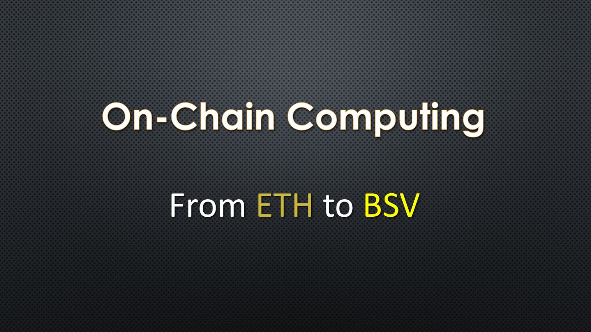

# (2019.07) 链上运算：从 ETH 到 BSV

## 简短说明

- 这是一篇较浅显的关于链上运算模型的文章，直接来源见：[Blockchain Computing on Ethereum and Bitcoin SV](https://www.yours.org/content/blockchain-computing-on-ethereum-and-bitcoin-sv-57371d4d5297)
- 本文**并非原文直译**，未免误导之嫌，请读原文为宜
- 本文 (出于个人需要) 若干处做了个人化的内容补充 (通常会标注 「GL-Note」)
- 本文提纲
    1. 链上运算模型 (ETH)
    2. 链上运算模型 (BSV)
    3. 新模型的关键点是什么？
    4. ETH 与 BSV 的模型对比
    5. (使用新模型) 构建去中心化超算
    6. 个人化的一些零碎的思考

----

## 1. 以太坊的链上运算模型

众所周知，以太坊设计目标是成为一台“世界计算机” (World Computer)，能够进行交易以外的运算。关于这一点，人们常这么去比喻——跟以太坊的计算能力相比，比特币就好像是个计算器，只有一些预定义的简单运算。

那么以太坊是如何实现链上通用计算的呢？

在以太坊上，人们使用 (不那么成熟的) Solidity 去实现计算逻辑，来保证与以太坊的共识相兼容。写好的代码通过一笔交易提交到链上，就成了一份所谓的“智能合约”。当这份合约被执行 (矿工将其写入区块) 时，所有的节点都需要执行并验证这份合约 (来确保有效性及一致性)。ETH 通过引入 Gas 来定义操作的运算量 (computing power) 与消耗费用 (fee) 之间的关系。

很明显，这个思路的扩展性是有限的。

- 整个网络的处理能力取决于网络中最弱的节点。 ( 「GL-Note」 此处存疑，没有验证能力或验证效率过低的节点实际上并不会影响到全网的整体推进)
- 整个区块链上堆积着主网上线之后所有的运算，任何新加入网络的节点都需要从头同步，并 (仅出于历史原因) 完整地执行所有这些运算。

以太坊的节点同步缓慢而且运算量巨大，全网的运算能力基本已达瓶颈，并且大大限制了可执行操作的范围。在这种情况下，不管是所谓“链上超算 (supercomputer onchain)” 还是 GB 级别的数据处理，目前看是不现实的。现有的方案有三： 1) 把复杂运算从合约挪到 DApps 的具体实现里，2) 寄望于 Plasma 这样的侧链， 3) 把操作及结果隐藏到状态通道 (State Channels, 类似闪电网络的支付通道) 里。

即使有这些问题，以“智能合约”方式实现的链上运算仍然成为了事实上的主流方式。一些后来的区块链尝试模仿并改进，如改用成熟编程语言，多链协作，其他的共识算法 (DPOS) 等等。 (「GL-Note」 在运算的同步执行这块，似无太大的变化)

----

## 2. BSV 的链上运算模型

跟以太坊“拿区块链当CPU用”不同的是，BSV 的思路更倾向于**把区块链当做一个数据库和操作系统**。 

在 _unwriter 于 Bitcoin Cash 上开发 BitDB 时，他应该是头一个“真正”把区块链当数据库用的。后来分叉时 _unwriter 选择了 BSV 的路线并留下了一篇有价值的 Blog：

- [The resolution of the Bitcoin Cash experiment](https://medium.com/@_unwriter/the-resolution-of-the-bitcoin-cash-experiment-52b86d8cd187)
- 【中】 (黄酥酥@微博) [深度解析比特币现金实验](https://weibo.com/ttarticle/p/show?id=2309404312035490985667) 

紧接着在 Craig Wright 发布了 Metanet 之后，_unwriter 发布了一系列相关的工具，这些工具所共通的设计基础，都是将区块链当做一个数据库和操作系统 (更进一步，当做某种意义上的互联网) 来使用。

----

- [BitDB](https://bitdb.network/) 去中心化数据库，将区块链写入 Mongodb，并让所有的操作更易于检索。
- [Genesis](https://genesis.bitdb.network/) 一个 BSV 专属的 bitdb 节点 (于2018年11月分叉后)
- [Babel](https://babel.bitdb.network/) 一个定制 bitdb 节点，只关心 OP_RETURN 内存储的数据，不关心典型的交易
- [Planaria（变形虫）](https://docs.planaria.network/#/) 一个更通用的 BitDB，支持自由定制规则，可以在链上存储和检索任意形态的数据
- [Bottle](https://bottle.bitdb.network/) **Bitcoin Browser** 一个定制 bitdb 节点，比特币浏览器（注意这是真正意义上的浏览器，不是 block explorer），使用 B:// 和 C:// 定位所有的资源，真正的 serverless，完全容纳于 Bitcoin Blockchain 的边界内。
- [BitCom](https://bitcom.bitdb.network/#/) **Bitcoin Computer** 仿 Unix 文件系统，使用 Bitquery 加载目录，方便定义二级应用程序协议
- [DataPay](https://github.com/unwriter/datapay) 轻量级 js 库，最简洁的发送带有数据的 tx 库，没有之一 (MoneyButton 和 Bitpay 都在用)。
- [Babel - A BitDB Node for Data-Only Bitcoin Applications](https://medium.com/@_unwriter/babel-230f73ed5dcb)
- (hqm@知乎) [Bitcoin SV的开发哲学——变形虫框架](https://zhuanlan.zhihu.com/p/62287840)
- (hqm@知乎) [BSV Planaria框架技术总结一 节点搭建](https://zhuanlan.zhihu.com/p/64697171)
- (hqm@知乎) [BSV Planaria框架技术总结二 Bitquery](https://zhuanlan.zhihu.com/p/64796784)

----

简单说，Planaria 可被用来 (以数据库的形式) 存储和检索，DataPay可被用来写入，BitCom 可被用来定义访问协议 (类似文档后缀名的作用)，Bottle 用来连接不同类型的数据和资源并展现到用户面前。 （「GL-Note」 连起来看，这已经是一个事实上成型的冯诺依曼架构了）

2019年1月份时 nChain 挖出的块中包含了一条 100KB `OP_RETURN` 的交易，从那时起，220 字节的限制被打破。几个小时之后，_unwriter 就发布了一个网站，以 serverless 网站的形态展示了 《爱丽丝梦游仙境》 中的一章。（「GL-Note」 这里得用 [ZeroNet](https://zeronet.io/) 杠一下，不过跟 [爱丽丝梦游比特仙境](https://alice.bitdb.network/) 相比，ZeroNet 只是套了个 Bitcoin+Torrent 的壳）

## 3. 新模型的关键点是什么？

从那时起，一种新的链上运算模型出现了。运算本身不在链上。只有指令 (类似一段脚本代码或一个程序库) 以“文件”形式在链上储存。

**区块链原来不是 CPU，而是文件系统。**

当用户执行一个链上运算时，实际上只是在本地运行需要的操作 (如在浏览器里执行一段 js 代码)。由于其他节点并不关心执行过程，对应的运算在链下执行，只有当产生有意义的结果时才上链，最终展现出来的成果，要么是一笔有意义的**交易** (以 tx 形式)，要么是一份有意义的**数据** (以 `OP_RETURN` 形式)。

利用这台超级计算机，可以使用 (链上已经存在的) 任意语言及任意库，不需要担心“合约”与共识的兼容，也不需要 (过分地) 担心容量和尺寸。**数据和脚本在链上，而运算在链下。** 这就是 ETH 和 BSV 在模型上的最大不同。

但这样一来人们很自然会问，如果所谓“区块链运算模型”都不发生在链上，那么这个模型的意义何在呢？如果关键的操作没有所有节点同步执行，谁来保证这个运算是有效，合法，且符合预期的？这相比老一套的数据库和互联网又有啥优势呢？

关键在于以下两点是不可变且已被认证的 (immutable and authentificated)：

1. 操作上链，保证了执行流程在需要时，可以随时被验证。(按需验证)
2. 结果上链，保证了执行结果在需要时，可以随时被验证。(按需验证)

「GL-Note」 不管代码是否开源，给定程序的执行流程和操作 (protocol/spec) 已经立此存照，全网见证；不管数据是否有加密，上链后就不会再被主动或被动地“丢失”。这两样都比自己维护一个服务器更健壮，成本也更低。

---------

「GL-Note」 拿游戏举个例子：

比如我现在写了个游戏，我把游戏的所有代码都上传到一个 tx (tx_sourcecode) 里。所有这个游戏的链上产出 tx_gamedata 都是跟 tx_sourcecode 关联的。矿工只是无脑地把 tx_sourcecode 和 tx_gamedata 提交上去（只要交够了矿工费）。注意：针对我这个游戏，矿工并不是利益攸关方，游戏是否盈利，对其并无直接的利害关系。而游戏运营方出于维护游戏的正常运营，则有强烈动机去运行从 source code -> game data 的运算。谁对这个行为有疑问，谁可以利用 tx_sourcecode 自己去运行逻辑验证。

跟朋友讨论时，朋友提到，即使同一份 lua 代码，在不同机器不同运行环境上都不尽相同，如何能保证结果是 verifiable 呢？ ETH 那里不会有这个问题，是因为需要当即对结果达成一致。

而我认为，这实际上不需要矿工来保证，因为他们不是利益相关方。游戏行为不一致，受损的是游戏厂商，矿工本质上是无所谓的，只要你给够交易费我就给你打包上链，并没有“验证所有逻辑一致性”这个义务 (就像矿工没有“验证所有链上的数据都是符合当地法律法规”的义务，同样的道理)。游戏和应用开发者才关心这一点。 而且进一步讲， lua/python 这类语言本身的设计目的就是尽可能在不同环境下尽可能给出一致的执行结果，如果做不到，自然会有更 well-define 的语言去填补这个需求。实际产品里，弄个受限的运行时(沙盒)应该就可以了。

---------

## 4. ETH 与 BSV 的模型对比

ETH 对于合约的强制链上执行，本质上是将“矿工验证交易”的过程通用化，并做了进一步扩展。客户端发起一笔 (与某个合约相关的) 交易，本质上相当于触发了一个全网执行的动作。

而 BSV 的路径截然不同。当一个网站以 severless 方式运行时，客户端可以随时去修改和操作某一部分数据，除了这部分数据作为结果保存到链上以外，其他不关心这个网站上的这部分数据的矿工和用户，基本是无感的。

ETH 的合约可以在满足特定情况时主动地创建交易，而 BSV 链上只有代码和结果，只能被动地接收用户发起的交易。（「GL-Note」 但实践中问题不大，只需要用 bitdb 去监听特定的事件并触发交易，也可以达到一样的效果。注意：这个监听及响应的代码逻辑同样也上链，所以同样是 verifiable 的）

这里原文顺带提了一下 BSV 日后的操作码恢复和扩展，及可能的图灵完备。这些等日后有了再谈吧，目前就不多说了。

----

## 5. (使用新模型) 构建去中心化超算

一个思维实验：我们现在打算构造两个超算，分别位于 ETH 和 BSV 上，它们上面需要跑一个 60MB 的程序，来计算 1GB 的气候数据。

先看看以太坊，

在以太坊上存 1GB 数据是比较困难的，这差不多是一个礼拜的数据量。把 60MB 的程序放上去会相对容易点，但也会需要脚本做不小的改动，用掉不少 Gas，而且可能会造成安全隐患。接着，考虑实际的运行，从运算能力角度讲，这样的计算量级可能会消耗大量的 Gas。

人们意识到，与其在以太坊上构造超算，不如构造一个链上的超算市场 (a marketplace for supercomputing) 更有意义，Golem 正是这么做的——用智能合约来满足去中心化算力交易 (supercomputer power) 的需求。 (「GL-Note」 与 NiceHash 相比除了更 General-Purpose 一点外，并无太大不同)

再来看 Bitcoin SV，

首先，1GB 算不上太大的数据量，Ryan X. Charles 就曾上传了 1.4GB 的图片。然后，是 60MB 的指令序列，二者都发到链上。这时候借助一个链上的交易网站，可以撮合提供计算能力的人和有需求的人。这样，区块链就成了一个共享的文件系统。

(「GL-Note」 这思路感觉有点绕弯了。实事求是地讲，从实践上看，更简单的做法是运营者直接用算力去支撑运算需求，然后卖服务，毕竟 SaaS 还是比 dex 门槛低不少的)

----

## 6. 个人化的一些零碎的思考

「GL-Note」 原文的最后一节是作者的一些杂感，我就不逐句照搬了。这一节是我另加的，是我在形成本文时的一些个人化的杂感。

上面对 ETH 和 BSV 做了不少的对比，这里我也来做一个对比。ETH 网络中，矿工，节点和其他参与者之间的关系是复杂的，没有良好定义的，整个网络**缺乏自发地向更好方向进化的能力**。而 BSV 的区块链网络中，矿工，服务提供者，服务参与者，他们从整个架构设计的角度讲，是良好定义的，从本质上都是可以**只**关心 self-interest 的。

展开来说一下吧。譬如矿工，所有的运营动机，只是单纯地为了从长远看不断提高自身利润率，至于运算，爱谁算谁算，我把你们的数据存到链上，只是我打包赚钱的一个天然副产品而已。再譬如服务提供者，把区块链当商品用，我付矿工费，得到公开账本+永不丢失的数据+透明可验证的舆论效果，这么一算，比去阿里云上租个服务器更省钱省事更划算 (初期可能简陋点，没有商业云上那么多工具，当然这都是机会)。再譬如服务使用者，比较区块链上的 Twetch 跟中心化的微博，简直不好比的好吧。删帖封号，更别提什么大数据侵犯隐私了。拿着私钥，自己对自己的数据有足够的掌控权。说句题外话，也许日后有一天，一个人的数据，也许比这个人本身更值钱。

我相信，关于链上运算的讨论只是刚刚开始。目前的现状其实很像 DOS 时代的 PC 产业， _unwriter 实现的一系列工具，正如 DOS 下，我们得以通过基本的手段，来朴素地控制 PC 的硬件资源。然而，从工具到操作系统，这种快速成长的可操作性，在当年反过来倒逼了硬件标准化，直至后来的只剩下 Win-tel，这里面有着深刻的历史必然性。同样的，区块链从无数不知所谓的创新项目，迅速收敛至最有扩展性，最有可操作性的链上，“书同文，车同轨”，才有机会活下来，创造更长远的价值，更深刻地改变人类社会。

----

「完」  
顾露 Gu Lu  
2019-07-07  

----

- 本文标题：[链上运算：从 ETH 到 BSV](https://gulu-dev.com/post/2019/2019-07-07-on-chain-computing-evolving-from-eth-to-bsv)
- 本文连接：[https://gulu-dev.com/post/2019/2019-07-07-on-chain-computing-evolving-from-eth-to-bsv](https://gulu-dev.com/post/2019/2019-07-07-on-chain-computing-evolving-from-eth-to-bsv)
- 2020-06-16 新增编号 `Bt-001-1907` 并入库

