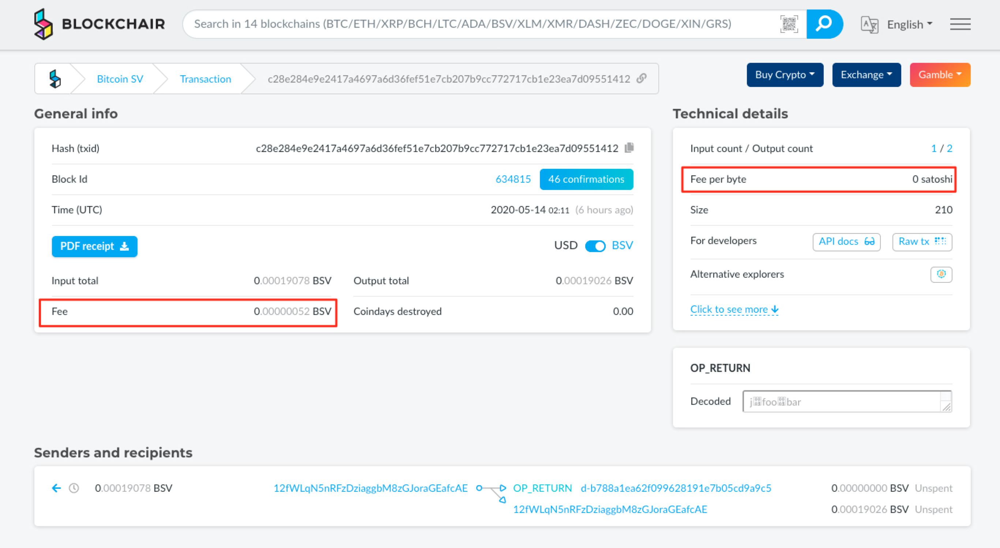

# (2020.05) Merchant API 与超低费率


前段时间矿池 TAAL 和 MemPool 开始支持 BitcoinSV 的 Merchant API，因为赶项目我还没来得及试用。今天趁着实验新项目里链上 NFT 装备的转移，我顺便试着用 Merchant API 来广播新的 NFT 交易。大概花了两柱香功夫，我从 MemPool 成功发出了[一笔手续费只有 52 聪的交易](https://blockchair.com/bitcoin-sv/transaction/c28e284e9e2417a4697a6d36fef51e7cb207b9cc772717cb1e23ea7d09551412)。（离传说中的 0 聪还远吗？）



---

**备注**

- bitsv 认为手续费不足，拦下了交易，被我强行拦下了它报的异常才把 tx 发出去 (本地 hack 了下，晚上推一个更稳妥的 Pull Request 过去)
- Blockchair 无法认出小于 1 sat/byte 的手续费，直接显示了 0 satoshi。
- 这笔交易被 unknown 而非 MemPool 打包，说明交易被 relay；且未知算力虽没有 Miner ID 但也支持超低费率

---

**结论**

- 仅仅矿池支持超低费率还不够，浏览器和工具等基础设施也需要跟上 
- 并不只是 TAAL 和 MemPool 支持超低费率 unknown 算力看起来也是友好的，至少也是与时俱进，有竞争力的

---

```
通过 Merchant-API 来推送交易和数据，小聪游戏（作为服务提供商）可以使自己关心的交易和数据在第一时间直抵（自己信赖的）矿池，并通过良好的行为在矿池处累积自己的信誉（声望值），从而有机会获取更大的长期折扣（本质上反映了信任成本和交易摩擦的降低）。

这有助于建立起双方（内环 miners 和中环 merchants）的纽带，整个网络向小世界模型更进一步。

—— 2020-04-17 日朋友圈
```

**参考**

- MemPool Merchant API 文档：[https://developers.dotwallet.com/dev/api/merchant](https://developers.dotwallet.com/dev/api/merchant)
- Fee Spec: Bitcoin SV 确定性手续费计算说明：[https://github.com/bitcoin-sv-specs/brfc-misc/tree/master/feespec](https://github.com/bitcoin-sv-specs/brfc-misc/tree/master/feespec)
- 一笔手续费只有 52 聪的交易：[https://blockchair.com/bitcoin-sv/transaction/c28e284e9e2417a4697a6d36fef51e7cb207b9cc772717cb1e23ea7d09551412](https://blockchair.com/bitcoin-sv/transaction/c28e284e9e2417a4697a6d36fef51e7cb207b9cc772717cb1e23ea7d09551412)

----------

（全文完）

- Gu Lu, 2020-05-14, 于免成居 (公众号：**免成居**) 
- 本文遵循 [Creative Commons BY-NC-ND 4.0 许可协议](http://creativecommons.org/licenses/by-nc-nd/4.0/)。
- 永久链接 [https://gulu-dev.com/post/2020/2020-05-14-merchant-api-and-fee](https://gulu-dev.com/post/2020/2020-05-14-merchant-api-and-fee)
- 2020-06-16 新增编号 `Bt-004-2005` 并入库
