两个月前，比特币协会 (Bitcoin Association) 与 nChain 联合举办了一次线上研讨会 (此 Webinar 全系列共 8 节讲座，链接见文末)，针对 BSV 的一些技术做了系统而深入的讲解。

### 研讨会概述 - 整体主题梳理

这次研讨会的内容全面而丰富，我简单按照主题列一下：

1. **节点技术** - Bitcoin SV 全节点相关的技术，包括安装，配置，基础架构，性能测试 (第 1/6 节)
2. **协议架构** - Bitcoin SV 分层网络，应用层协议，及商户接口 MAPI (第 2/3/4 节)
3. **可证公平** - Bitcoin SV 可证公平游戏 (第 5 节)
4. **门限签名** - Bitcoin SV 上的门限签名技术，及相应的 Nakasendo SDK (第 7/8 节)

很荣幸，我有机会成为讲师中的一员，参与了这 8 节课程中 "Bitcoin SV 应用层协议"(链接见文末) 这一节课程的讲解。

### 应用层协议 - 内容梳理

下面是讲稿的全部内容，共 26000 余字，略读全文需要 20-30 分钟。

由于全文较长，我将其整理为下面三个小节，并为每部分内容划分了小节，并添加了小节标题。

1. **协议栈的架构模型** (内容包括 Bitcoin SV 应用层协议栈与 TCP/IP 协议栈之间的模型与架构对比，及其演化及竞争的关系)
2. **应用层协议与实践** (汇总了 BSV 生态内活跃的绝大部分应用层协议，及对应的开发工具，以及对开发者而言，有价值的原则，技巧与实践)
3. **课后问答和释疑** (如何对不同协议做选择和取舍，协议的演化，等等，及我向 Jack Davies 请教时，Jack 对部分问题的进一步阐释) 

### 正文 (一) 整体介绍及大纲

(演讲正文由此处开始)

大家好，欢迎大家参与由比特币协会和 nChain 联合主办的 Bitcoin SV 系列线上研讨会，本活动于每周二及周四晚上 8:00~9:00 进行，为期一个月。我是顾露，是比元科技的创始人，也是 Bitcoin SV 上的应用 [小聪游戏](https://satoplay.com) 的开发者。


本期讲座的主题是 `**Bitcoin SV 应用层协议**`，内容包括了 **协议栈的架构模型** 和 **应用层协议与工具概览** ，也就是说包含了理论和实践这两个部分，主要面向对 “Bitcoin SV 应用层协议特性”，以及 “在 Bitcoin SV 上开发应用程序” 感兴趣的听众，也欢迎其他的开发者。

大家在听讲座的过程中，如果有任何问题可以在评论区提出，助教老师会进行问题收集，我也会在讲座结束后统一进行解答。最后希望各位保持课堂的秩序，在接下来的一个小时里有所收获。 

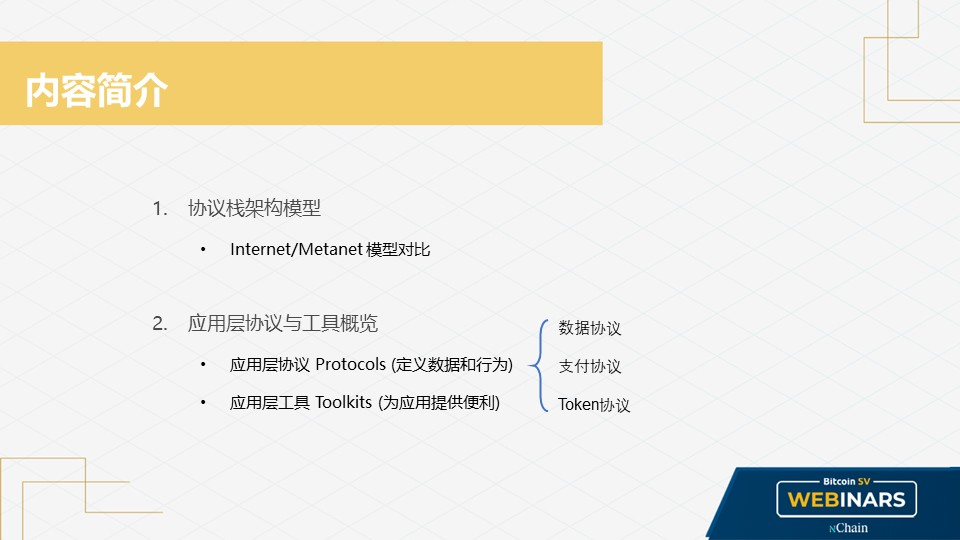

好，这里我们展开说一下今天的内容框架。 

在这里可以看到我们刚刚说的两个部分，一个是协议栈的架构模型，另一个是协议和工具概览。

那么在架构模型这一块，我们会对比应用层协议栈跟传统互联网的 TCP/IP 协议栈，做一个他们之间的模型和架构的对比，以及他们演化和竞争的关系。在协议和工具这块，我们会重点介绍各种协议 (protocols) 主要分为数据协议、支付协议和token协议，我们会逐一地讲到它们各自的特点。最后会介绍一下当前有哪些工具可供使用。

那么对开发者来说，我们这一讲既有协议架构的理论的知识，也有很多开发者他们针对自己的需求，定制各自的协议，及相应的探索实践，这样整体上来讲，可以作为开发应用时的一个比较全面的参考。 

### 正文 (二) 协议栈的架构模型

好，我们现在先一起来看一下传统的互联网抽象模型。目前已有的抽象模型有两个，一个是 OSI 模型，一个是 TCP/IP 模型。

#### 1. 传统互联网抽象模型 (TCP/IP)

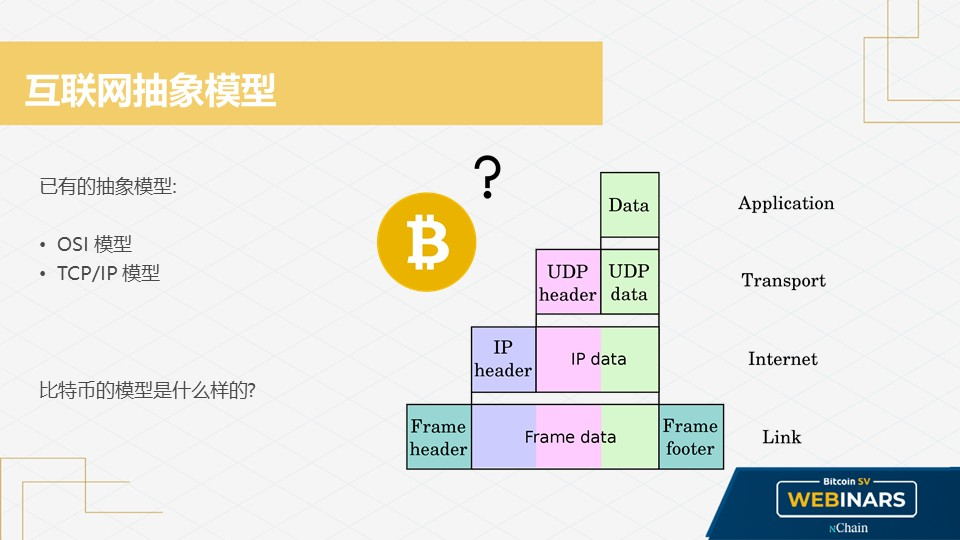

这两个模型我简单介绍一下，OSI 是上世纪70年代互联网形成早期的时候，定义的一个模型，这个模型相对比较繁琐，从最上面的应用层到最下面的硬件设施一共有7层，那么反过来 TCP/IP 协议就相对实用一些，他把 OSI 的7层协议简化成了4层，在右边就可以看到，我们看右边的图它是比较有特点的，从最上面的就是应用程序所在的层开始，那一层里面应用程序的数据，实际上只是他自己的数据，然后为了被传输，加了一个 UDP header，再往下一层为了 IP的寻址和路由，又加了 IP header，到最后硬件层，为了让它在设备之间可靠的传输，又加了数据帧的帧头，叫 frame header。 

那么我们的疑问是：bitcoin 的模型是什么样的？在传统的互联网抽象模型里边，bitcoin 应该在什么位置？ 

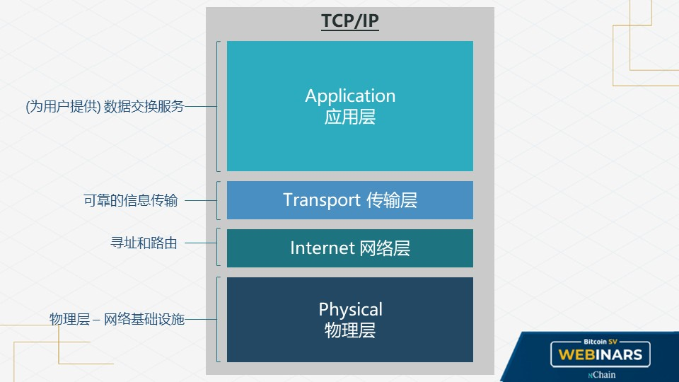

好，在回答刚才那个问题之前，我们先简单的把 TCP/IP 模型里面，每一层的上下文介绍一下，那么后续理解 bitcoin 网络模型的时候，就更方便一些。

我们从下往上一层一层地看，首先是物理层，这一层是网络的基础设施，数据链路层，主要是开放网络上的硬件设备以及这些设备之间的物理连接。然后到了网络层，这一层提供的功能是寻址和路由，也就是帮助不同的参与者找到自己的目标地址，他们所在的位置。网络层是IP协议实现的，我们知道现在互联网上 IPv4 的地址非常紧张，正在普及 IPv6，这个是大的背景。 

那么在这个之上是传输层。这一层为整个互联网提供了健壮可靠的消息传输，是基于TCP协议实现的。TCP协议通过损失了一部分效率，来保证消息传输的健壮和可靠。如果你想避免或者说减轻这一部分效率损失，可以用 UDP 协议。对大多数的互联网应用来说，TCP协议是他们构建其他协议的基础，比如说我们访问网站，浏览网页需要用到 HTTP/HTTPS，这些协议就工作在 TCP 上。

在最上面的应用层，这一层是直接面向用户的，通过无数的这种针对特定的具体的情况下面的协议，就可以帮助用户去实现各种各样的数据交换，来实现千差万别的数据服务。我们常见的云存储、视频直播、网络游戏、移动支付，这些都是应用层的服务，所以你看这个层，其实它比其他的层占的面积都大，这是应用层它丰富和复杂性的体现。 

那么我们简单介绍了一下这4层网络模型，给之后我们理解 bitcoin 的模型，提供一个对比和参照。 

#### 2. TCP/IP 与 OSI 的对比

好，在这之前我们先简单对比一下 TCP/IP 和 OSI。

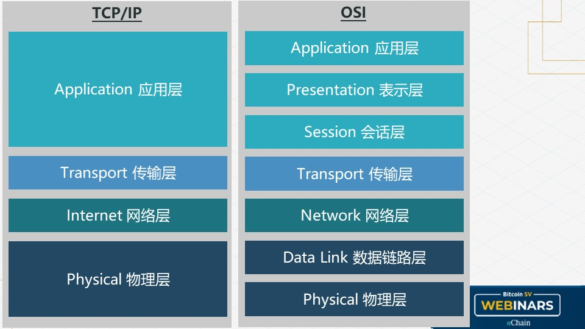

可以看到左边的应用层，在 OSI 里面，实际上是应用层，表示层和会话层，共三层。

这里我展开介绍一下，(右边第一项) 应用层里面，是各种应用层的协议，什么 HTTP、FTP 这些协议在 OSI 里也是属于应用层。 (右边第二项) 那表示层是什么？它实际上是各种不同的数据格式，比如说图片有 JPG、PNG 这种的，然后不同的算法，不同的加密方式，其实也是表示层的一部分，因为所有的这些数据，实际最终看起来是什么样子，实际上就是一种 presentation，是一种表示和呈现。 (右边第三项) Session 会话层。 会话层是对应到主机的进程里面，是本地主机跟远程的主机他们之间进行的会话，以及与会话相关的维护性工作。

那么除了应用层两者不一样之外，还有底下的物理层 (也不一样)。 在 TCP/IP 协议里面，底下的物理层在 OSI 模型里，实际上被拆成了两层，对应起来说，物理层实际上是跟物理设备直接相关的，是建立维护断开物理连接用的。数据链路是建立逻辑连接，去处理数据帧用的。(这两者) 一个是物理性的，一个是逻辑性的，总的来说就是它们的差别其实并不大。 

#### 3. MetaNet 模型 (整体演化)

好，那么讲了传统的模型了之后，我们来看一下 metanet 的抽象模型。

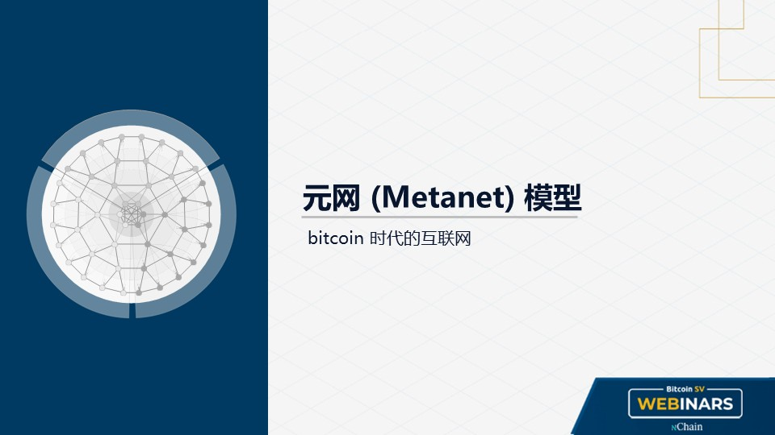

它需要支持各种不同类型的数据，就像传统互联网一样，有非常丰富的数据(处理和呈现能力)。而且我们会去讲解为什么会设计成这样，他是怎么工作的，从内到外去理解这个系统。

大家可以看到左边的图，为什么选左边这张图？它实际上是 bitcoin 的层次化网络，也就是所谓的 BLN (Bitcoin Layered Network) 这个层次化网络，因为时间关系，在这一讲里是不会展开，但是随着 Bitcoin SV 的发展，我们可以去观察和验证，看看真实世界里网络的发展会不会像图上这样去演化。

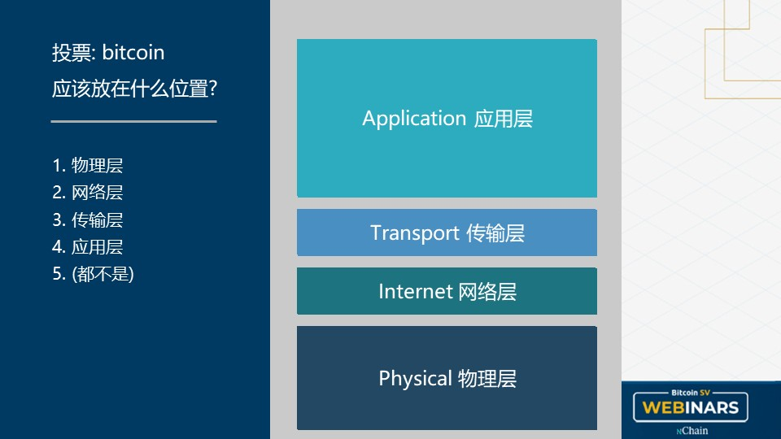

好，在开始讲之前我先问一下，作为开发者来讲，你觉得 bitcoin 应该是在哪一层？

有几个选项：物理层、网络层、传输层、应用层和“都不是”。

我在这里停留一点时间，大家可以思考一下。

这是一个很有趣的问题，因为这个问题实际上是开放的，目前来说没有一个严格意义上确定性的标准答案。 

接下来我们会解释一下，到目前为止 Bitcoin SV 的实现情况，以及未来在这个基础上，我们期望去实现的理想的情况。这样应该就能说明白， bitcoin 是怎么从根本机制上，去结合并驱动整个系统，在不同层面上去创新的。 

好，我们先回到传统的 TCP/IP 模型，从这里开始。

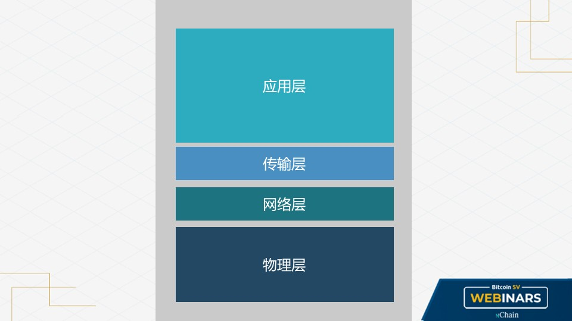

按照我们目前的情况来看，bitcoin 的具体位置是在应用层和传输层之间。

这是因为，往下看，bitcoin 需要通过下面的传输层 TCP 来实现数据的传递。TCP 协议是非常稳定的协议。往上看，越来越多的应用程序，开始利用 bitcoin 来提供服务。 bitcoin 所在的位置，目前来说实际上是一个 **承上启下的结合部的位置**。

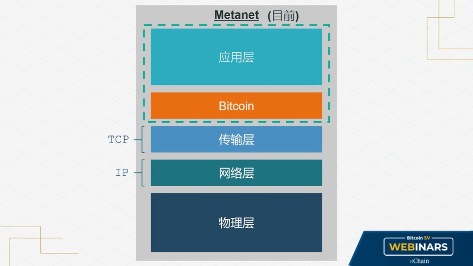

从目前的角度来看，bitcoin 也的确是互联网上的一个应用，这是目前真实情况的反映。确切的说，在应用层里面，bitcoin 是属于偏底层的一个基础性的服务性质的应用。 

但是如果仅仅把 bitcoin 和 metanet 看成是应用层的子集，从协议栈的角度来讲，它意义就是非常有限的了。

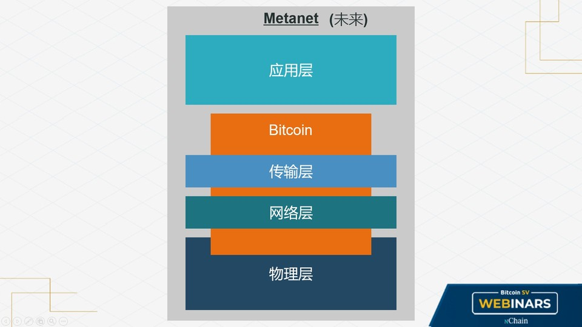

这里我们拿微信来打个比方，微信本来只是 App Store 里一个非常单纯的社交应用，但是因为它涉及面越来越广，后来就有了微信小程序，微信小游戏，慢慢的你会发现 App Store 可以被它蚕食，甚至是替代了。微信，从一个应用，慢慢地变成了一个操作系统，甚至以后有可能会变成一个终端。那么 bitcoin 也有可能会经历这样的过程。 

接下来5~10分钟里，我们会探讨一下 bitcoin 是如何影响，并且延伸到不同的层次，更进一步，在将来，整个 metanet， 也就是元网，这个模型是怎么样演化的。

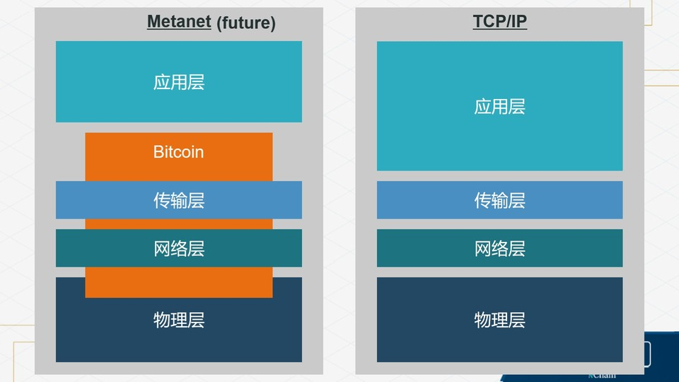

如果我们把 MetaNet 和 TCP 放到一块，对比来看的话，我们认为，bitcoin 会开始逐步渗透，透过传输层和网络层，直接到达下面的物理层。总的来说，这是由 bitcoin 作为一个经济系统，强大的经济激励模型来决定的。在TCP之外，bitcoin 不仅可以发展出独特的替代性的方案，而且对物理层也会有相当程度的影响。

举一个目前已经在发生的例子，10年前的中本聪，也只是推断网络里面会出现服务器集群，作为大型的专有设施来挖矿，但是后来很快就出现了专属的矿机，矿池，矿场，这些是跟算力直接相关的 POW 硬件，是很典型的基础设施。 

那么物理层这个基础设施，作为现实网络的承载层，很大程度上可以被传统互联网和元网共享。

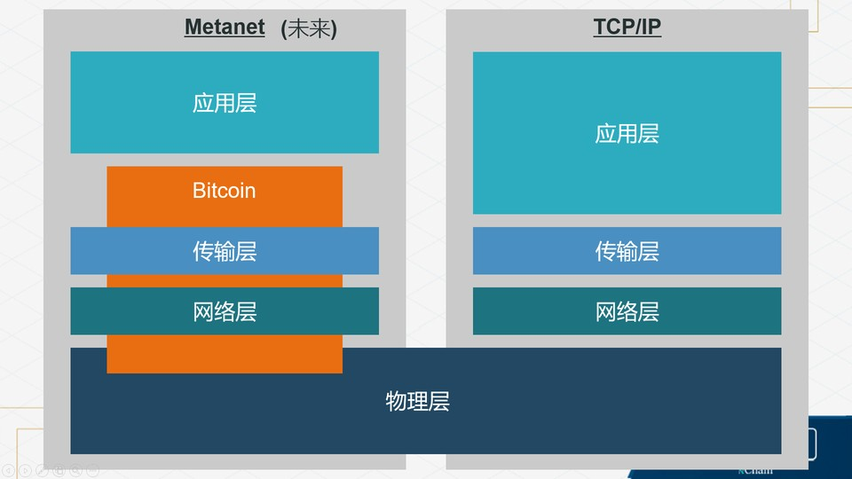

其实互联网一开始就是这样的，在90年代互联网发展的初期，那个时候互联网大量的复用了已有的电话网络。不知道大家还记不记得，我们那时候都是通过 modem 来拨号上网的。我记得那个时候上网，要是有电话拨进来，网络还会断线，网络被占用的时候，有时候还拨不进来。互联网其实是借助了当时已经普及的电话网络，走进了千家万户。我想如果 bitcoin 发展起来的话，元网实际上同样也会共享和复用已有的基础设施，这样来最大程度地借助已有的物理层来实现普及。

这里我们顺便说一下，这些物理设备，在实际使用上可能会非常不一样，这是元网的性质决定的。 

#### 4. MetaNet 模型 (对协议栈每一层的影响)

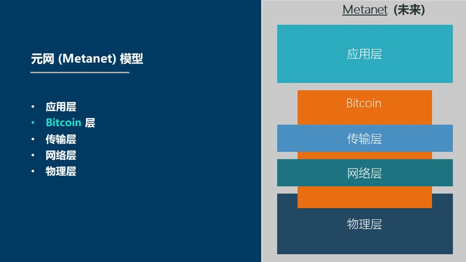

好，说完了整体上的大形状，接下来我们从最下面的物理层来讲起，向上挨个去分析每一层的具体情况。

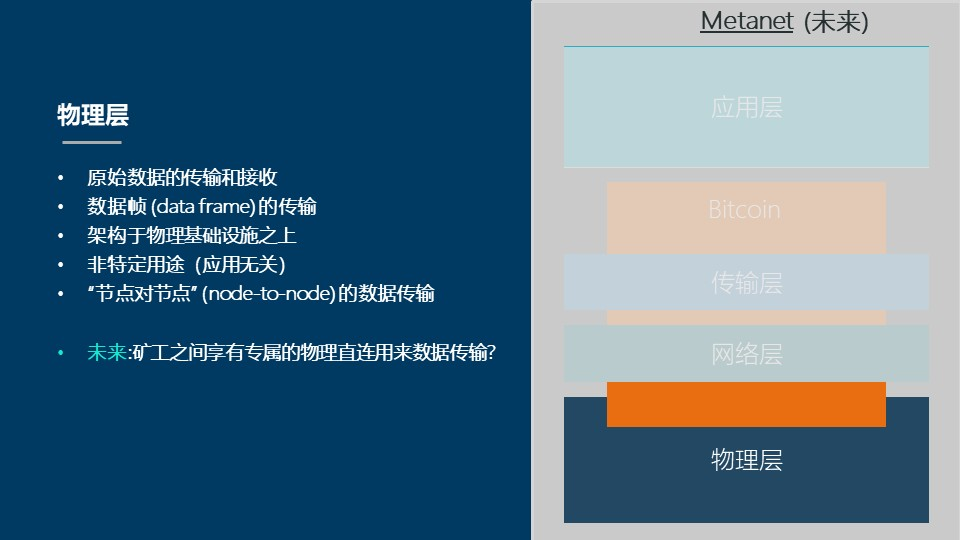

首先是物理层。现实网络中，物理层是对原始数据帧的接收和发送。这是一种很宽泛的封装，实际处理的是节点跟节点之间数据交换的行为。

为什么 bitcoin 会改变 TCP/IP 的物理基础这一层呢？ 

我们已经知道，矿工之间是通过专门的强化的通道连接，经济激励会让他们不断改进连接，不断改进相互沟通的效率，这样才能尽可能更快地去处理区块，获得更多的奖励，更有竞争力。

这种激励反过来会改变物理层的模型。举个例子，在挖矿的演变过程里面，挖矿产生的能源消耗本来非常大，但是由于有激励，有挖出的币来驱动，在真实世界里，会逐步转变为对绿色能源的利用，因为这样是最优解 (这些能源是所谓的 least-useful energy 效用最低的能源)。 

具体的说，本地的网络就会用专门的硬件设施去做更大更快更大吞吐量的本地路由，然后通过共同的广播机制去高效地广播到其他子区域，那么这也是 bitcoin 在未来改变整个TCP协议站的方式。

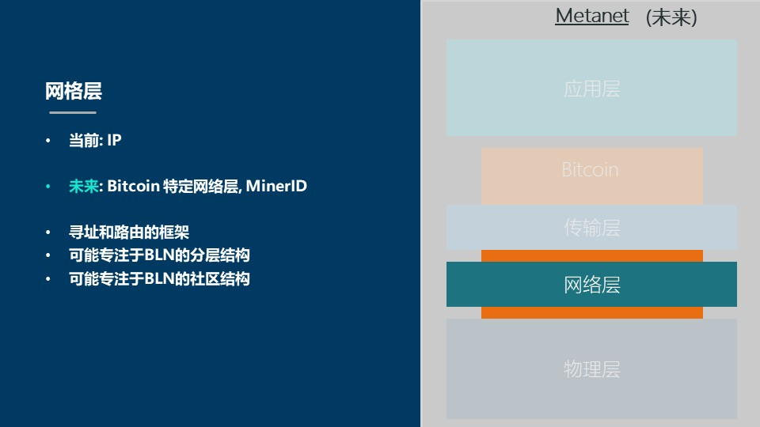

然后是网络层。当前网络层主要是基于 IP 协议的互联网协议。这一层是互联网的基础协议，经过多年的完善，实际上是非常牢固、非常可靠的。如果我们把 IP 协议看成是网络上不同部分的一种定位，寻址和路由的方式，那么比特币网络实际上提供了一种不同的方式。新的方式是建立在分层网络上，不同的层次会有不同的专门化的方案，通过 Miner ID 来互相识别和沟通，并建立相应的声誉 (reputation) 。 Minor ID 是矿工的一个标识，当你发起了跟特定事务相关的请求，很有可能你只关心核心的矿工网络上，那些提供特定服务的成员，比如说如果你拉取视频的话，是专门提供视频流的数据服务商。那么有的矿工（以及与他们关联的服务商）在你关心的这个事情上有特别的积累的声誉，它通常也能更好的处理你的请求，提供更有竞争力的服务。 

这种声誉，它独特之处在于，它有持续的 POW 也就是工作量证明来作为背书，与传统的可以刷，可以作弊的好评系统相比，这种声誉的累积是更可靠的，很有可能改变我们聚合，访问，反馈及评价的方式。 

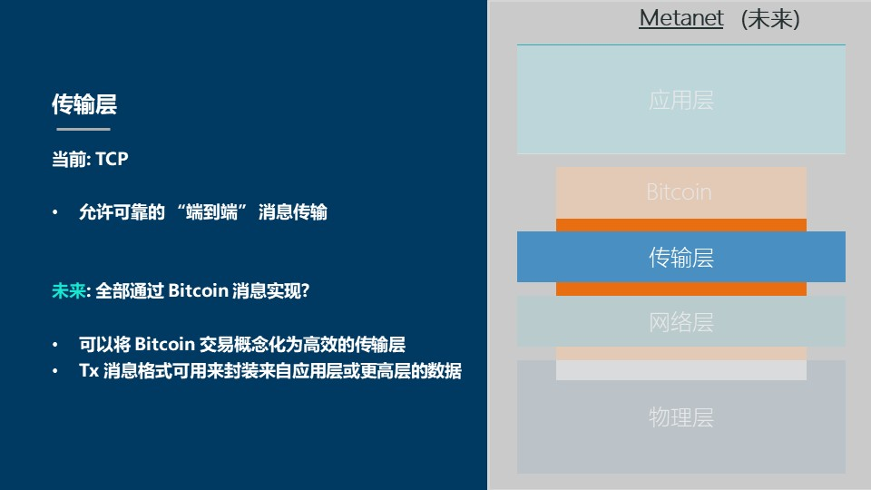

接下来是传输层。当前的传输层是 TCP/IP 来实现的，是主机之间可靠的端对端的传输。在这一层，我们可以把 tx 也就是交易，当成一种非常特别的消息格式，这样在传输层我们可以把我们关心的数据封装到特定的消息格式里面去，通过网络节点去传播，就像一笔典型的 tx 一样。这样的话，交易消息就是对应用数据的封装了，我们知道 bitcoin 的交易格式已经有10多年的历史了，已经被证明是非常可靠，而且非常紧凑。尤其是底层的专门硬件不断进化了之后，这种消息格式也会跟着一起进化，这样 tx 的处理也会变得更加高效。 

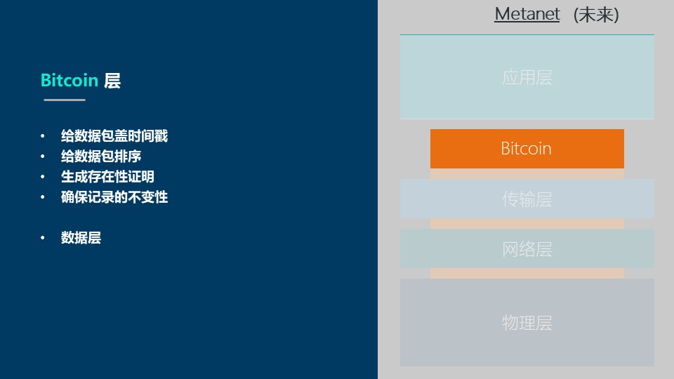

好，在传输层之上，我们可以看到 bitcoin 自己有专门的一层。之前我们一直在说 bitcoin 对其他层会产生影响，然而 bitcoin 作为独立的一层，它实际上对上面的应用层以及整个架构其实也是有着深远的影响的。

左边这些实际上是 bitcoin 能提供的功能，这些功能都是传统的 TCP/IP 协议里没有的。给数据包盖时间戳，是经由 POW 背书的时间戳，在时间戳的基础上，会产生一个天然的排序。这个特点非常有价值，也是目前互联网数据包所没有的。因为 bitcoin 作为一个时序无关的系统存在，他其实并不关心这个事件是什么时候发生，以什么顺序发生，只是非常忠实地，按照事件发生的顺序把它们坍塌为一个状态。

当然了，你可以手动地选择这些交易什么时候发生，通过你触发的时机。不过从整个系统的角度来讲，非常有价值的是，bitcoin 网络总是会按照单一的原始顺序，把所有的事件给逐个坍塌。这个特性影响会非常深远，作为对比，在传统的互联网协议站上，所有这些数据，他们发生的顺序是不确定的，它们在互联网上流动，被路由的顺序，从回溯的角度讲，也是不一定可靠的。

存在性证明，是往账本上去添加事件的时候，自动就会生成一个跟它相关的 Merkle 证明，这个证明非常有价值，这也是为什么 bitcoin 被概念化成独立的一层的最本质的原因，就是因为有存在性证明。

不知道大家是不是还记得第一页上的图，当应用层的数据被传输的时候，下面每一层都给这些数据追加一些额外的信息，而 bitcoin 这一层，追加的就是这些 Merkle Proof，也就是这些默克尔证明。那么这些证明用来确认，这些数据，在那个时候，是存在并且有效的。上面说的这几样，时间戳，顺序，存在性证明，他们之间是相互关联的，都能归结到这些默克尔证明上来。

这个不变性，最后一条，记录的不变性 (immutability) ，是 bitcoin 可以提供的最核心的特性。

互联网上的数据不变性非常重要，这种不变性，有能力确保，当一个事实发生了以后，数据历史是不可修改的。为很多事情能够提供线索，提供证据，是非常有价值的。

上面三个特性能导出不变性，这就使得所有的数据，在应用层下面，都能经过 bitcoin 层，以用户无感的方式，也就是用户不需要知道它存在，自动就 “可追溯，不可变” 了。

那么还有 (这一页左边最下面的) 数据层。bitcoin 本身其实是一个数据层，是一个非常通用的，可以处理各种不同类型数据的数据层，同样这也是在 TCP/IP 里面是没有的。 

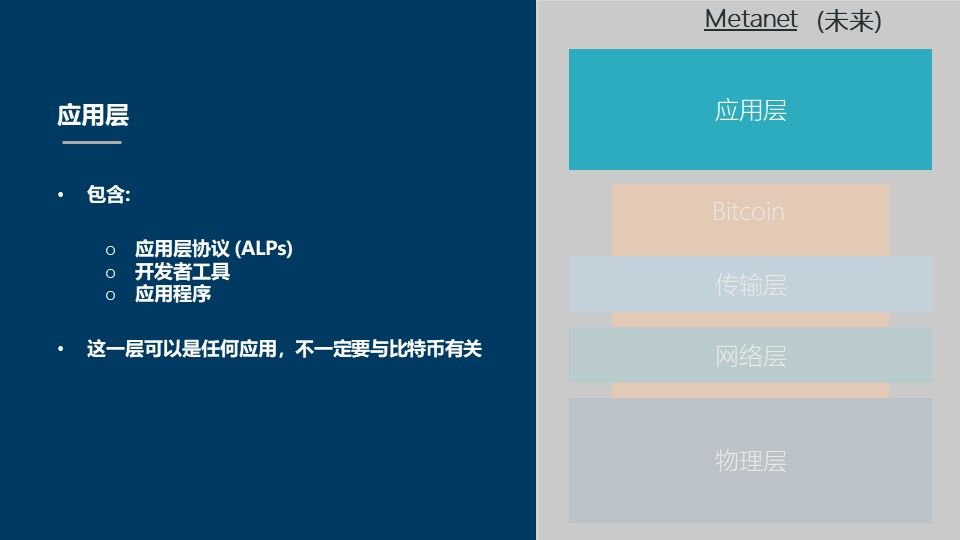

好，那么最上面的一层是应用层，这一层也是我们今天课程后半段的核心的内容。

应用层，它的特点是跟传统互联网是非常融合的，可以延用以前的方式去处理数据，展示数据。在应用层这一层的开发者，还是用他们之前熟悉的工具去处理和展示数据，用户也用他们熟悉的方式去接收和交互，不需要理解什么新的东西。那么这一层其实可以是 bitcoin 无关的，也就不一定要跟比特币有关，可以作为一个可选项，既可以由传统的互联网支撑，也可以由 bitcoin 层支撑。也就是说，bitcoin 提供的默克尔证明这些，都是附加的，不是必须的。 


说完了每一层的情况，我想回顾一下整体的情况。我们可以看到，随着发展，bitcoin 穿透了中间的传输层和网络层。这是不是说，有了新机制，老的就可以不要了？不是这样的，他们是各自发挥各自的作用。 

有人可能会问，不通过 TCP/IP 协议，那还怎么通信？

实际上这不是什么新鲜事，比如说我们熟悉的 GPS 就不是 TCP/IP 协议的对吧？我们的 GPS 设备上面有 GPS 芯片。再比如，我们拨一个电话号码，打个电话给别人，这个也不是通过 TCP/IP 协议去找到对方的。

我们认为，在未来 bitcoin 会发挥更大的作用，bitcoin
网络上也会有更大的价值转移。在这之后，会有专门化的网络逐步的出现。这个过程非常自然，就像矿机取代 CPU 挖矿那样，现在你已经看不到 CPU 挖矿了对吧。到那个时候，metanet 就会成为真正意义上的元网，互联网也会真成为真正意义上成为元网的子集。 

#### 5. 应用层概览 (ALPs)

好，这个是目前应用层的400个项目的列表。

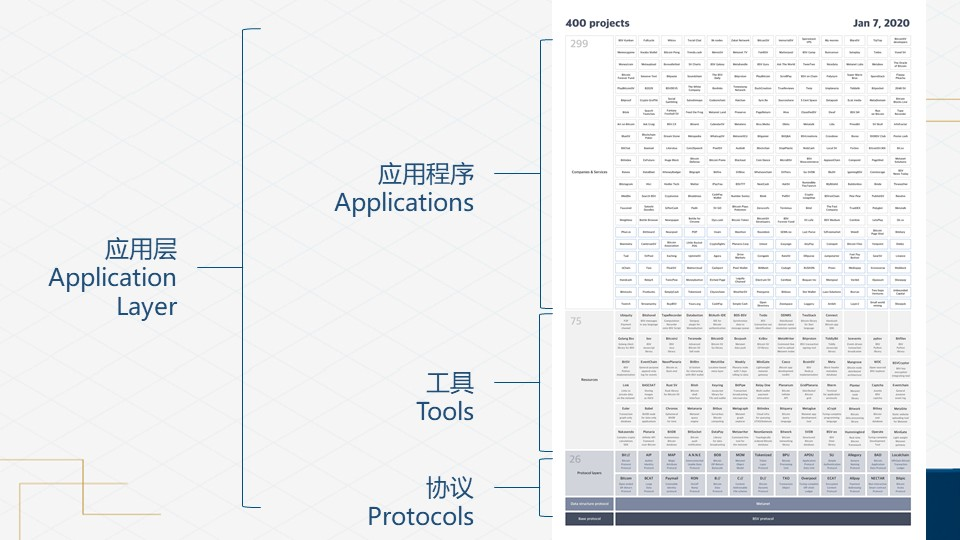

这个图其实是有点老的，最底下这个黑的可能看不太清楚，这个是 Bitcoin SV 协议；再往上一层，有一点点灰的是 MetaNet 的协议；然后再往上它分成三个部分，一个是协议层，一个是工具层，一个是应用程序层。那么每一层都对上面的一层提供支撑，应用是由工具来支撑的，工具是由协议来支撑的。 

今天我们不去讲具体的某一个应用，也不讲某一个工具，主要是在讲协议部分，以及这些协议对开发者写应用有哪些特定的帮助。

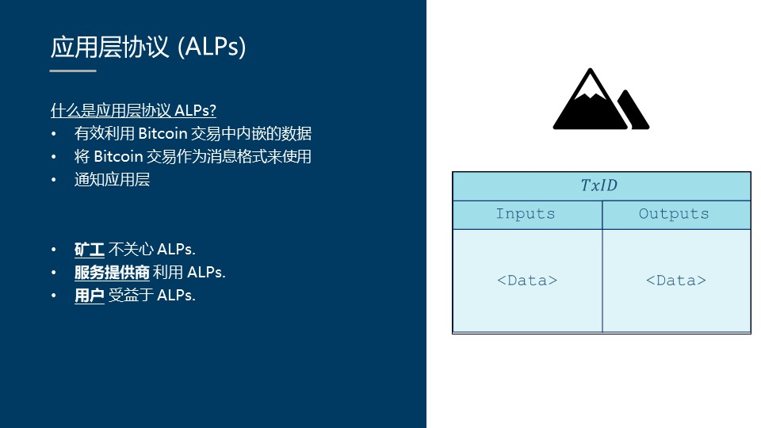

应用层协议。那么，什么是应用层协议呢？应用层协议需要满足下面的三个特征，第一个是有效的利用 bitcoin 交易里内嵌的数据，第二个是将 bitcoin 交易作为消息格式来使用。第三个是能够 (在必要的时候) 通知应用层。只要满足这三个特性的东西，我们才称之为应用层协议。这三个特性可以帮我们去标准化，怎么来使用 bitcoin 来组织应用层的数据，并且在合适的时候，去通知更高层的业务逻辑。

应用层协议对 (页面左边) 下面三个角色有什么影响呢？矿工和节点，他们通常是不关心这个协议的，他们更关注底层规则的执行情况。比如说，我们有大量的数据和行为，在 op_return 里，矿工对这些数据大部分时候是直接忽略的。服务提供商会考虑现成的协议，或者在没有合适的协议可用时，制定他们自己的协议，而用户则从成熟的协议里面获益，他们会用脚投票，去决定哪个协议能活得更长一点。 

举个例子，微软刚出 Win95 的时候，OpenGL 作为图形学的标准已经发展很多年了，是非常成熟的协议。微软自己弄了一个 DirectX，花了大量的成本，做了好多年，还是被各种吐槽。这种吐槽到了这样的地步，就是用户装了一个游戏以后，总是第一时间切到 OpenGL，有的游戏只支持 OpenGL。但微软比较厉害的就是，它不计成本不断投入，一直反复改进 DX，一直到 DX7 的时候，量变引起质变，然后 DX8 的时候，基本上就统治了图形渲染这一块，从那时候起，协议的战争就结束了。

那么，从这个故事你也可以看到，协议的演化是有多方参与的，不同人关心的东西不一样，到最后会有一个比较厉害的胜出。 

#### 6. 简易支付验证(SPV) & 可追踪证据链

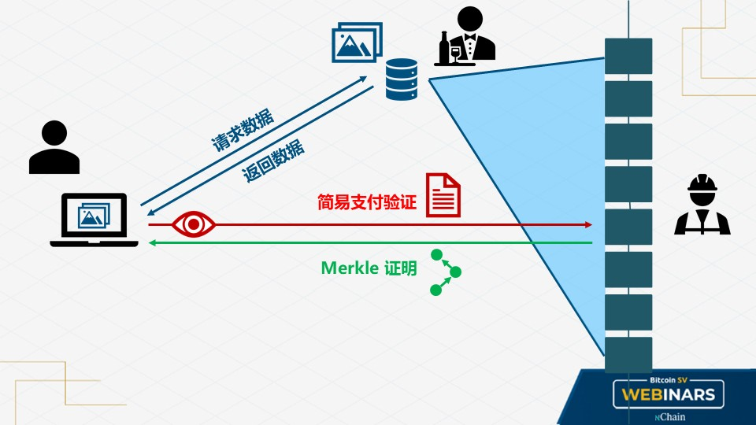

好，现在我们来看一看用户数据提供商和矿工他们之间是什么关系？那么服务提供商相当于是像 Twetch 这样的微博应用，他们一方面利用应用层协议去把数据从链上给过滤出来处理，并且把区块里那些非常紧凑的数据转换成服务可以直接用的形式，这个过程实际上是一个数据展开的过程。另一方面，用户发起请求的时候，就把准备好的数据用更方便更可读的方式返回给用户。 

那么对于用户来说，他们随时拥有去链上直接验证数据有效性的能力。你看就是这样，利用 SPV，就是简易支付验证，来链上直接查看自己关心的数据的默克尔证明。 

SPV 服务实际上对数据提供商和用户都是有用的。

我们拿微信支付来做个比方，微信相当于是矿工，也就是基础服务层。那么你扫了披萨店的二维码来付款的时候，披萨店处理之后，告诉你付款收到，并且在卡包里给你增加了一些积分优惠券，这一类东西。这个时候，如果你不放心的话，你可以自行去微信钱包里查看余额，去卡包里查看你的优惠券。 然而有一点不一样的是，传统互联网应用里面，上面说的这种消费记录，积分的变化都是微信在打理，比如说他决定只允许你查6个月之内的，你就只能查6个月之内的。也就是说，核心的业务数据都在微信里，用户和商户其实是很被动的。但是在 bitcoin 的协议栈里面，所有的数据是天然可以有明确的所有权定义和访问的授权的。这个是从本质上优于传统的互联网的。

我们知道传统互联网上数据来来去去，转瞬即逝，如果商业公司不保存，不提供，或者是因为时间久远不可访问，或者甚至它直接淘汰掉服务的话，这些数据实际上是无迹可循。那 bitcoin 作用就是为所有的这些关键的事件，提供一条可以追踪的证据链。 我们叫它 a trail of evidence，可追踪的证据链。 

### 正文 (三) 应用层协议与实践

好，现在我们进入今天的下半段就是应用层协议，它实际上分为数据协议、支付协议和 Token 协议。 

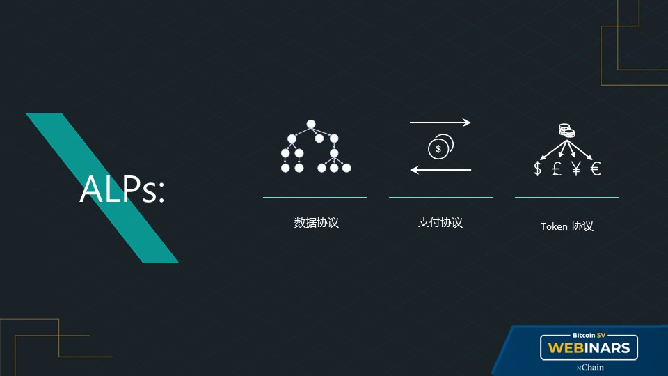

我们一个一个来看，首先是数据协议。

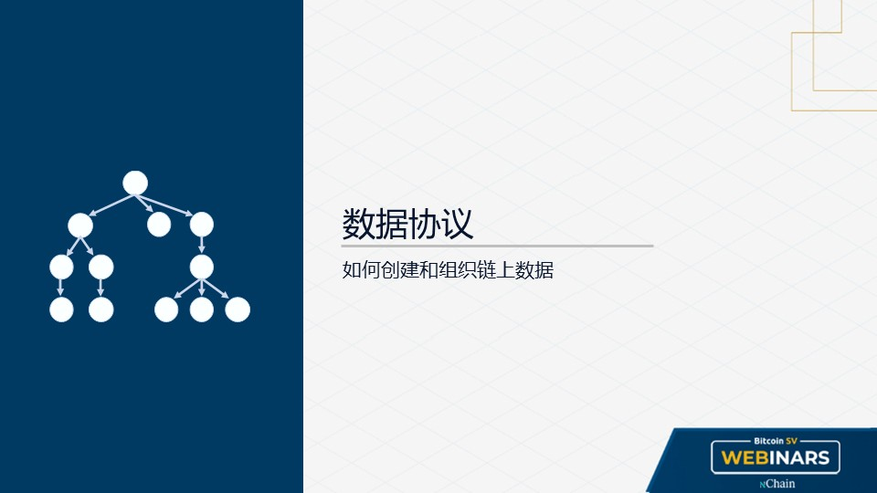

这个数据协议，是关于怎么去创建和组织区块链上的数据的。

#### 1. B协议 / B-CAT - 文件及流媒体

好，最简单的是 b-protocol，就是 B 协议。

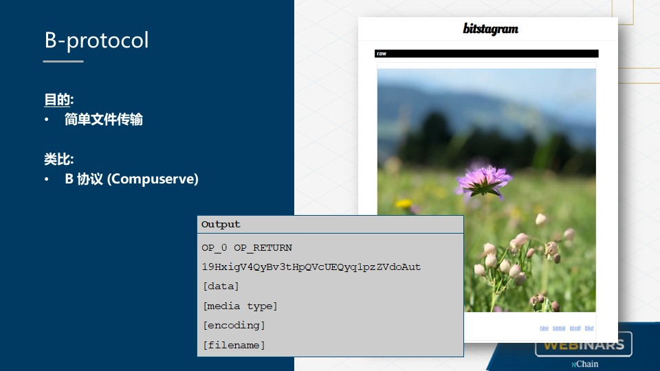

B 协议是什么意思？它支持把一个文件上传到区块链上。

可以看到，下面是一个例子。我们把有紫色小花的这幅图，上传到区块链的1个 op return 里面。你可以看到它分成4个部分，data，media type，encoding，file name，分别是数据、类型、编码和文件名。这实际上是跟传统互联网上的 B 协议非常像，这个是 unwriter 在早期实现的，这也是最快的把文件放到区块链上的方式。 

实际的应用层，就是实际向用户提供服务的网页去取数据的时候，其实是可以做到 bitcoin 无感的，也就是说，你的数据，想在任何一个时间点上把它全部迁移到链上，都可以，是否在链上其实也不应该影响到实际的访问。读取出来后，其实对用户来说是个熟悉的界面，他也不是那么关心，你这个数据是不是真的在链上。随着网络承载能力的提升，传上去的文件可以越来越大，一开始是KB级别，很快，就可以到 MB 级别。也就是说，我们实际生活当中用到的大多数文件，理论上都是可以放到链上的。 

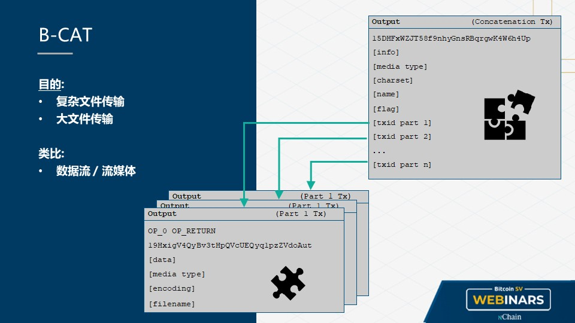

好。在 B 协议的基础上更进一步，我们有 B-CAT 协议。B-CAT 协议实际上是连续的多个块。同一个文件，如果太大，你不想把它放在一个 tx 里，那么你可以把它用连续的多个 tx 连接起来，本质上是同一个文件的多段存放。不仅仅是因为“大”而拆分，也有可能是因为，这个文件是连续的，有可能在你播放的时候，这个文件还没出来，比如说像一些视频直播，每分每秒都有可能会产生新的tx，所以我们叫它cat，是一个流媒体的形式。下面的类比你可以看到 b-cat 可以用来做数据流，可以用来做直播这一类的流媒体。

(动画示意) 这是一个例子。 多个 output 实际上是一个文件的多个不同部分。那么在最终有一个 concatenation tx，在这个里面，我们把文件的多个部分，就是可以看到图中第一部分，第二部分一直到第n部分，使用他们所有的 txid 拼成了同一个文件。 

#### 2. D协议 - 动态可变内容

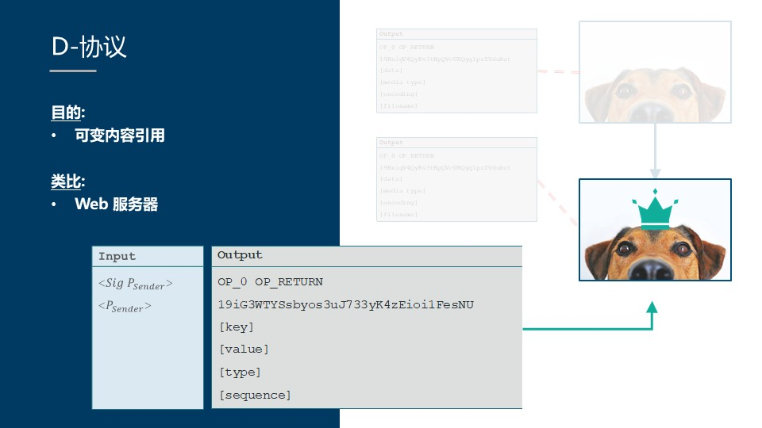

好，跟刚才的 B 协议不一样的是，D 协议实际上针对的是可变的内容。那么对同一份内容，比如说右边的狗狗，我们可以支持修改图片，给它加一个皇冠。那么会产生一个引用，总是指向最新的内容，这里的 d 实际上是 dynamic 的意思，就像 DHTML 一样。我们可以看到，原始的小狗图片是一笔交易，然后我们修改了这个图片以后，是另一个交易。那么通过一个协议，对于原始数据和变化后的数据，我们可以保持一个单一的引用，利用它的先后顺序，总是找到最新的引用。 

在这个基础上，我们还可以给 D 协议里边的内容，给他们添加kv值，产生KV值的关联。你可以看到，在最下面的这笔交易里面，通过一个key和value来指定把哪些数据附加到这个图上去，比如说他可以设定一个新的 key 为 name，然后指定 value 为小明，只有图片的主人才能来做关联，那么这个是数据所有权的天然体现。 

#### 3. BOB 协议 - 多协议组合

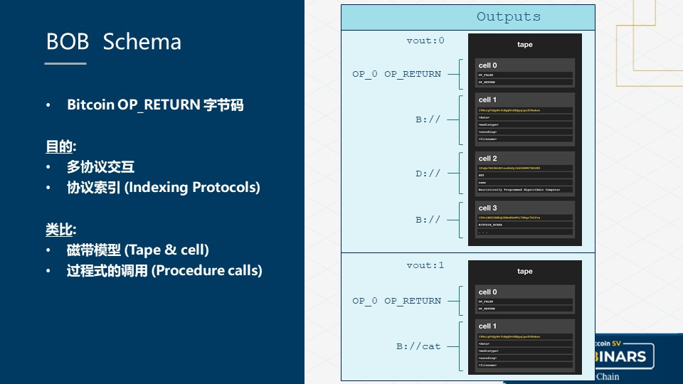

好的，BOB，这是一个更复杂的协议。BOB Schema，它实际上是一个多个协议的组合。 

有的时候我们的应用程序需要更复杂的数据组织形式，并且希望在复杂的协议之间交互，就用的上这个了。 

你可以看到这里有一个 tape，它这个 tape 就是磁带的概念。它是多个协议的线性排列，每个协议的数据块都是里面独立的单元。你可以看到这里有cell 0, cell 1, cell 2，它是分别是不同的协议，每个 cell 有一个独立的操作，比如说第一个 cell 里面存了 op_return，然后第二个 cell (也就是 cell 1)，里面存了 B 协议，cell 2 存了 D 协议，cell 3 存了 B 协议，等等。那么这是其中的一个输出，另一个输出里面也是一样，也可以存很多东西。

#### 4. 关于 “实际数据是否应完整存于链上” 的讨论

这里面有一个非常关键的点，也是一直以来争论非常大的情况，就是“实际的数据是不是要完整存在于链上”这个问题。那么每个应用需要根据自己的情况去考虑，这里的重点在于，这些数据全部都流经了 bitcoin 这一层。

考虑到实际情况的复杂性，真实世界里面数据（按照重要性）可能会有很多层。

我们拿一局足球比赛来打个比方，一场比赛90分钟打完以后，最关键的核心数据是，谁赢了，谁输了，比分是多少，谁进了球。那么这些信息，我们完全上链是毫无问题的。更多的数据，比如说有多少观众，多少次射门，每个球员跑了多少米什么的，这一类信息是是完整的上链还是哈希上链呢？就可以考虑一下了。 

更进一步，这场球赛的每一分钟里，每一个球员的位置，他们的运动，这一类实时的细节，如果你不是专业的针对运动员的数据分析服务，绝大部分情况下是不需要上链的。

但是，不管这些数据最终是否上链，他们全部都能够在他们发生的时候，流经协议栈的 bitcoin 层，是可以获得默克尔证明和时间戳、存在性证明等这些好处的。这是 bitcoin 这一层非常有价值的服务。 

#### 5. 元网 (MetaNet) 协议

好，接下来我们看到的是元网协议。

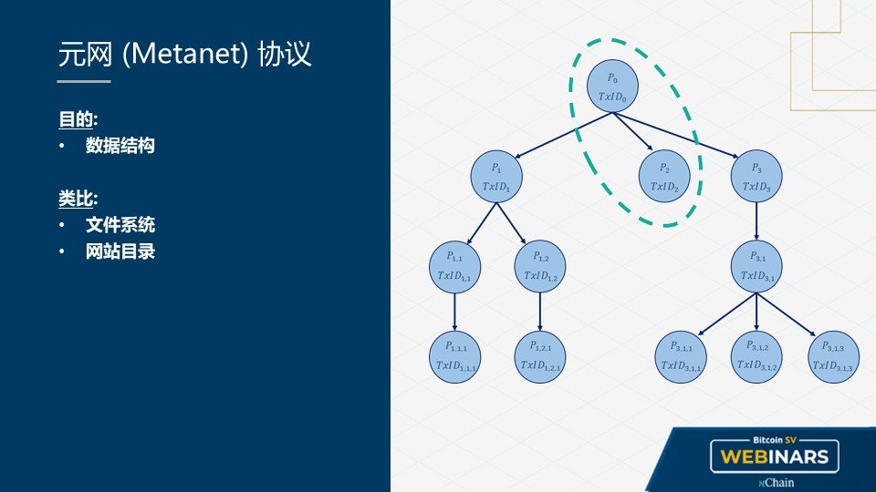

那么元网协议作为一个数据协议，其实它是一个相对比较复杂的东西。这里限于篇幅，我们只是简单的介绍一下，如果深入的话，这一个协议可能就把剩下的时间全部都给占去了。 

元网协议最重要的关键点是，它是用来 **建立数据之间的联系** 的。而且通过建立联系，它形成了一个层次化的结构，他用 “边” (Edge) 这个概念来把逻辑相关的 tx 给关联起来。要是没有这种关联呢，tx之间只有先后的关系，也就是基于时间戳的排序。有了这个树状结构，最大的好处就是任何一个数据都可以去层次里面去追溯和定位。这种定位对复杂的数据组织来说是非常必要的。

举个例子，比较大型的 3D 游戏里面，有数以万计的物体，它们都组织在一个巨大的场景树上面，这个场景数可以提供各种需求和服务，比如说你哪个物体看不到，需要被裁减了，哪个物体碰撞了，需要被反弹了，这些都依赖树状结构去提供快速的筛选，检索和定位的服务。 

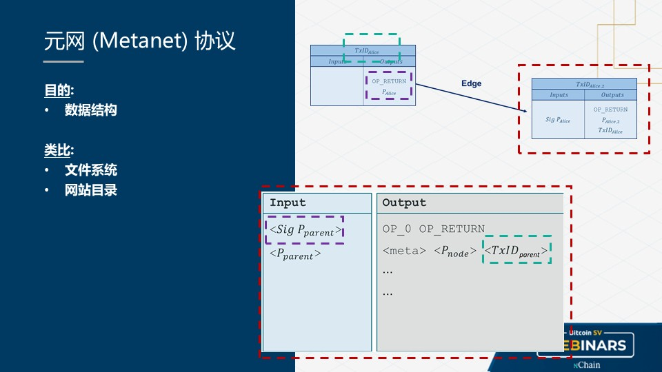

好，我们看到这个元网里面，最重要的一个概念就是“边”。

“边” (Edge) 的定义是什么？它是节点跟节点之间，逻辑上的关联性。在子节点里面有父节点的签名，这一点是非常重要的。你可以看到下面的放大的框里面，子节点的输入里面父节点的签名。这样的话就能够避免假的子节点，也就是别人伪造一个子节点，因为如果没有父节点的私钥的话，它是没法签名的。在子节点的输出里面，是有父节点的 txid 的，这样的话就构成了一条边，你通过子节点你可以随时往上追溯。

#### 6. MetaNet 应用 - 权限管理 & 版本历史

好，我们来看看 MetaNet 的数据协议能做些什么事。

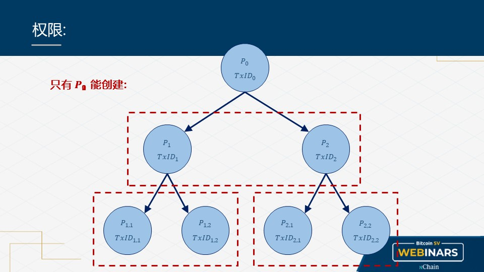

首先是它可以帮我们管理权限。你可以看到只有根节点就是p0的节点，它能够去创建p1和p2，而在第二层到第三层里面，只有p1才能创建 p1.1和p1.2。那么同理也是 p2 才能创建 p2.1 和 p2.2。

那么这实际上是比 TCP 要更好的。

这是因为，第一点是 bitcoin 天然会帮你去验证这些所有的这些交易，也就是这些消息它的签名来确保这些数据的有效性，可以节省大量的验证的工作量。 
那么比特币的基础设施，使得你不用自己去验证哪些数据是有效的，哪些是伪造的。那么 (第二点)， 在这些数据依赖的关系之外，除了数据本身，还有这些交易，就是 utxo 所定义的支付关系，也就是说谁给谁付了多少钱，这些支付关系也是非常重要的数据，在你需要的时候就可以直接用。

打个比方，比如说我们一个游戏内的道具，在游戏里被别人捡了，实际上你是不需要在数据中去管理这种所有权的转移。因为通过 utxo 管理， 通过支付关系，它已经转移给另外一个人了，你不需要在数据里去再去额外定义一遍，它已经转移了。 

除了权限之外，MetaNet 还可以有很多其他的应用，比如版本管理。

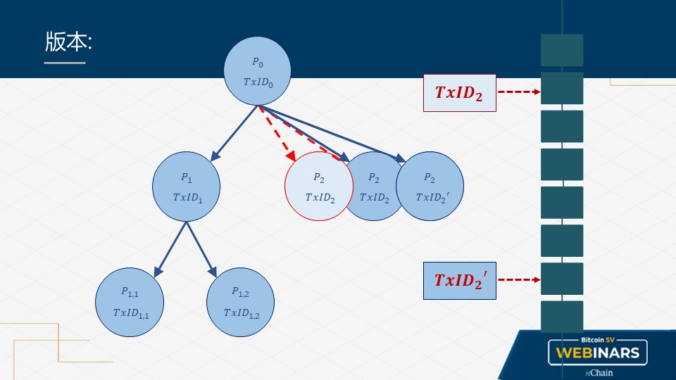

比如说在这里同一个 key，创建了多个交易，多个交易源于同一个 key，但是有不同的 data 在这个时候就很自然的能够形成，关于这个数据的版本历史，那么你再通过时间戳很容易就找到最新的版本了。你看就像这样 (动画演示)，很容易你就知道 (对于同一个 key 来说) 后面的一定是新的版本。那么即使在同一个区块里面也是一样可以保证的。

#### 7. MOM - 元网对象模型

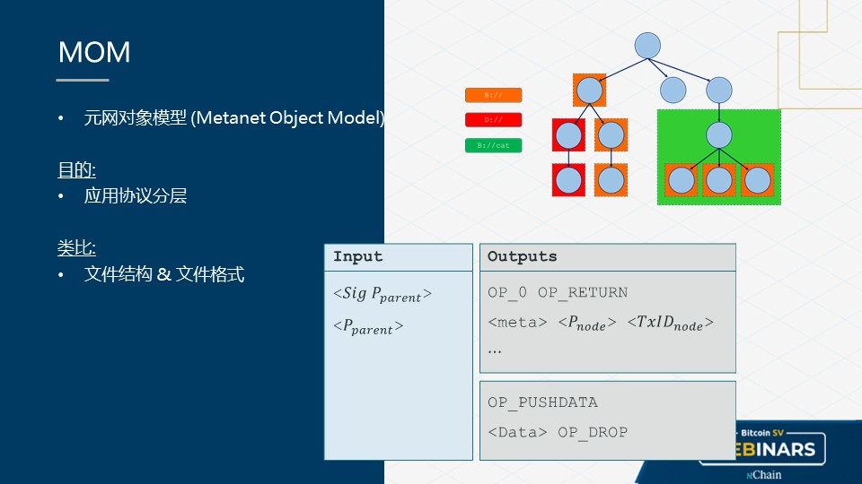

好，在元网的协议的基础上，我们有一个对象的模型，这个对象模型其实是一种基于元网协议的组合。

你可以看到右边，三种不同的颜色，比如说绿色，绿色是 B-CAT，实际上是一个父节点，然后下面追加了 n 个子节点，那么通过这种方式，我们可以把元网跟其他的协议相组合，可以形成非常灵活的配置，这也是一种非常有效的方式，去对不同的协议去组合分层 (来应对真实世界里繁杂的业务需求)。 

这些组合既可以是线性的，也可以是递归的，也可以是层次化的。在上面我是通过数据流的方式，然后到了下面每一个我又可以做成可变的，这是非常灵活的。 

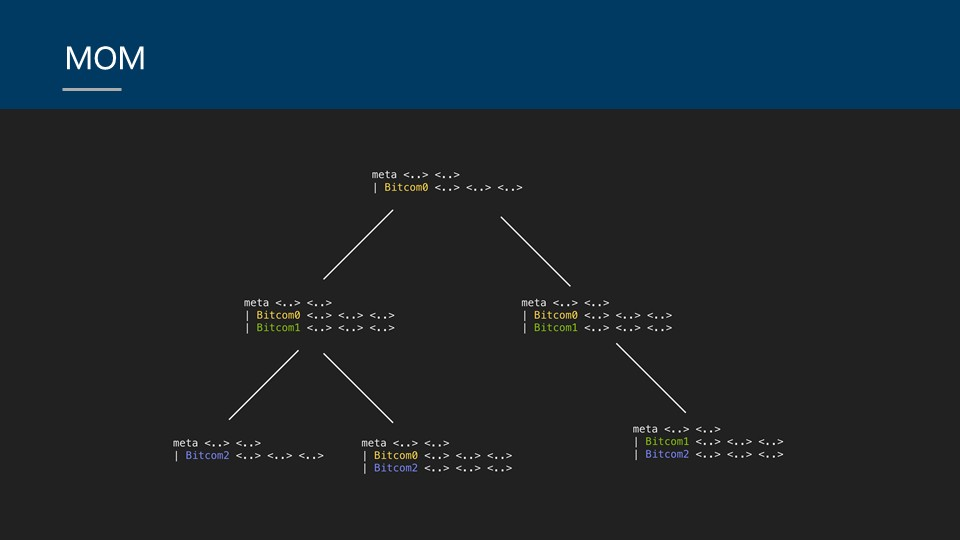

这是 MOM 的一个实际的例子。对于同一组相关联的数据，在不同的情况下，你可以用不同的协议去解决不同的问题，这样你实现功能的时候可以非常灵活。同样，利用前面说到的版本(管理功能)，你可以很容易的去迭代你的协议。 

#### 8. MAP / AIP 等

好，还有一些比较小的协议，比如说 map 就是 map，它实际上是 magic attribute protocol。

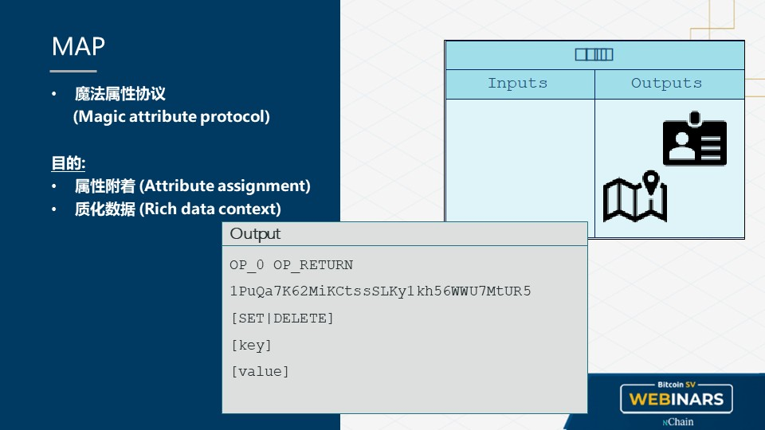

看起来好像很复杂，但实际上它很简单，它就是给现在已有的一个数据附加更多的 kv 值，那么也就是更多的属性。你上传了一个文件，你可以去写这个文件是作者是谁，是什么时候创建的，然后它的标签有哪些，你可以设置很多的kv值给他。实际上是给一个数据赋予更多的属性。

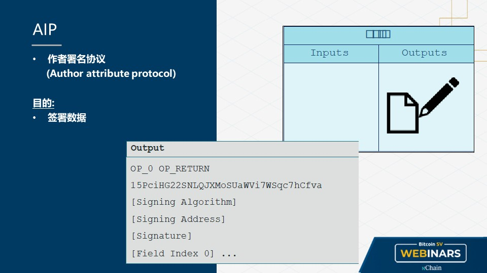

那么另一个是叫 AIP 协议，AIP 协议是关于作者对有版权的作品来署名的。你可以通过这个协议，来签署一个专门的签名信息上去。

也可以用它来做第三方的签署。比如说你有一笔交易，你需要另外一个公证人来签一下，他不会出现在 input 里边，但是你需要他的签名，这个时候你就可以用这个协议。或者说有很多人联名签署一笔交易，在不关心 utxo 的情况下，也可以做到很多人来签名同一个文件，比如说什么请愿书一类的，上面可以收集几万个签名。 

#### 9. 协议的共性

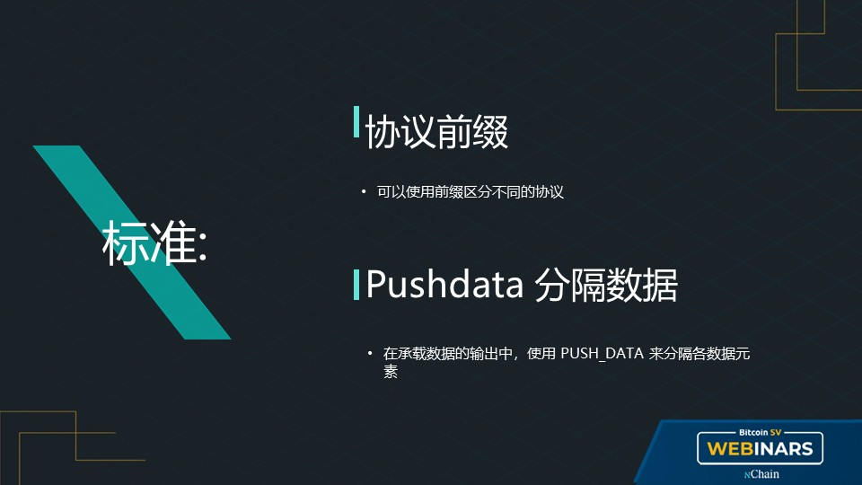

好，前面说了一大堆协议，现在我们来归纳一下这些协议有什么共同的特点，也就是协议的共性。

归纳起来，有这样两个特点，第一个特点是：有一个公共的前缀，每一个协议有各自的前缀，你可以用前缀去区分不同的协议。第二条是用 PUSH_DATA 来分割数据。这两点其实是非常浅显也非常直白的，你基本上你用过这些协议的一看就懂。

### 正文 (四) 支付协议 & Token 协议

#### 支付协议 - BIP270

好，说完数据协议了之后，我们现在来讲，支付这一块的协议。

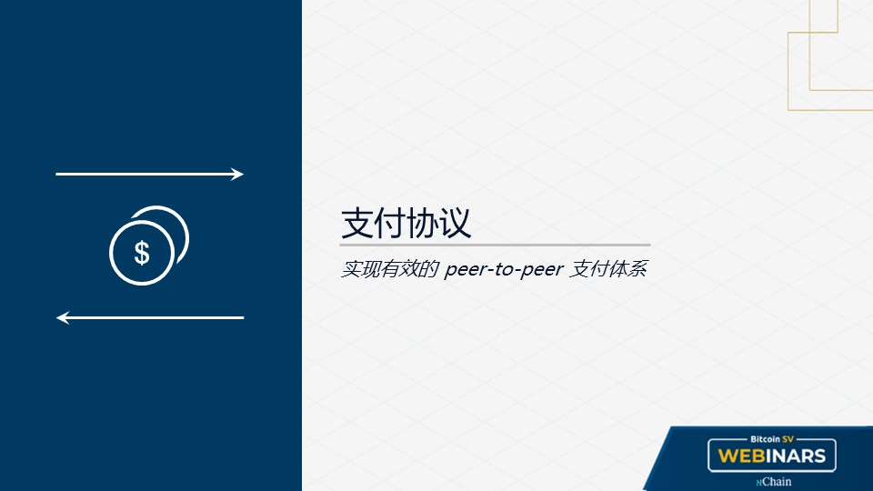

首先我们先来看一看最近讨论的比较多的 BIP270 协议，这个协议的目的，是用来处理和简化商家和客户之间的支付的。

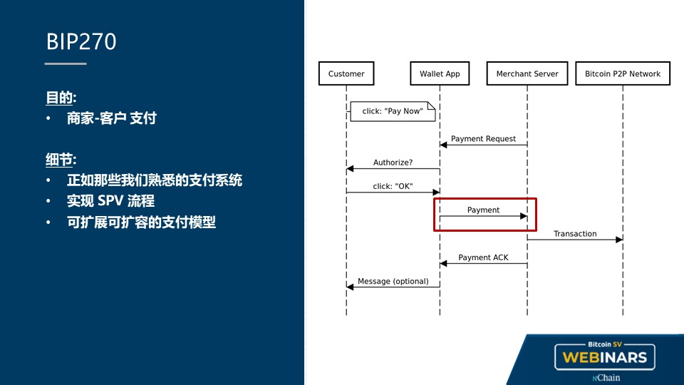

之前我们最经常见到的 (处理方式) 是什么样的呢？

是客户签名了一笔交易，然后把它广播给网络，然后商户你自己去找，找到了你就认为这个人签了一个有效的交易。 

那么 BIP270 有什么不一样呢？

是商户提供一个模板给客户签字，客户签了之后由商户去提交给网络。

那么这样做，其实是跟我们比较熟悉的传统的支付系统是很像的，交易最终是不是完成，商户自己会对它负责。实际上是简化了整个流程，商户需要自己去广播，需要自己去结跟结算系统同步，从用户的角度来讲是省了很多事情的。 

BIP270 内融入了 SPV 的流程，对交易验证只要很少的运算资源就能完成。 不管是用户也好，商户也好，就可以通过 SPV 去验证，这样保证了就是大部分的支付场景下面，你想去验证交易，不需要花费什么运算资源，也不需要运行全节点。 

#### 支付协议 - 扫码

好，那么第二种支付协议是扫码。

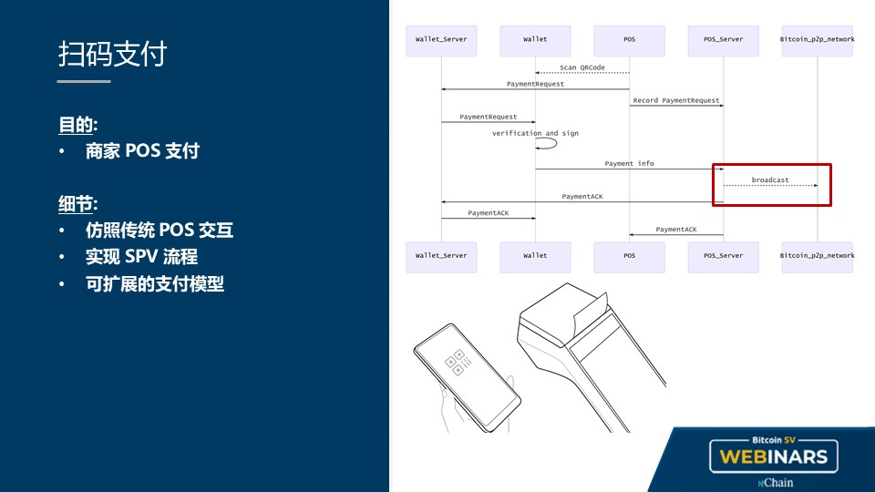

扫码支付，我们其实用微信和支付宝已经很熟悉了。它是用户提供一个二维码，商家扫描这个二维码了之后，向用户钱包的服务器发出一个支付请求，然后钱包的服务器来让钱包的客户端去签名。签完名之后，跟前面的270是一样的，仍然是由商户去广播这笔交易。那么由商户去广播，对商户的安全性是有更好的保障。比如说你金额越大，商户可以等越长的时间，来保证有效的交易尽早的去到多个节点上。不一样的是，在扫码这种方式里面，用户钱包只显示一个二维码，系统里多了一个钱包服务器去参与，这个参与者需要去告诉钱包，什么时候对哪笔交易签了名。 

这里我们专门讲一下，我们前面说的 BIP270 和现在说的扫码支付，为什么说他们是可以扩展的支付模型 (scalable payment model)。

有这么几条原因，一个是，原来的方式里，用户去广播，商户自己去对应的地址上面查，实际上是很低效的，有很多支付的时候，你会对同一个地址查多次，如果不同的客户付到不同的地址，你要到不同地址上去监听，是很低效的。 第二个原因是，(在 BIP270 下) 用户是可离线的，在特殊的情况下，比如说有时候电梯里没信号，这时候不需要联网就能产生交易。再比如说有很多设备他们可能不被允许联网，比如说摄像头，它也可以产生有效的交易。 第三条原因是，商户也可以依赖 SPV 不需要运行全节点。那么这对商户来说就省了很多事情。

所以有这么几条，那么这种模型不管对商户也好，对用户也好，都是可扩展的。

#### 支付协议 - Paymail

好，第三种支付协议是 Paymail。

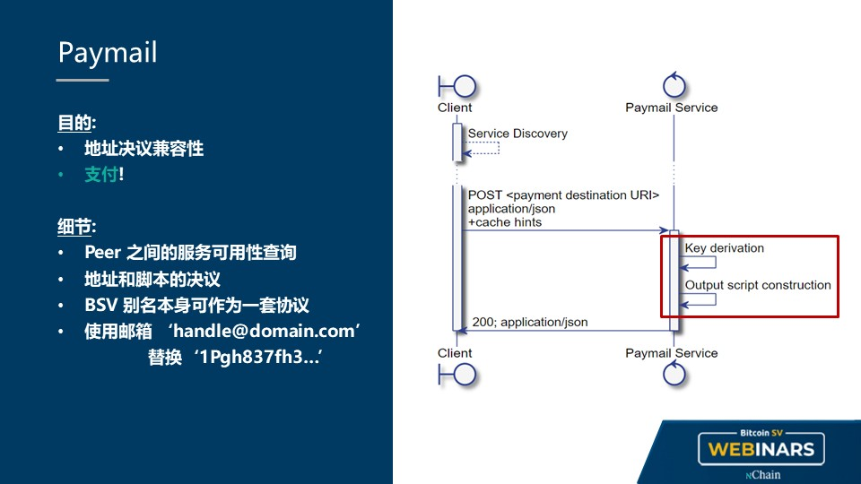

Paymail 是一种非常有价值的服务，本质上是利用电子邮件来做一个别名。它比 1 开头的 bitcoin 经典地址好记很多。就好像你用一个域名一样，如果没有域名的话，大家都通过 IP 去访问互联网，是非常不友好的，而且不太可能记住。

从实现的角度，我们简单说一下细节。用户是依赖 Paymail 的服务来做这个地址的决议，就好像我们通过域名的服务 (就是DNS服务) 去确定对象的IP。我们有理由推测，提供这个服务(从别名到具体地址，或者到公钥的这种查询，解析和决议这种服务)，它本身也会变成非常有价值的服务。 
有了一个明确的协议了以后，任何人都可以进来竞争，促进网络不断的去进化。 

#### Token 协议

在数据协议和支付协议之后，我们再讲一下简单的讲一下 token 的协议。

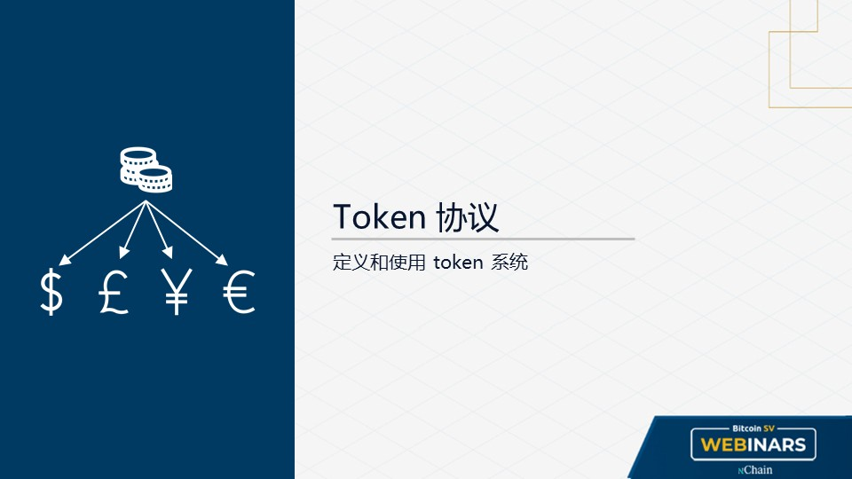

Tokenized 我简单提一下，它也是传统的 request/response 模型，对开发者来说是很熟悉的。

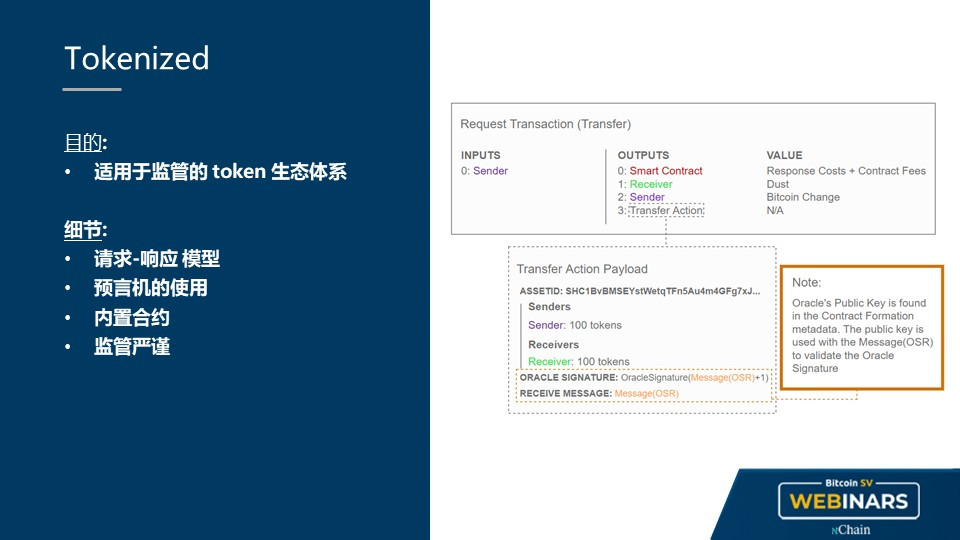

它通过预言机来引入外部的数据，它里面也内置了一些他自己的合约，有很多合约，比如说什么电影票什么的，可以拿起来改一改就能用。 Tokenized 的特点是针对监管是非常友好的，他有很多方式来帮助监管来判断，这里时间关系我们就不展开说了。

另外一个 token 协议是 Run (RunOnBitcoin)。

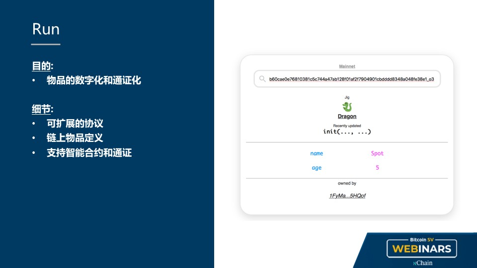

跟 Tokenized 不太一样，Run 更加专注于现实世界的物品或者虚拟物品，它的数字化和通证化的，一个相对快捷的方案。他这个协议本身要比 Tokenized 更简洁一些，更好扩展一些，他很容易支持自定义的物品，也是支持智能合约和 Token 了。 

### 正文 (五) 应用层工具包 (Toolkits)

好，讲完了协议这一块，我们来简单的了解一下，应用层是怎么通过工具包来支持的。因为对于应用层开发来说，光有协议是不够的。

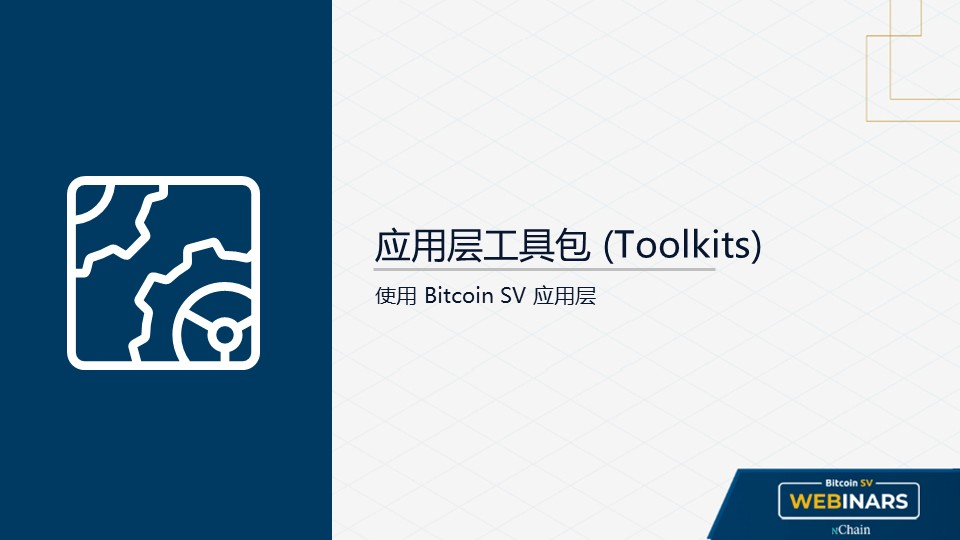

我先问个问题，就是，应用层，具体指的是什么？

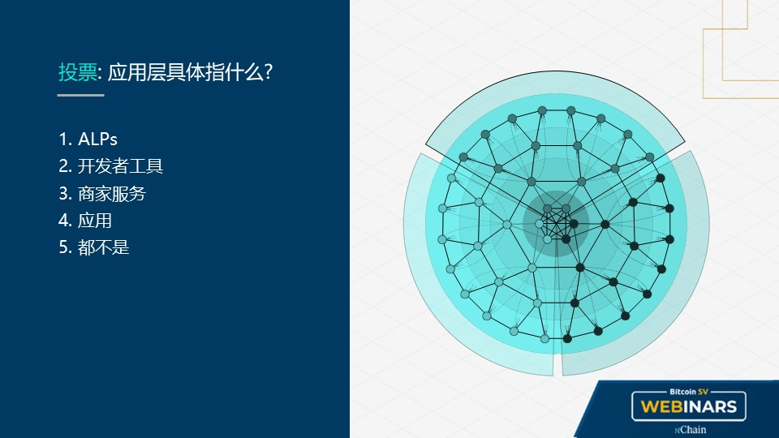

有 ALPs，也就是应用层协议，和开发者工具，商家服务，还有应用 (这些选项)。 

那么应用层具体指的是什么呢？

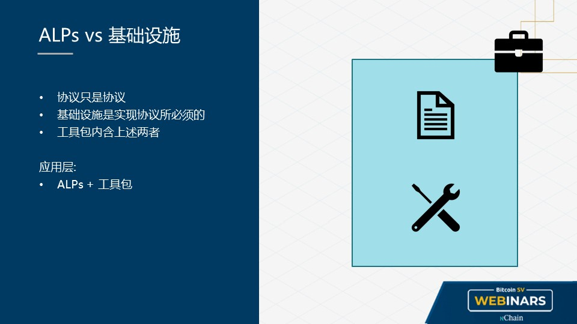

这里的基础设施是指应用层的基础设施，那么协议跟基础设施有什么区别？协议其实只是协议而已，基础设施才能够让开发者可用。只有一个单纯的协议的话，开发者是没法上手去直接做自己的事情的，就像我们开发游戏是不可能拎着 OpenGL 和 DirectX 就直接上了，我们可能还需要什么 Unreal，Unity这样的引擎或开发包。

那么工具包里面，既包含了协议，也包含了基础设施，说白了就是一些代码，我们可以直接拿来就能开发。那么我们也能看到，这里应用层它实际上包含了协议和工具包两部分。 

好，在最后，我们罗列并对比下，所有的应用层协议，和他们对应的这个工具和基础设施。

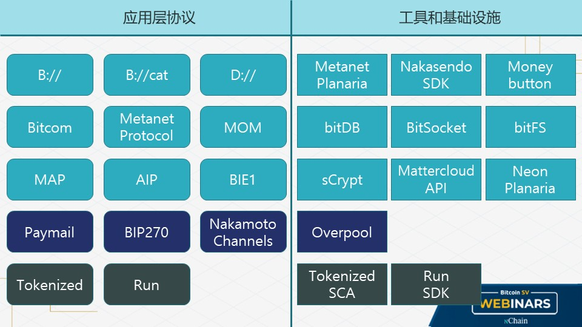

你可以看到有三种颜色，蓝色的部分是数据协议，深蓝色的是支付协议，黑色的是 Token 协议，那么右边是它们对应的工具，一般都是一些软件的 SDK。

在我们做实际开发的时候，我们不一定会完全的符合已有的协议，你可以部分的符合，然后可以扩展，甚至你可以演化出你自己的协议。

比如说我们小聪游戏，打算实现游戏里的道具，那一开始用 Tokenized 了，后来发现游戏里的道具资产，有各种奇奇怪怪的属性，而且运行的时候还会不断变化。这个时候对这些很特定的业务需求，Tokenized 就不是很灵活了，所以后来我们定制了自己的协议，一开始我们叫它 GAP，也就是 game asset protocol，游戏资产协议，后来我们改了一下名字叫 GAS。

实际上如果你的应用产生了真实的价值，你大概率会定制出你自己业务相关的方案。甚至可以这么说，你的业务越深入，你就会越来越寻求专门化的方案，毕竟这是业务上的积累，是非常有价值的。

### 课后问答

好了，以上就是今天这节讲座的全部内容，感谢大家的参与。接下来我会对讲座的过程当中收集到的一些问题来解答一下。

第一个问题，有朋友问能不能开发一款战棋游戏，我要说，这是好主意，欢迎来跟我们一起参与，来设计。

第二个问题，有朋友问，“不上链，但是流经 bitcoin，所以可以对这个数据来进行默克尔证明”，这个怎么理解？

实际上是这个数据的哈希是可以存在 op_return 里的，然后 op_return 是随着交易一起上链的。所以这要看具体怎么用了，可以多层次的去用，可以去把所有的数据坍塌成一个哈希，也可以坍塌成一个数据流，这就取决于具体对数据的重要性的分析了。

第三个问题，还有同学问，在 MetaNet 里面是怎么证明自己拿到的版本是最新的？这个问题是因为所有的所有的 tx 是有一个时间戳排序的，即使是在同一个区块里面，实际上是它交易顺序也是完全确定的，我们完全可以依赖 bitcoin 系统本身的顺序，来拿到最新的版本。 

#### 问题：开发应用时怎么判断，什么情况下用哪一个协议？

好，然后第4个问题，就是，这些协议比较零散，在开发一个 APP 的时候怎么做判断，什么情况下用哪一个？

这个问题，最核心的点，其实这是一个很大的问题，但最核心的点是，你要问自己一个问题：我的数据需不需要跟别的应用共享？如果不需要的话，你完全可以用你自己定制的方案，如果需要的话，你就尽量用已有的协议，这样能显著的降低你跟别人沟通的成本。 

在这个基础上，我还想提一下，“对协议怎么去选择”，其实是反映出来的是，你怎么看待你自己程序里的关键业务数据，你怎么判断，怎么分析这些数据。这个话是怎么说呢，因为我们做开发的，就是有一个词之前比较流行，叫数据驱动开发，也就是 data-driven development。我们发现，凡是这种由数据驱动的程序，就是你一开始就想好你的数据是怎么来到哪去，这种数据驱动的程序，它整体的复杂度，会比那些就是强调业务逻辑的那种程序，复杂度要低很多，你的程序的流程会清晰很多，可读性也会好很多，出 bug 几率也会低很多。

那么再回来看这个问题，就是你选协议的时候，最好的做法是，先思考你的业务，先思考你的业务的核心数据，然后围绕你的核心数据去做设计，做架构，然后对你自己的核心数据的特点，你明确的理解它了，你知道了明确的数据从哪来往哪去了以后，你再去选对应的协议，那就很显然了。 

#### 问题：这些协议是稳固不变的，还是会随着时间的推移，随 bitcoin 体系的演化而变化？

然后是第5个问题——你认为这些协议是稳固的不变的，还是会随着时间的推移，整个 bitcoin 体系的演化而变化的？

这个问题是这样的，bitcoin 底层的协议，我们知道它是 set-in-stone，就是我们在下次更新之后不会再变了。但是这是不是说，应用层的协议也都不变了？其实不是这样的，我觉得如果站在 5~10 年的尺度上去看的话，整个系统，从应用层的角度来讲，一定是一个不断发展不断演化的过程。 

要是比特币的分层网络 (BLN)，它能够向我们期望的方向发展的话，我觉得，可以预见，这个行业应该是会从粗放式的，慢慢的转向精细化、专业化，对特定的业务会很重视，那个时候就不是看什么TPS，看峰值的这个时候的业务量。那时候会去关心什么呢？比如说，平均响应延时，终端的用户体验，这一类的问题。就是相当于在特定环境下，解决特定环境的痒点，痛点，这种能力指标了。 

到那个时候，我觉得那个时候可能会有更多的专有的定制的协议，甚至是有的私有协议，可能还会产生比较重大的影响。

#### 问题：目前有没有一个比较全面的支持所有协议的生成 tx？

还有一个问题是，目前有没有一个比较全面的，支持所有协议的生成tx？ 这个问题比较深，现在目前还没有。但是可以剧透一下，我自己写了一个小工具，这个小工具可以给我自己作为一个参考，生成各种不同协议的 tx，我其实是打算把它梳理成一个比较大的条目，在你写 bitcoin 程序的时候，可以直接三五行代码拷过去就能用。这个可能不能作为一个严谨的工具，但是可以作为一个个人的小教程或者是示范代码，之后我可能会把它放到 GitHub 上去。 

#### 问题：bitcoin 是一个基于经济激励的系统，这个激励在开发者层面上如何体现出来呢？

这个问题很有意思，总的来说我认为这是一个机会。

有的同学可能会觉得像 Linux 那样的开放社区，通过开源作为纽带来激励。不是很好吗？看起来也行之有效地运行快30年了。然而你可能不一定知道的是，社区里面，中老年开发者的比例每一年都在上升，在他的核心开发者圈子里更是如此。也就是说，年轻的新鲜血液，越来越不倾向于参与这种开源协作了。

当年大多数开发者在为微软的Windows操作系统开发应用程序的时候，苹果公司用 “app store 三七分成” 的简单口号，开发者们用脚投票，光速构建起来了一个庞大的开发者社区。可见正确的激励模型是非常重要的。

我相信在不远的将来，在数据和价值上，一定能找到一个被广泛应用的商业模式，而这种商业模式是可以被标准化和协议化，并沉淀到应用层协议里的。这样一来，那些参与进来的开发者和厂商才能从中获益，广大人民群众才能真正有得花，有得赚。

游戏的行业有句老话叫做：一流的厂商定标准，二流的厂商做引擎，三流的厂商做游戏，我希望早日能在BSV生态里看到这一场景的出现。

-----

好，就这些问题的话，各位同学那本次线上研讨会到这里就正式结束了，Bitcoin SV 线上研讨会，系列讲座将会在每周二及周四晚上8:00~9:00进行，为期一个月。屏幕上方的二维码是我们系列研讨会的报名链接，欢迎大家将课程推荐给身边的开发者，也希望你们持续关注 CSDN 上的 Bitcoin SV 开发者专区，链接是 bsv.csdn.net，谢谢，我们下期再见。 

### 引用及视频地址

1. [Bitcoin SV 线上研讨会 (全8节) 视频地址汇总](https://bsv.csdn.net/m/zone/bsv/online_lecture)
2. ["Bitcoin SV 应用层协议" 讲解视频](https://live.csdn.net/room/zxff716/6bGl6TfW)

### Jack 对 BIP270 的扩展性的释疑

本文中关于 BIP270 的扩展性的释疑，来自于我向 Jack Davies 请教时，他详细回复的邮件。

关于这一点，我的问题如下：

```
Questions:

1. (about BIP270) what does it mean by "Payments as we know them" in PPT? (in page 38)
2. (about BIP270) Why & how the method "allows the merchant to scale their own security" (mentioned in the audio without explaining)?
3. (about both BIP270 and Show&Pay) Why & how the method "allows scalable payment model" (mentioned in PPT without further explaining)

I read through BIP270 proposal and I believe I understand the difference between the proposed
method and the original naive method.

for the security, are you referring to the broadcasƟng is done by merchant, so that it eliminates the
possibilty of client double-spending?
```

Jack 的回复中，涉及这几个问题的原文，摘录如下：

```
Question 1:

When I say "payments as we know them" I am trying to explain that BIP270 deliberately
mimics/takes inspiration from the way we do payments in the real world, with or without
Bitcoin. In other words, it mirrors the asymmetry between customer and mechant – the
merchant has the responsibility of broadcasting a Bitcoin transaction, in the same sense that a
merchant using an existing physical payment terminal provides a connection to the
Visa/Mastercard etc. clearance and settlement system.

Question 2:

When I mention a merchant being able to "scale their own security", this is referring to the
fact that a merchant can make their own decisions e.g. how long to wait after broadcasting a
transaction to be confident that the Bitcoin transaction will make it onto the blockchain. As an
example (numbers made up, for illustration) if it takes 0.1s for a transaction to propagate to
50% of network hash rate, and 1minute to propagate to 99%, then somebody selling a cup of
coffee might be happy to give the coffee as soon as they have broadcast the transaction, but
somebody selling a car may ask the customer to wait for one minute. Note that in the case of
the car, the 99% propagation minimises possibility of the payment failing, but much faster
than in the existing world. So BIP270/SPV mimics existing payments model, but far more
efficiently, and quickly.

Question 3:

When we refer to the "scalable payment model" we are talking about a couple of things. First,
the fact that we are handing a full transaction to the merchant – this means that the
merchant can query the Bitcoin network to ask if the transaction has been 'accepted', or
request a proof that is in a block. This query is much more efficient/quicker than if the tx was
broadcast by the customer, and the merchant has to 'scan an address' for incoming payments
– this makes BIP270/SPV much more scalable in this sense. Secondly, this method allows for
the customer to be offline, which means payments can 'scale' to many different methods of
use e.g. smart cards/physical devices. Thirdly, this method does not require the merchant to
run a full node – it only requires that they have a copy of block headers and have a
connection (for tx broadcasting and querying) to the Bitcoin network of miners.

Hopefully the above should also address your question about why the method is more secure
(or resilient to situational double-spending), and yes this is in large part because the
merchant broadcasts the transaction, and that we apply Bitcoin's probabilistic security model
regarding how much of the Bitcoin (mining) network the transaction has propagated to.
```

Jack 的回复全面，系统，深入，一气读下来豁然开朗，令人击节。

### 彩蛋

能翻到这里的同学，可能是真爱了。附送彩蛋两个吧。

第一个是应用层协议全貌缩略图：

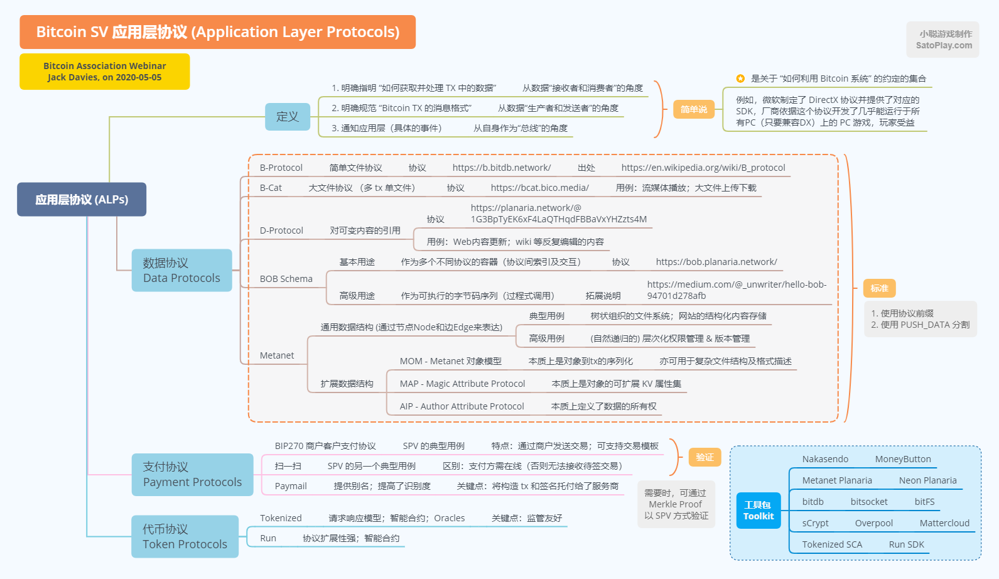

第二个是应用层协议栈的简易说明：

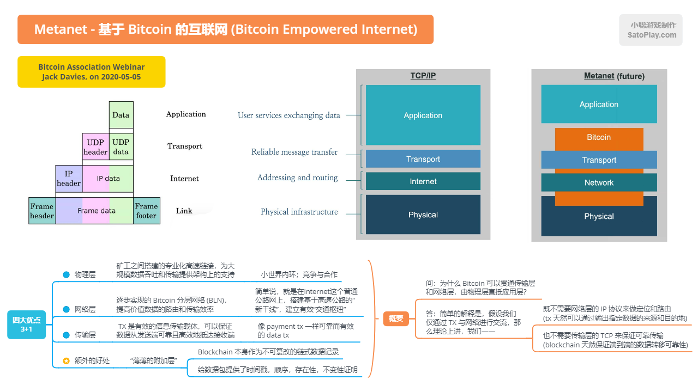

这两张图对应了今天研讨会 “应用层协议” 的两大块内容，可以作为一个快速的 CheatSheet 以供参考。

[完]  

----------

- 顾露 (Gu Lu) 于免成居
- 时间: 2020-10-04
- 编号: Bt-006-2010
- 本文遵循 [Creative Commons BY-NC-ND 4.0 许可协议](http://creativecommons.org/licenses/by-nc-nd/4.0/)。
- 永久链接 [https://gulu-dev.com/post/2020/2020-10-04-webinar-app-layer-protocol](https://gulu-dev.com/post/2020/2020-10-04-webinar-app-layer-protocol)
