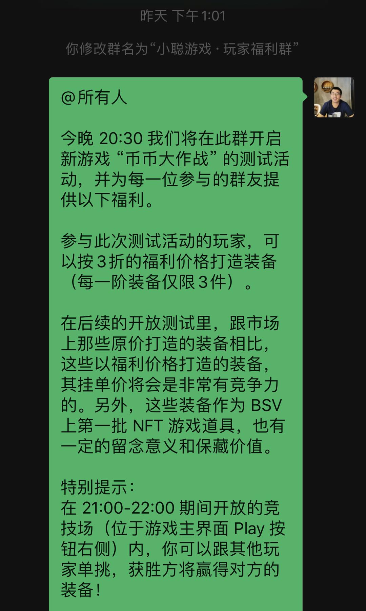
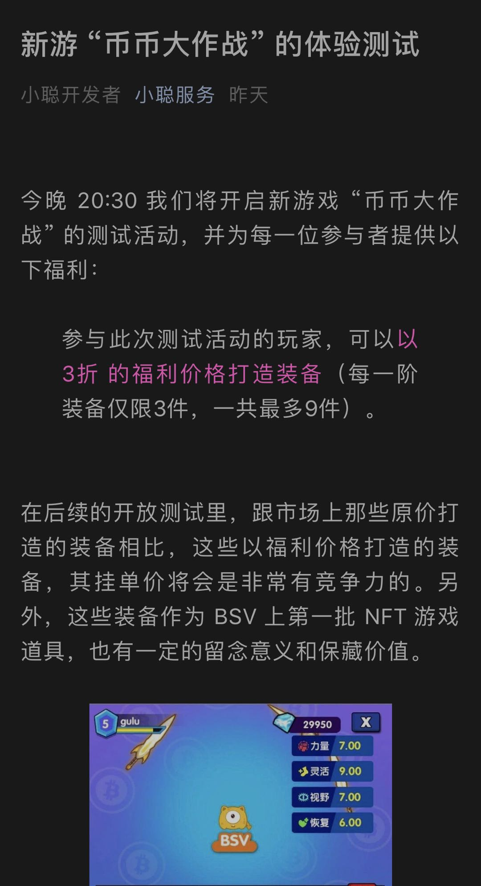
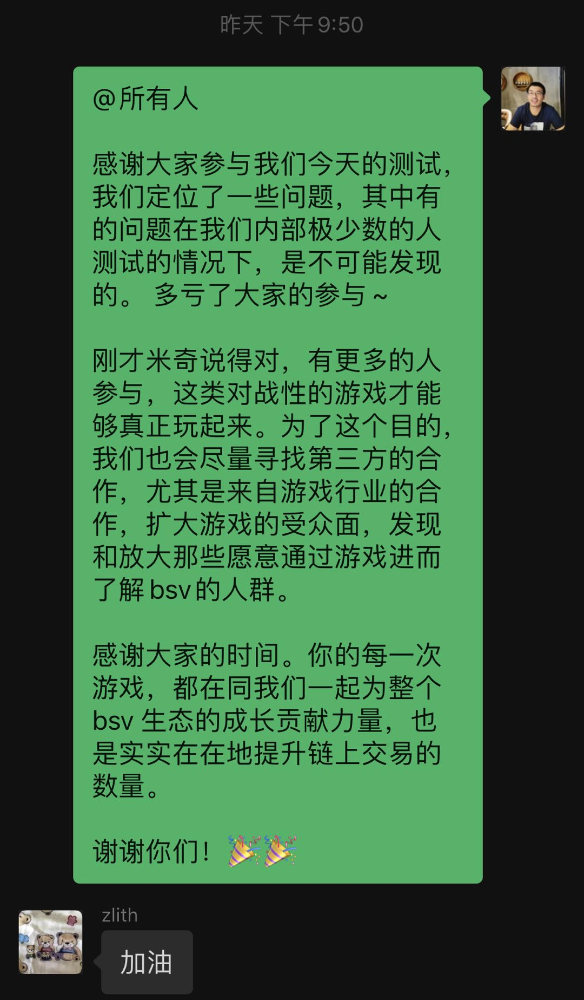
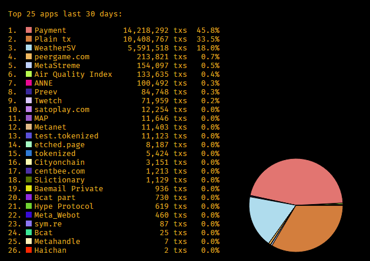
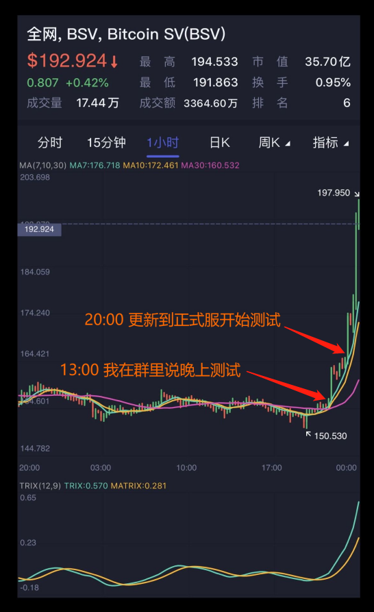
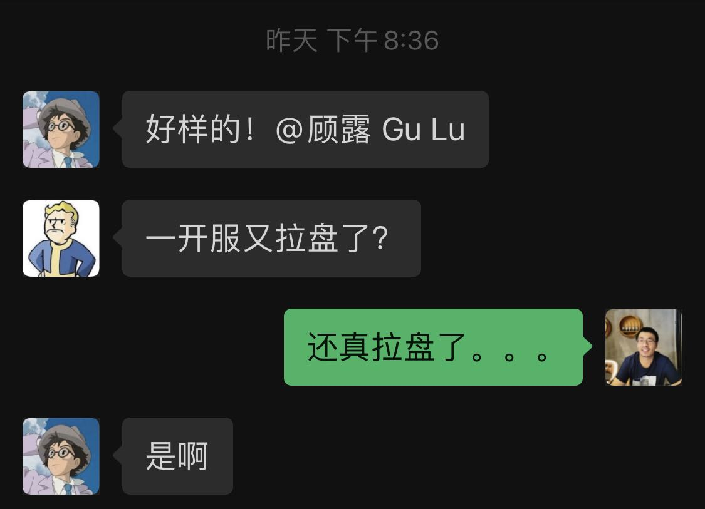

# 小聪游戏 《币币大作战》 首次测试小结

今天小聪平台的新游戏《币币大作战》 做了首次面向小范围玩家的测试。整个过程虽然状况不断，不过看起来没有遇到什么难以处置的问题，还算顺利。

睡前简单梳理下好了。

## 大致情况

先说下大致的情况：

因为担心游戏完成度不够，想小范围测一下，不然人多了各种问题控制不好影响面；打算就在玩家群内发一个邀请了事，能来多少人纯靠随缘。

于是中午 13:00 时在群里说了一下，

结果到下午 16:00 时才稀稀落落十来个人在公众号里发了领福利的动作。

这下有点慌了，没人啊。。。

因为各种准备不够，又不想变成开放测试，所以，想了想，在微信上戳了宝拉同学一下，

请她帮我想想办法 (上图过于心酸的地方已打码)，

宝拉同学就没我这么纠结，直接跑到别的群各种扩散，哈哈。 

这时我想，也没啥好矜持的了，索性直接用 "小聪服务" 的公众号发了个测试公告：

然后感谢叶大 @yelin 帮我在打点的群里转发了我们的测试公告。

这下人数是不担心了，

开始担心游戏可能会爆发问题导致进来的玩家失望。。

好在后来还算顺利，哈哈。

晚上测试结束后，感谢了大伙的参与。

## 数据

数据这块，

- 今天 2020-07-07 **新增 418 人，活跃 786 人**，希望能早日稳定日活上千。
- 小聪游戏的链上 tx 数量也回到了前 10。新的应用在不断涌现，我们需要继续加油才能不落后。

## 技术

技术这块，

- 原本以为会出问题的 NFT 道具铸造这里，整个晚上第三方 API 没有掉链子。说实在我担心了一晚上，因为这些查 utxo 的第三方 API 常常会因为调用频率超过阈值而罢工。好在整晚看起来没有出这方面的问题，正式服的报警邮件一次也没有触发过。 (Nice!)

- 但没想到的地方出问题了。之前内部测试的时候，腾讯小游戏对战引擎偶尔出问题，当时我们没太在意，心想企鹅怎么可能出问题，一定是我们眼花了，或者姿势不对而已，要不自己换个姿势吧。结果没想到今天 21:00 的关键时刻，小游戏对战引擎居然掉链子了，不仅几分钟毫无响应不说，恢复之后也是频频出状况，同步数据不稳定持续了十来分钟。好在后来恢复了，但也对我们的测试造成了影响。明显21:00那一波不少玩家退出了就没再回来。

- 预约流程还需要简化，自动化程度不够，最好是下一次玩家在公众号点一下，不需要输入自己的账号，就可以在游戏里领到对应的福利了，可以通过公众号的接口实现，技术上是很简单的。

-----------------

## 神奇的情况

再来说个神奇的事，看下图：

这配合的精准让我一脸懵圈。。。。

我陷入了深深的疑惑。。。

[完]  

- 顾露 (Gu Lu) 于免成居
- 时间: 2020-07-07
- 编号: P-001-2007
- 本文遵循 [Creative Commons BY-NC-ND 4.0 许可协议](http://creativecommons.org/licenses/by-nc-nd/4.0/)。
- 永久链接 [https://gulu-dev.com/post/2020/2020-07-07-bbio-beta-test](https://gulu-dev.com/post/2020/2020-07-07-bbio-beta-test)
