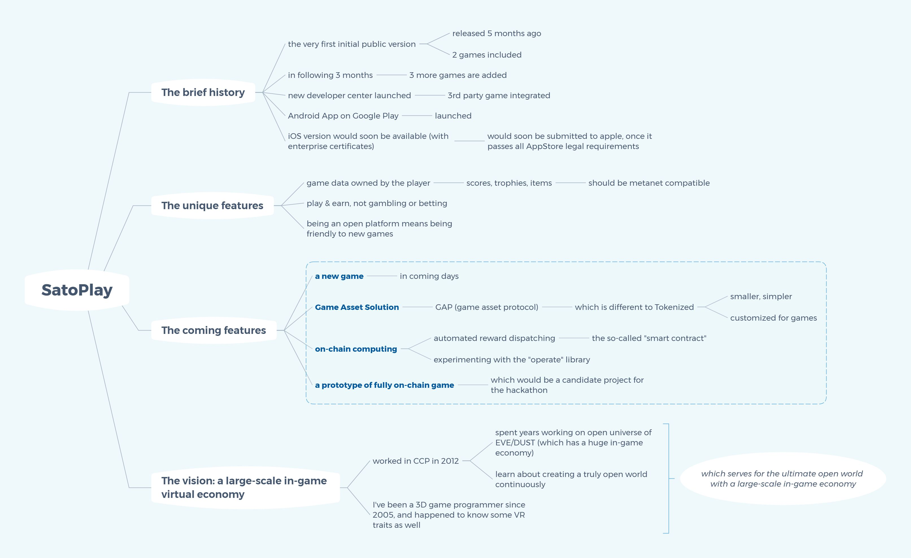
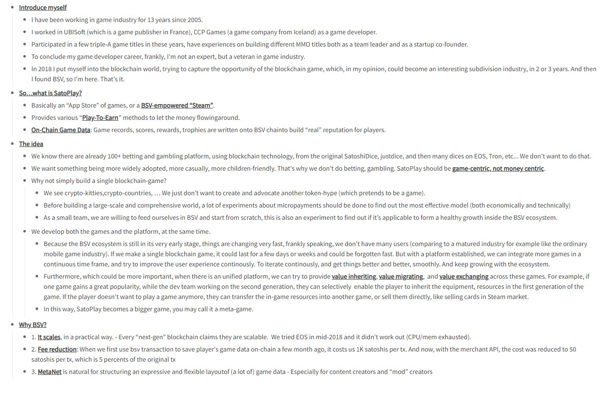

# 2020.07 小聪接受 CoinGeek 远程视频采访

Charles Miller 是 [CoinGeek](https://coingeek.com) 的一位播客制作人，在[他的专栏](https://coingeek.com/author/charles-miller/)里可以看到一百多篇与 Bitcoin SV 相关的各类文章和视频播客。从这些内容中可以看出，Charles 对行业的理解是广泛而深入的。在上个月 (2020-06-15)，Charles 约小聪做了一次远程视频采访。这次有幸通过这次短暂采访的机会与他结识，希望等疫情过去后，有机会再当面深入地交流和致谢。

------

> "In 2018 I put myself into the blockchain world, and tried to capture the opportunity of blockchain game, which, in my opinion, could become an interesting sub-division industry in two or three years. And then I found BSV - so I'm here. That's it." 

------

内容

细节

------

> "Is this the first #BSV app for children? 
>
> @satoplay1 is a casual gaming platform, whose founder, Gu Lu, is an experienced game developer. He explains his ambitious plans on this week's #CoinGeekConversations."
> - https://twitter.com/RealCoinGeek/status/1276831310418509827

------

- [采访文章 - Gu Lu: Building a child-friendly gaming platform powered by Bitcoin SV](https://coingeek.com/gu-lu-building-a-child-friendly-gaming-platform-powered-by-bitcoin-sv/)
- [采访视频 on Youtube (需翻墙)](https://www.youtube.com/watch?v=W7bZYM2ow_w)

------

这是 CoinGeek.com 第三次报道小聪，我把它们汇总在下面，作为一个索引，可以作为小聪游戏成长的一个侧面的记录。

- [Gu Lu: Building a child-friendly gaming platform powered by Bitcoin SV](https://coingeek.com/gu-lu-building-a-child-friendly-gaming-platform-powered-by-bitcoin-sv/)
- [SatoPlay proves Bitcoin SV’s value to the gaming world](https://coingeek.com/satoplay-proves-bitcoin-svs-value-to-the-gaming-world/)
- [BSV ecosystem spotlight: SatoPlay launches its first third-party title](https://coingeek.com/bsv-ecosystem-spotlight-satoplay-launches-its-first-third-party-title/)

[完]  

- 顾露 (Gu Lu) 于免成居
- 时间: 2020-07-10
- 编号: P-002-2007
- 本文遵循 [Creative Commons BY-NC-ND 4.0 许可协议](http://creativecommons.org/licenses/by-nc-nd/4.0/)。
- 永久链接 [https://gulu-dev.com/post/2020/2020-07-10-coingeek-interview](https://gulu-dev.com/post/2020/2020-07-10-coingeek-interview)
