# (2020.08) BSV 首届中文 devcon 小聪主题演讲

[按] 以下内容是今天 (2020-08-30) 我在 BSV 首届中文开发者大会上，关于小聪游戏平台的主题演讲。我下载了会议回放后，使用讯飞听见转成了文字稿，略加编辑放了上来，方便没时间看完整视频的朋友。

-------------

## 一、简介，数据与提纲

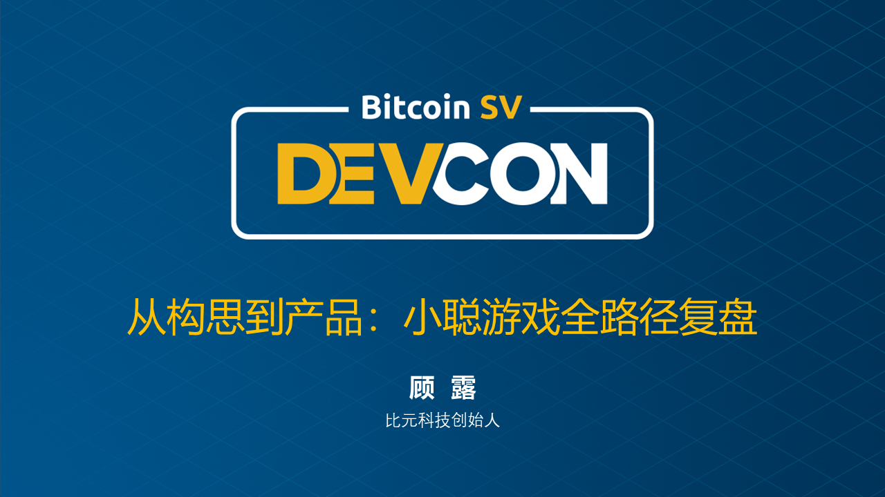

大家好，非常荣幸受邀参加BSV首届中文开发者大会。我是顾露，是小聪游戏的开发者，也是比元科技的创始人。我是14年左右了解到区块链，后来在18年创办了比元科技，到现在有两年多了。小聪游戏是我们去年9月份开始构思的项目，去年年底上线，到现在已经有半年多了。

除了小聪游戏平台之外，在区块链游戏这块，尤其是区块链游戏里边的虚拟资产这块，比元科技还提供完整的技术解决方案，目前在游戏行业已经有了采用的案例。 

下面我们正式开始主题演讲，本次演讲的主题是——从构思到产品，小聪游戏全路径复盘。演讲的内容包括小聪游戏这个项目的过去，现在和未来。不仅包含了产品之前的规划，和实际我们开发的进程；也包含了技术方案的选择，问题的解决，主要是面向对开发 BSV 产品有兴趣的开发者。 

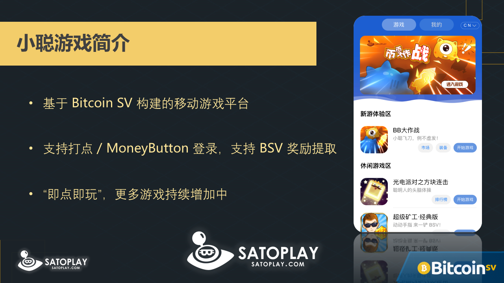

好，现在我们进入正题。

首先我介绍一下小聪游戏这个游戏平台，在幻灯片上您可以看到我们平台的截图，它基本上就是一个游戏的列表，以及一些游戏相关的平台化功能。小聪游戏平台是基于BSV网络来构建的，BSV在其中发挥了很多的作用。比如我们在之前做了数据上链，然后支持打点和 MoneyButton这些系统的登录，也支持bsv的充值，等等，体现在这个平台的方方面面。平台上的游戏是即点即玩的，基于h5实现，点进去就可以直接开始玩。在今年上半年我们提供了一些游戏，下半年也会有更多的游戏加入进来。

### 平台的数据统计

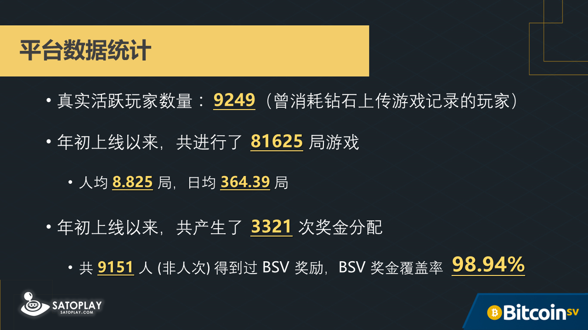

我简单介绍一下这个平台上的数据：我们现在真实活跃的玩家数量有9249个，这个数字不是总的玩家注册数量，而是在平台的游戏里真正打了一局游戏，而且消耗了钻石，把游戏的记录上传到区块链上，这样的玩家我们认为是真实有效的玩家。从年初以来，一共有8万多局游戏，平均下来每个人大概参与的是8.8局，也就是八九局的样子，每天有300来局的游戏，从年初上线以来一共有3000多次的奖金的分配，一共有9100多人曾经得过得到过这个奖励，奖励的覆盖面大概是98-99%左右。你可以看到这个平台上参与的玩家大部分曾经获得过BSV的奖金分配。

以上是我们这个平台上的一些简单的数据统计。 

### 提纲：构思，立项，插曲，技术，方向

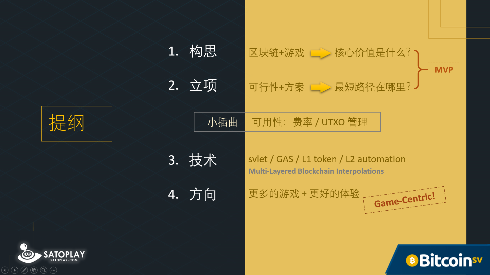

现在我介绍一下今天要讲的几个主要的内容。

首先是产品的构思，就是我们在开始做之前是怎么想的，我们肯定会去想的是，区块链和游戏怎么结合，结合在一起它的核心的价值是什么？因为核心的问题想不明白的话，后面的开发会在这上面反复纠结，就会非常影响整体的进展，而且如果方向不太确定的话，很可能整个产品做出来味道就是不对的。 

想清楚大方向了之后，怎么去立项，怎么样做技术选择，我们做了哪些对的事情，做了哪些不对的事情，我希望能够通过我的讲解，让开发者能够从我们这个案例里得到一些参考。我主要会去讲，我们是怎么样得到一条(我们认为的)最短的路径的。

讲完构思和立项了之后，有个小插曲，我会讲一下，在开发的过程当中, 我们遇到了哪些问题，怎么样去解决的，用了什么手段去解决。

讲完了这个项目是从哪来的，之后我会讲我们将往哪去，包括现在我们已经在做的事情，和下半年我们计划将要做的事情，这里面最重要的就是，在方向上，作为一个游戏平台来讲，我们的目标是提供尽可能更多的游戏，更多类型的游戏，然后尝试去服务更大的群体。 

在构思和立项里面，我们最终得到的是一个什么呢？是一个最小的可运行的产品，一般我们叫它MVP。这个MVP是非常重要的，它决定了你这个产品的基因。也决定了我们后续的大方向是以游戏为核心的，待会就可以看到我们的后续计划。 

## 二、构思：区块链和游戏结合的核心价值是什么？

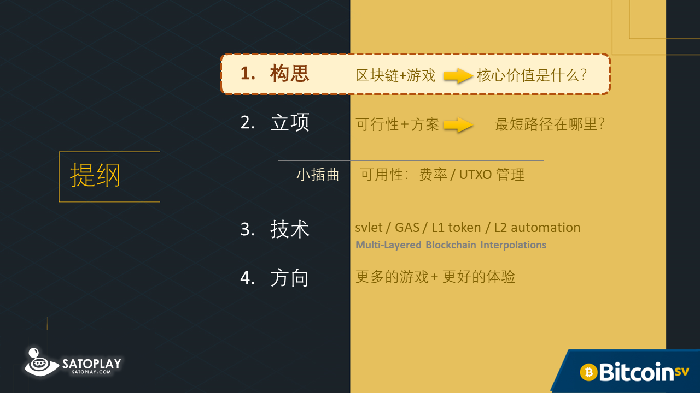

好，首先我们来看一看构思，构思其实简单用一句话概括下，就是区块链和游戏结合在一起，它的核心价值是什么？

我们一起来看一下。

### 链上麻将？

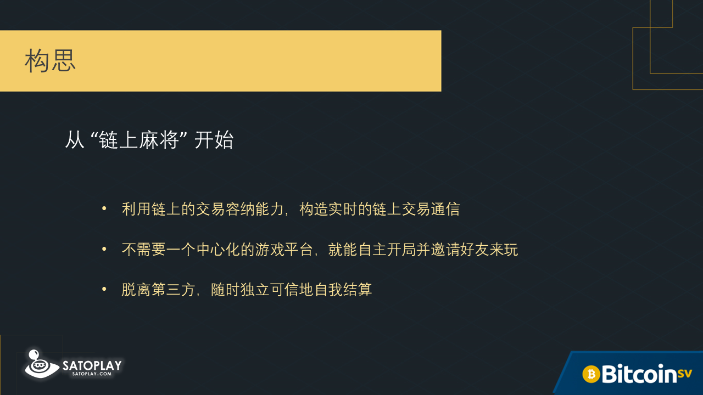

在计划这个项目之前，我一开始是构想了一个链上麻将。这个项目的特点是利用链上的交易容纳能力，去构建实时的链上交易通信。它不需要一个中心化的游戏平台，玩家就可以自主去开局，邀请好友来玩，是一个脱离第三方，可以自主做结算的系统。在这个系统里，你可以看到玩家基本上可以自己做所有的事情，这实际上在当时，我们认为是比较符合区块链本身的思维方式的。 

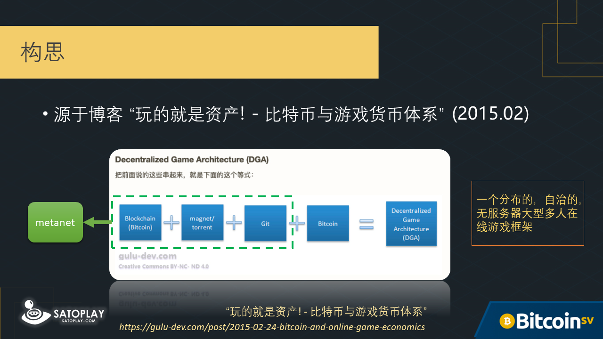

这个想法的来源，是我之前写过的一个blog，叫“玩的就是资产——比特币与游戏货币体系”。这个体系实际上是我当时对区块链的一个认知，当时我认为一个比较理想的区块链游戏，应该是一个分布式的，自治的，而且是无服务器的，是一个没有服务器的大型多人在线游戏框架，但这是15年我的想法，四五年过去了之后，这个框架里的一部分，实际上现在已经可以由 metanet来实现了，比我当时的设想要更简洁一些，但是整体而言，这是一个项目想法的最初源头。 

### 去中心化？

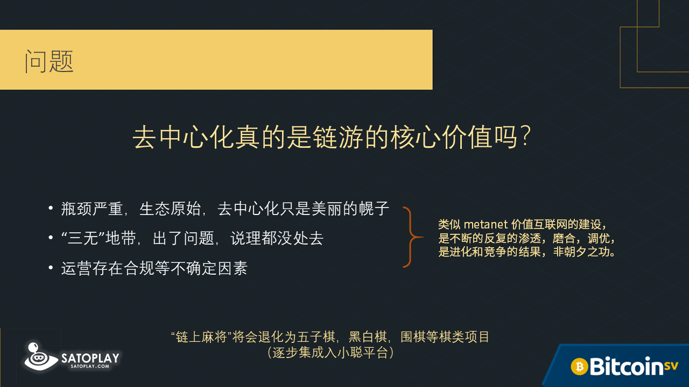

在有了这个想法之后，更进一步，我会去想，去中心化真的是区块链游戏的核心价值吗？这个问题其实困扰了我挺长时间。因为，如果你找不准核心价值的话，很多事情做出来就是事倍功半，吃力不讨好的。

那么去中心化真的是它的核心价值吗？其实不是的，因为在现阶段，你想要做到去中心化，有很多困难的事情。大家可以看到，现在的其他的一些区块链项目，他们号称是去中心化，但实际上因为它们的生态非常原始，有很多事情想做的但做不到，出了问题的时候，你去找人都找不到，很多地方都是处于没有人管的状态，我们叫它三无地带，说理都没地方说去。 

另外，一个去中心化的项目做出来之后，这个项目受到谁的监管，运营是否合规，你需要跟监管的哪些部分去配合，这些都是一些不确定的因素。这一切的核心原因都是因为，现在还在非常早的早期，就类似metanet的建设，它应该是一个不断的，反复的，这样一个渗透，磨合和调试的过程，是长时间的进化和竞争，不是说我们喊一个去中心化的口号，它就立刻去中心化了。

链上麻将的构想，之后会退化成一个五子棋、黑白棋、围棋这样的棋类的项目，然后逐渐把它并入小聪平台。这个想法也不会消失，它会以其他的形式进入这个平台。 

### 灵魂拷问：在现阶段，区块链游戏的核心价值究竟是什么？

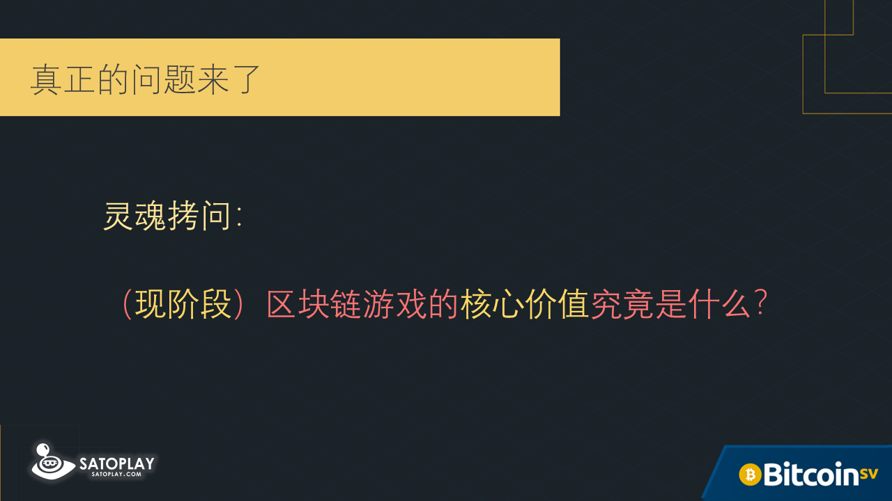

好，现在真正的问题来了，在现阶段，区块链游戏的核心价值究竟是什么？这个问题里面，有两个关键词，一个是**现阶段**，一个是**核心价值**。为什么我这么强调“现阶段”？因为有些价值，我们认为，的确是核心价值，但实际上它是很遥远的，我们做项目不能说只考虑很遥远的以后的事情，不考虑眼下的事情，应该是反过来，先考虑眼前，然后再考虑将来的1~3年，然后再考虑3~5年，慢慢的再把视野往后推。 

那么我们现在来看，区块链游戏核心价值究竟是什么？

有人说**打破渠道的垄断**，有了区块链游戏，传统的那些渠道，价值就可以被我们打破了。那么这就好像是在说有了开源的Linux，我们就能打破Windows的垄断了。真实的世界是这样吗？事实是，这不是同一个层面的事情，也就是Linux的成功，未必会影响Windows，也许他们是在各自的领域里都能做得很好。

那么还有人说区块链游戏可以**让同款的IP资源可以被复用**，这种复用从技术上来说很简单，但是法律法规监管这些方面有太多的路要走，而且公司之间，怎么样利用区块链来协作，这些都是非常空白的事情。如果你知道任天堂在早期的家用游戏机上因为IP被滥用，跟不同的公司打过多少官司，就会同意这个观点。在很多时候，利益纠葛，欺骗，贪婪，是根深蒂固的企业文化，或创始人等重要参与者的人性决定的，不是采用了某个技术就能自动消失的。

我个人认为是一个长期的，是一个比较曲折的，渐进的接受过程。它不是我们**眼下**现阶段最重要的事情。

### **即时小额交易** 和 **快速结算** 是核心竞争力

那么我们自己的思考是什么？现阶段最重要的想法是什么呢？

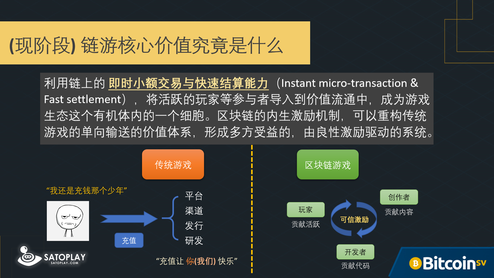

是怎么样去利用区块链现有的**即时小额交易**和**快速结算**的这种能力。请注意，这种能力并不是承诺的未来会有的能力，而是现在就具有的能力。那么通过这种能力，我们能把那些活跃的玩家，这样的参与者导入到我们这个游戏的大循环里面，成为游戏生态的有机体里面一个一个能够参与的进来的细胞。那么利用区块链它本身的内生的这种激励机制，能改变传统的单向输送的价值体系，变成多方受益的，然后由良性激励驱动的系统。 

我讲的可能有点抽象，大家可以看一下，我下面做了一个传统游戏跟区块链游戏的对比，在传统游戏里边是什么情况呢？玩家作为一个客户，充值到了平台上去了以后，他充值的资金，流动到平台渠道发行研发等等所有这些，是一个单向的价值流动。 

实际上可以说，整个庞大的游戏产业的链条，都建立在对玩家的充值，怎样去进行更好更合理更高效的分配上。

那么区块链游戏有什么不一样？ 

区块链游戏里面，玩家、开发者、创作者以及其他的参与者，他们对于生态的意义是类似的。大家各自贡献各自有意义的部分，比如说开发者贡献功能代码，玩家贡献活跃，还有其他的一些社区参与，创作者贡献内容地图，包括地图角色其他一些有意思的东西。在这个系统里面没有谁比谁更优越，是由区块链本身的激励机制，当然是由设计得很好的激励机制来驱动的。

我们看到之前一些链游，激励这块做的不是很好，那么他游戏刚开始很火爆，然后过了没多久，由于某个因素一开始没有想好，或者是出了bug或者是其他什么因素，就整个搭建起来的积木就轰然倒塌了。那么这个实际上是在说，游戏是非常复杂的，优秀的激励机制，是反复淬炼出来的。人们只看到中本聪白皮书横空出世，0.1版本就set in stone了，没有想过在这之前是多少年，甚至是超出一两代人的反复积累和尝试。

### 传统游戏跟区块链游戏，之间应该是什么关系？

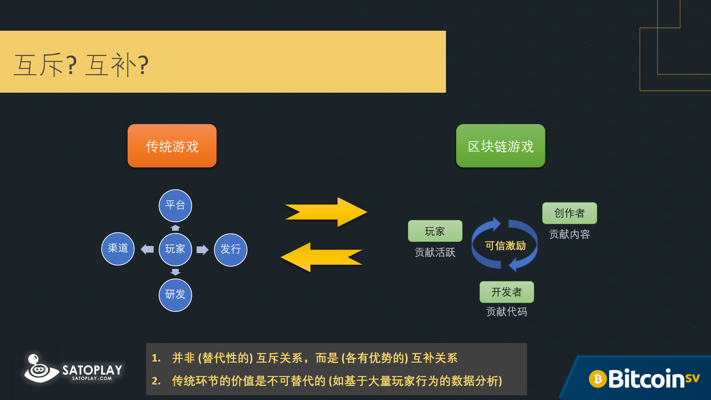

好，回到我们的主题，传统游戏跟区块链游戏，他们之间应该是什么关系？ 

有一种论调认为，区块链来了，就是要打破传统游戏的格局，是来革命的。我个人认为这种观点相对是比较片面的。打个比方，手机兴起了，PC也没有消失，对不对？只是变得更专业化了，变成一个工作者的生产力工具了。手游，就是手机游戏起来了，端游也没消失，只是进化得更加成熟了，更加高端了，变成专业玩家的大型游戏入口了。 

我说这个是什么意思呢？传统游戏跟区块链游戏，它们之间并不一定是一种替代性的关系，实际上它们是各有优势的这样一种互补的关系。我希望看到的是，我们能促成的是，传统游戏的方式，和区块链游戏的一种新的方式，新老两种方式的一种融合。 

我们作为区块链游戏的开发者，要认识到，传统游戏，它的一些环节所具有的价值，在目前看是不可替代的。比如说，平台和渠道，他们有能力去基于他们已经积累的大量的玩家的行为，去做数据分析，并且给出来非常靠谱的一些分析结论，来指导开发，这些是非常有价值的，而且是一般的游戏研发者创作者，以他们在这方面的能力，是很难去处理好的。大多数开发者，包括我自己，更擅长的是做出一款游戏产品本身，对市场，对用户，跟渠道和平台相比，是相对缺乏了解的。

虽然说我们是区块链游戏开发者，但一定要利用传统游戏的这种不可替代能力。要让这两种能力能够互补，而不是说抱着一种革命的心态，什么都要替代，这样是错误的。 

### 数据的不可变性

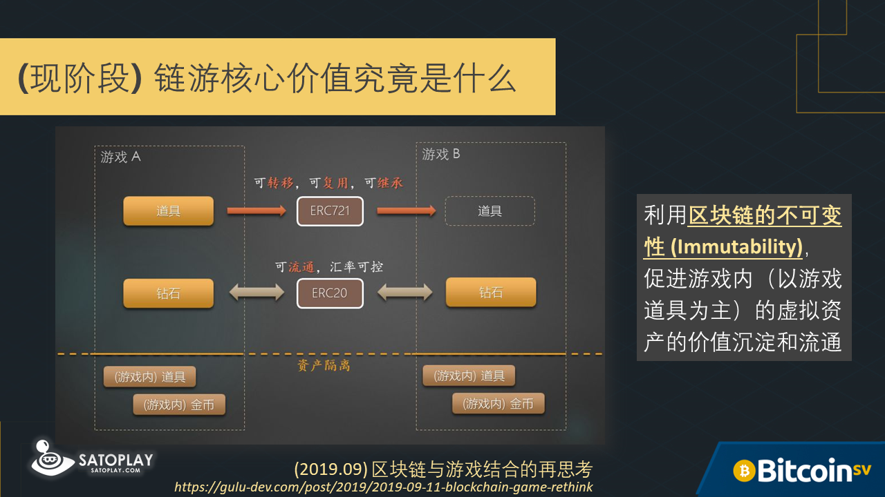

好，我们接着说。除了即时交易和结算的这种能力之外，另外一个值得利用的区块链的能力，是它的不可变性。这种不可变性有什么意义？它能让游戏里面的虚拟资产的价值沉淀下来，而且流通起来，这也是区块链给一些传统的互联网产品带来的最大的不同。 

因为在传统的互联网产品里面，很多数据是变化的，从游戏公司或者互联网公司的角度来说，这些数据他们是完全控制的。从用户的角度来讲，是很难掌握的。有了区块链之后，我们可以做到，让用户在某种程度上，控制他们自己实际拥有的这些东西。在游戏里，比如说魔兽世界里面一个道具，对于之前的游戏来说，游戏更新换代，作为玩家，是很难有办法去参与到这个过程里面来的；但是对新的区块链游戏来讲，实际上你的道具可以做到真正意义上属于你，那么玩家的参与感，话语权等等，都会放大。

那么从游戏到游戏之间的这种虚拟资产的价值沉淀和流通，这里我就不详细讲了，我有一篇去年写的文章，叫“区块链与游戏结合的再思考”，更多的内容可以到这篇文章里面去看一下。 

------

### 小结和方法论

好，现在我们来小结一下，区块链游戏的核心价值究竟是什么呢？

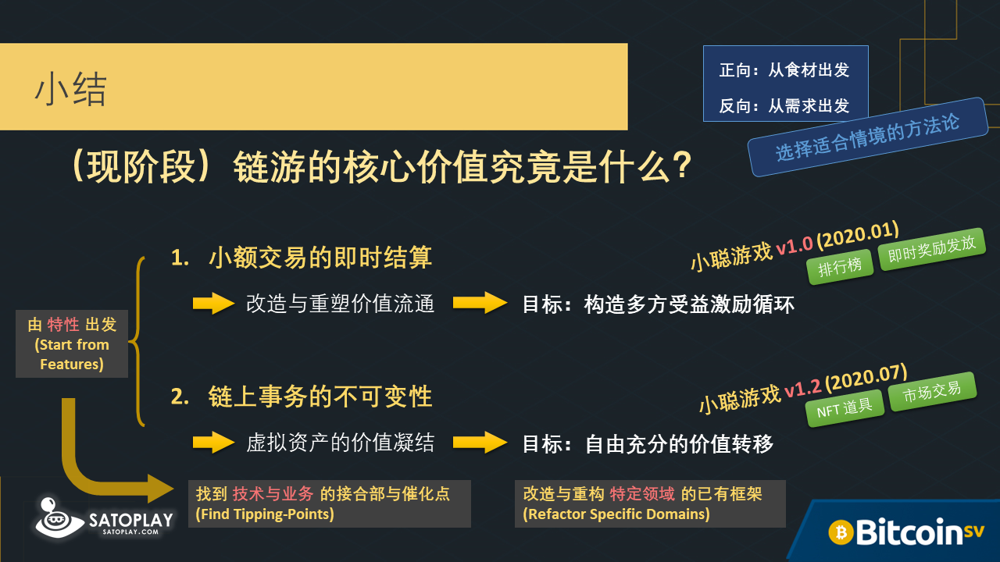

我们从区块链本身的特性出发，一个是小额的即时结算，另一个是链上事务的不变性。从这两个出发，我们去找这两个技术跟我们实际的游戏业务，它的结合部在哪？那么它能不能够让现有的业务变得更有价值？对于即时结算，我们相信它可以改造，并且重塑价值的流通。对于链上事物的不可变性，我们相信这是有助于虚拟资产它的价值凝结出来。 

从特性出发，然后去找结合点，到最后目标是什么？目标是去改造特定的领域。对于区块链游戏来说，往小了说，是改造我们游戏产品的研发和运营环节，往大了说，是改造游戏行业的整体价值的大循环。具体到这两个点上，一个是能构造多方的收益循环，另一个是能实现自由的虚拟资产的价值流通。

我们实际做到了哪一步呢？我们小聪游戏在年初1月份的1.0的版本里面实现了第一个目标，通过排行榜、即时奖励发放，基本上实现了第一个目标；那么在7月份的我们的1.2的版本里面，我们实现了第二个目标，就是通过NFT道具，通过市场交易这些功能模块，我们实现了自由充分的价值转移。
但是我要说的是，我们现在实现的东西，仅仅是刚刚开始，这些都还是很不完备的，离实际的规划还差很远，我们会通过这个版本的不断迭代，去把它做得更好。 

那么接下来是方法论的问题，我们怎么去选择方法论？

最基本的方案有两个：一个是正向的，从我们已有的东西，已有的特性出发，往前推；另一个是反向的，从玩家的需求，用户的需求出发，然后往回推，我们应该做些什么。

我同意很多人的观点，你应该先去想用户想要什么。但是在区块链游戏这个特定的领域里，实际上是有点特殊的，因为我们面对的是一个暂时没有人解决的问题，也就是说，这个问题目前还是一个unsolved problem。

在这种开放的情况下，我们更多的先想一想，我们要去找到沙漠里的一条路，首先要想想看自己拥有什么装备，拥有什么优势，否则的话，如果我们去空想一些需求，对于一个未知的，对于一个没有人真正探索过的东西，去提炼他的需求是非常困难的，就好像在iPhone发明之前，你坐在那里想手机上应该设计哪些应用才比较好用一样，是空中楼阁。还不如从已有的东西出发。

但是中间一定会有一个点，到某个时间点时，你发现，你对用户的理解，你对他们需求的理解，比你刚刚开始的时候更好，那个时候就应该反过来了。它不是一个非此即彼的关系，实际上正向反向都是我们需要的。

## 三、立项：最短路径是什么？

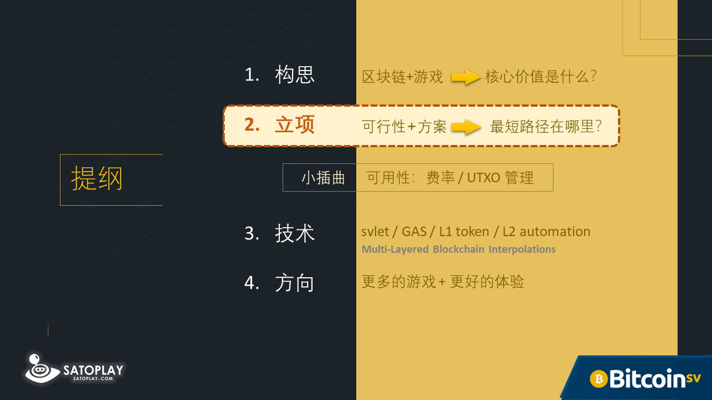

说明白了区块链游戏的核心价值，我们理解并且想透了之后，就涉及到立项的工作了。立项涉及到可行性，怎么样做才是可行的，你的方案或者说路径是什么。 

这两个加起来，实际上就是在问，你这个项目的最短路径在哪里？第一个月，第二个月，第三个月，你要完成什么东西，以及为什么要完成这些东西。
我们来具体看一下。在立项的时候，我们有两个基本的立足点。

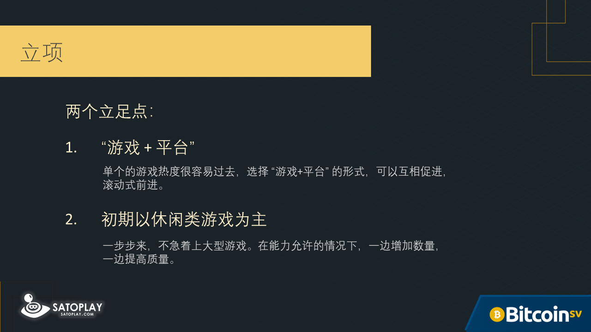

第一个是“游戏加平台”。什么是游戏加平台？就是游戏我们也开发，平台我们也开发。为什么这样？因为单独的一个游戏，它的热度非常容易过去，一个游戏，再好的游戏可能都有它自己的生命期。如果选择了游戏加平台的这种形式，可以互相促进，游戏能促进平台，平台反过来也能促进游戏，这样滚动式地往前走，那么有了一个平台多个游戏的话，你就可以天然的可以去尝试游戏之间的价值流通。一个游戏的话，显然是做不了这件事的。 

另一个立足点，我们在一开始是以休闲类的游戏为主。我们的想法是一步一步来，不要急着上大型的游戏，在我们能力允许的情况下，再去慢慢的去发展，一边增加数量，一边提高质量，这样就给我们自己一个比较平缓的曲线。

因为有很多项目，尤其是区块链行业的项目，他们就是一上来选择了太陡峭的路线。那么自己做的很吃力不说，从其他人的接受度的角度来讲，也都会觉得很奇怪，就是一上来要理解太多的概念，我认为是不合适的。我们应该给自己和给用户选择更平缓的路线。

### 技术选型 (2014) 六年前的选择

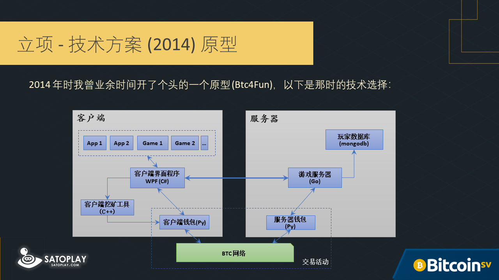

想清楚了前面的立足点了之后，我们就要为自己的技术选型了，在技术选型这块，我在6年前曾经写了一个原型，这个原型当然没有全写，它是开了一个技术的头，但是其实那个时候的选择，就决定了现在的一个选择基调。 

图上可能看的不是很清楚，我来解释一下。在客户端我们用的是一个当时还是PC上的C#，我们用的是C# 的WPF，里面集成了一个C++的挖矿工具。这个挖矿工具就是给玩游戏的人提供一个价值的支撑。在你不玩游戏的时候，这个工具它就会不停的智能的挖矿，你玩游戏或者做其他需要CPU的工作时，它就会自动停止挖矿，来给你游戏提供 CPU。服务器是用Go语言写的，后台是mongodb，客户端和服务器之间不仅有直接的通信，而且有通过 Python的钱包在BTC网络上通信，这样的两层通信结构。 

你可以看到，在这个架构里面，其实我们已经把这个架构精简到一个非常简化的，游戏本身的通信和通过BTC的通信，这样两层的通信来完成整个系统。

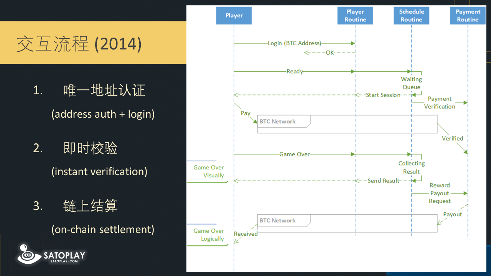

这是当时的交互流程，在2014年的时候，我们设计的一个最简化的交互流程，是跟上一张图是相匹配的。

它就是三个特点，一个是客户端是使用一个单一的地址来登录，不像传统的互联网应用，需要去注册账号什么的，在区块链上实际上你有一个私钥和它对应的地址，已经可以完成大多数事情了。 

第二点就是即时的校验，这个校验也是通过BTC网络来完成的，就是你支付，我校验；或者你在游戏内购买，我校验；总之都是可以通过BTC网络来校验。

第三点是结算，结算可能会慢一些。当时我们认为是必须要有打包区块才能算结算，但是实际上是不需要的，我们现在认识提高了，即时校验，在现在的概念里我们叫它SPV校验，如果感兴趣的话可以了解一下。 

### 技术选型 (2020) 六年后的选择

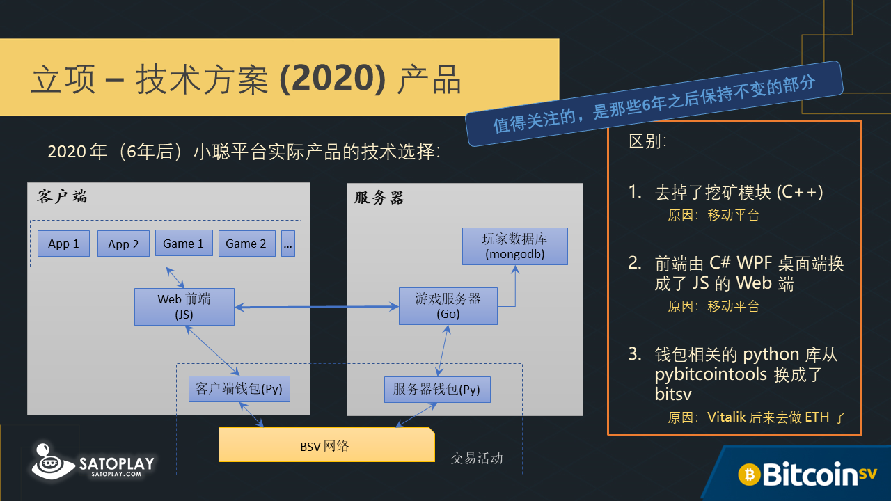

好，6年后，实际去开发这个平台时，我们做的技术选择是什么呢？

有几点区别，第一个是我们把 C++ 的挖矿模块给去掉了，因为我们是面对移动平台，你再去做挖矿是很奇怪的事情，而且挖矿本身，不管是在PC上也好，在手机上也好，如果消耗大量的电池电力来做这样一件事，现在觉得是不合适的。另外一个变化就是前端，从之前的 C# 的一个前端，因为之前是PC端，换成了js的web端，换成web端的好处就是网页，APP，苹果、安卓都是可以适配的。第三个不一样是，钱包之前是用的一个 Python 库，之前是用的是 pybitcointools，后来换成了 bitsv，这也是因为 Vitalik 后来去做 ETH 去了，然后他维护的库后来也没维护了。 

这些变化里，最重要的不同是BTC网络变成了 BSV 网络。这实际上是一个本质的不同，这让这个事情从更大的尺度上变成可能。因为在14年我设想的时候，BTC实际上在小范围内是没问题的，但是当你这个系统承载量大到一定程度的时候，几乎可以肯定他一定会出问题。那么对比2014年和2020年的就是6年之间的变化，我觉得变化的部分其实不重要，因为那些是不适应的部分。我觉得真正值得关注的是那些过了6年仍然不变的东西，那些才是真正稳定的有价值的东西。

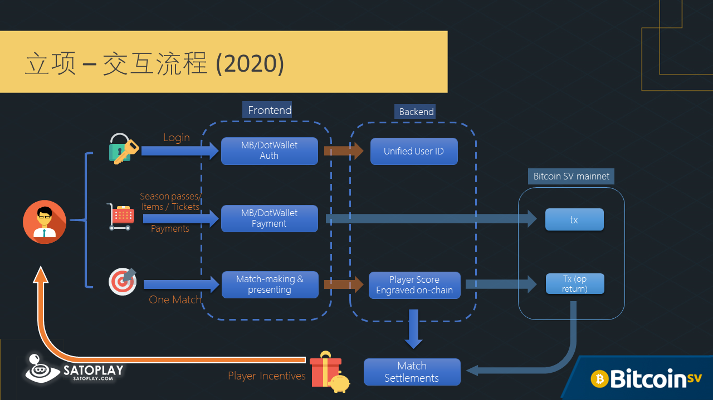

这是我们现在的整个的交互流程。这个图的交互看起来非常复杂，但实际上简单说它就是三项，最上面一排是用户的登录，第二行就是用户的支付，第三行是游戏和结算，最后的结算会生成一个奖励，这个奖励会返回给那些玩的好的玩家，在积分榜上排在前面的玩家，以及其他的活跃的玩家，这是我们在设计的时候的一个基本的流程。左中右三个框分别是前端、后端和网络，这样的话它实际上形成的是一个三横排三竖排的结构，其实是对我们实现来讲是一个比较容易调错的。 

## 四、小插曲：可用性 / 费率 / UTXO 管理

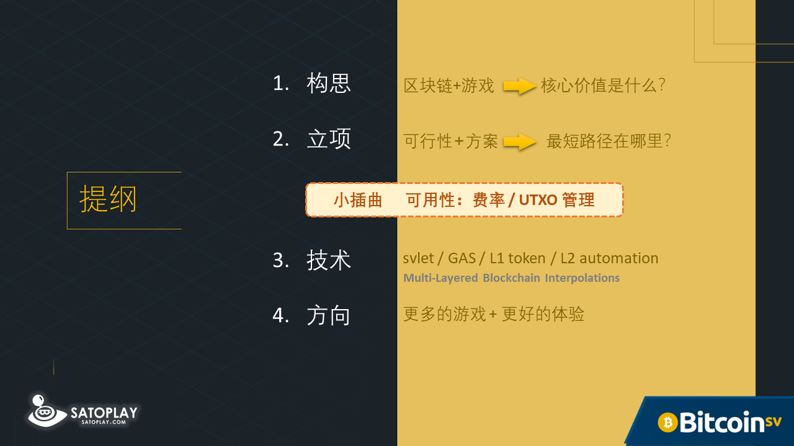

好，讲完了立项这个部分，我简单的讲一个小的插曲，是我们在开发的过程当中遇到的问题，这个问题可能对开发者会有一定的启发。我们怎么解决问题的，或者说我们没有解决的问题，我们怎么绕过去的。

### 可用性

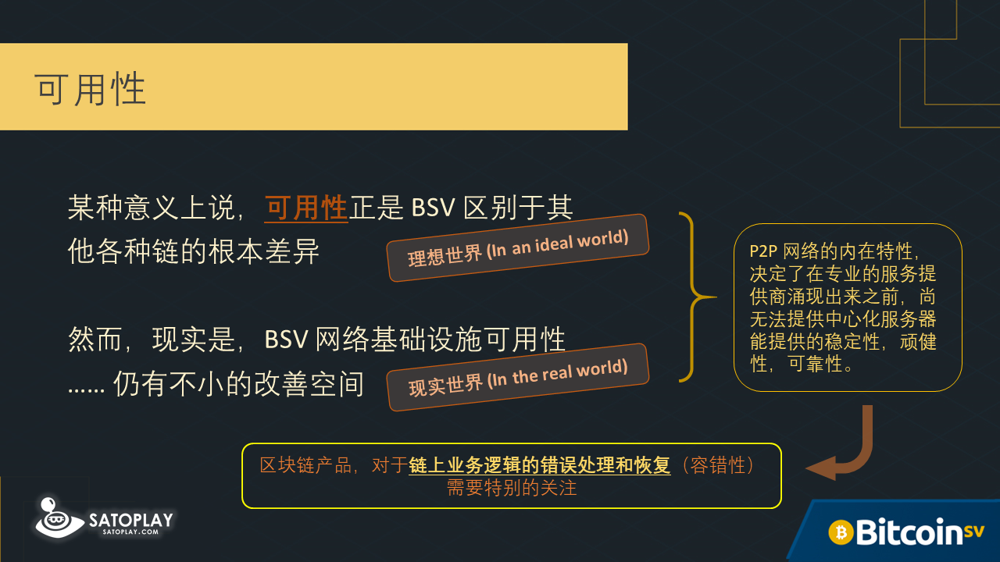

这里主要是费率，utxo，还有整个网络的可用性的问题。某种意义上说，可用性正是我们觉得BSV比其他的链更加优越的地方，然而现实就是BSV网络，它的可用性，因为他是刚分出来没多久，仍然有很大的改善的空间。那么这个也是理论研究跟工程实践不一样的地方。 

那么有人可能会说 set in stone 对吧，协议坚如磐石，完美。——但是事实上是什么呢？事实上是工程角度的完善，从来没有间断过。

有人会说，即时结算，秒到账，立刻可以看到结果，非常完美。——但事实是大量的，已有的 utxo的查询，是滞后的，那么真正的实时性其实是离不开大量的手动挡的操作。

还有说，区块接近无上限，可以随便造，完美。——但事实是，真实网络上，不少基础设施还处理不了连续的大的百兆的区块，更别说上G的了。

那么结论是 p2p 网络的内在的特性，决定了在日后专业的服务提供商，他们涌现出来之前，现在还没有办法去提供，中心化服务器所能提供的这种稳定性，顽健性和可靠性。这可能在未来的几个月当中，仍然会是这样，这也是一个新的体系一定会面对的挑战。

那么他就决定了我们在技术选点上的思维模式是什么——区块链产品，对于链上业务这块，也就是跟区块链相关的业务逻辑这块，它的**错误处理和恢复**是非常重要，就是容错性这块，是需要特别关注的，代码里面这一块可能要特别注意。 

### 费率

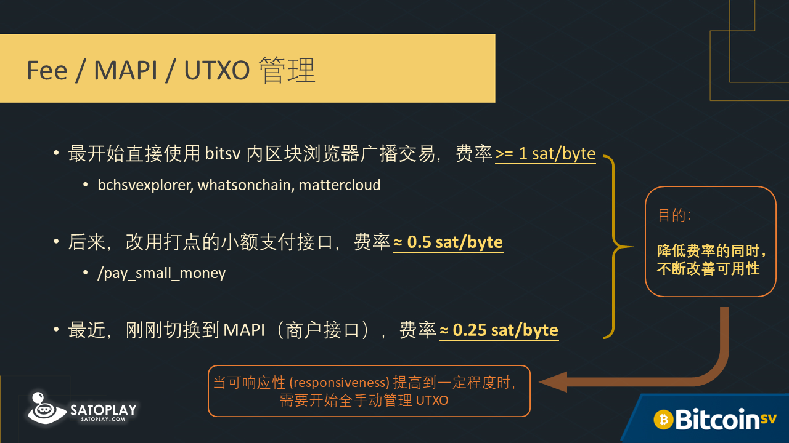

最开始的时候我们用的是 bitsv 里面的自带的一些区块浏览器来广播交易的，它的费率是在每字节一聪，甚至是更高，后来我们改用了打点的小额支付，小额支付直接就把费用降到了0.5聪左右，应该是不到之前的一半。 

最近我们刚刚切换到了MAPI，MAPI是今年整个生态在推进的这样一个东西，它让我们的费率又减到了打点的一半是0.25，也就是说我们相当于是一聪可以发4个字节了。我们为什么不断的在改进这个？一方面是降低我们自己数据上链的成本，另一方面也是不断的能够去改善整个系统的可用性。不断的改用新的API，就可以适配网络的进化。 

当网络的可响应性达到了一定程度的时候，我们就需要开始手动地去管理utxo了，这也是为了以后网络更大规模的使用的时候，我们能够有所准备，而不是说到时候再去现做。

### MAPI 错误和自动 Fallback

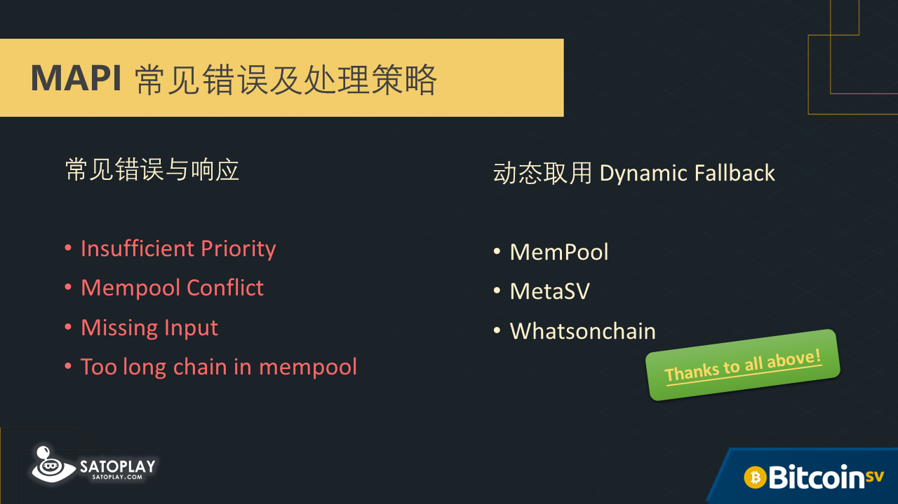

具体怎么去做呢？我们来看看，在处理MAPI时，我们遇到的一些问题如何去处理。 

那么会遇到哪些问题呢，最常遇到的，就是我列出来的这几条。第一个 insufficient-priority 是什么意思？这是说你付出的费率可能不够，为什么会不够？是因为0.25聪未必是矿池总是愿意接受的。我们的实践当中发现，当我们发前几个小于10个的交易的时候，矿池是很愿意接受的。如果我们在很高的频率下连续发很低费率的交易的时候，矿池就会报 insufficient-priority，我们这个时候只要临时地调高一下费率（就好了）。其实这个也是很容易理解的，这就好像你去银行柜台办事，当人很多的时候，那就开俩柜台，然后人少了以后他就回到一个柜台，是一个意思。 

第二个错误是 mempool-conflict。这个的情况就是当你调用的某个API，他对utxo的反馈比较滞后的时候，这个时候你就需要自己去手动管理了，因为如果你不管理的话，他就会认为你的utxo是无效的，或者是同一个utxo发了两条。mempool-conflict 和 missing-input 都是跟 utxo 管理直接相关的，这也是为什么我们说当你的数据量越来越大，数据的频率越来越高的时候，你需要手动管理 utxo的原因。 

那么还有一个错误是 too-long-chain-in-mempool，我相信做区块链开发的人可能或多或少都会遇到这个错误，就是在同一个区块还没打包的时候，一条交易形成的链过长了，这个也是跟区块的区块结算的时间，跟你跟你发送数据的规模是直接相关的。对于这个错误来说，其实它本质也是utxo的管理，你只要切出尽可能多的utxo就可以了。 

实际上这些错误实际上都跟utxo有很大的关系。当发生这些错误的时候，除了按照你知道的方式去处理这些错误以外，还有一种办法是去尝试不同的服务商，他们提供的MAPI，我们是实现了对三家的支持，一个是打点，Mempool的MAPI；一个是metasv的MPI；还有就是whatsonchain。实现了三家的好处，就是当一家因为偶然的因素，出现什么问题，或者临时不可用，或者是报出一些奇奇怪怪的错误的时候，我们能快速的让程序自动的转移到另一家，然后当他恢复的时候我们能再回去。

我们非常感谢这上面三家的支持，因为他们给我们提供的机制，让我们很方便的去做集成。 

## 五、技术：多个层次的区块链互操作性

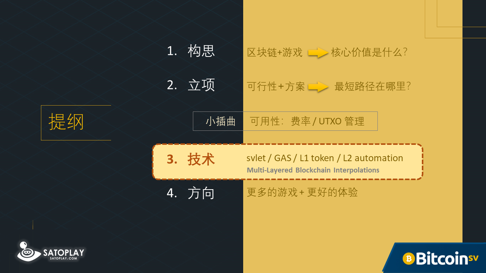

(注：这里幻灯片上有个小错误，interpolations 实际上是 interoperations)

说完小插曲，我们看看技术这一块，小聪游戏做了哪些功能，以及之后将要做的一些改进。这些技术我主要谈跟区块链直接相关的这一块。相信我们在区块链相关这块，主要是在区块链的数据交互这一块，做出的一些探索，可能对其他的项目更有参考的意义。 

### 可剥离性

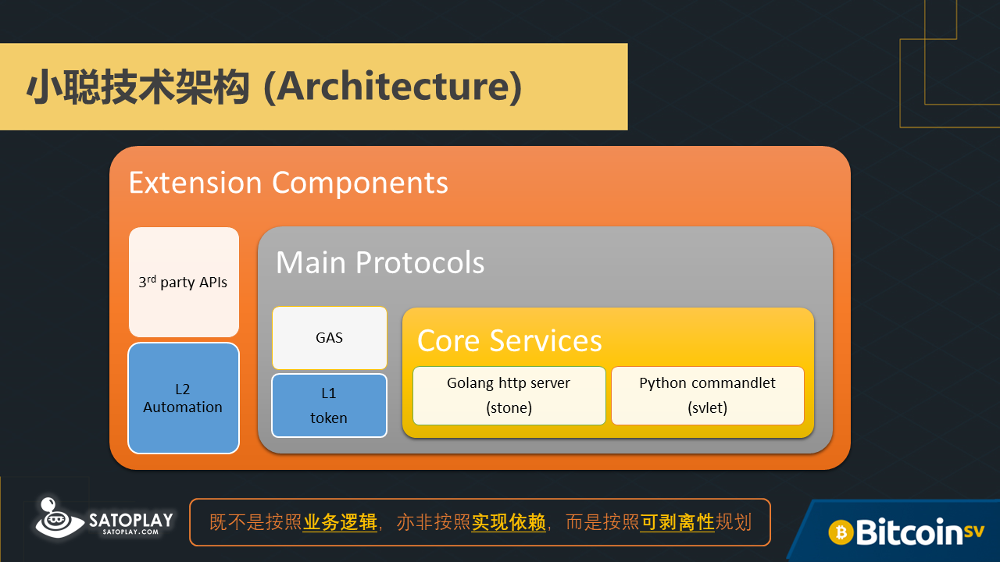

先看一看我们的架构。这个架构是三层，中间是核心层，然后灰色的是主体层，外面的是外延层。这个架构为什么这样去分呢？实际上我们既不是按照业务逻辑，也不是按照是怎么实现的，谁依赖谁，而是按照“**可剥离性**”这个规则来设计的。什么叫可剥离性？那些很容易剥离的东西，在最外层；那些你不一定能剥离的，在中间；那些你必须依赖的东西，是最核心的。可剥离性的最大的好处，就是允许你这个系统，能够**以合理的节奏去快速进化**。 

如果你一开始就吹毛求疵，反复去计较工程的架构上的合理性，考虑的太多，就是你去设计一个你自认为非常合理的系统的话，那么有可能因为BSV整个生态是快速变化的，外面有什么情况变了，有新的协议出来，对你就会非常被动，你之前考虑的再完美，也有可能在某一次升级之后显得很笨拙，很僵化。那么按照可剥离性做规划，就让你这个系统能够快速的往前滚动。

### svlet

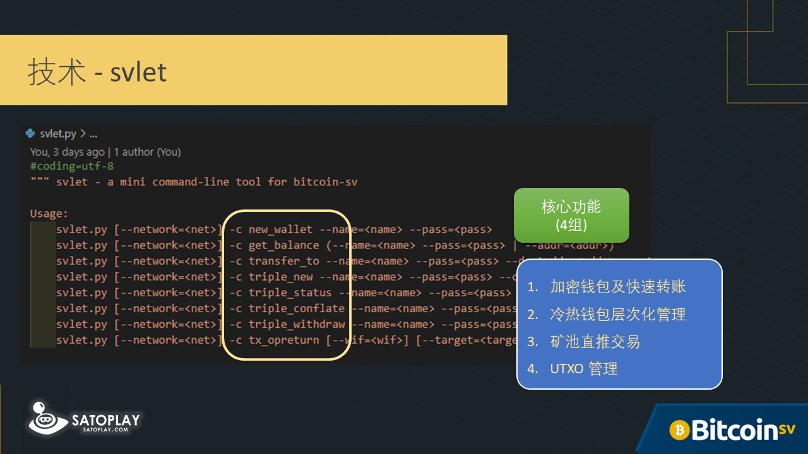

在核心的这一层里面，我们有一个小工具叫svlet，这个svlet是一个小的命令行工具，提供了4组核心的功能。 

一个是最基本的，对于区块链项目来说最基本的加密钱包，以及快速转账的功能。然后在这个基础上，它提供了冷热钱包，冷热钱包的这种层次化的管理，确保即使我们服务器被黑了，里面的资产也不会有什么问题。第三个是矿池直推，就是我们刚说的MAPI的服务。第四个是utxo的管理。

其中前三个是比较完善的，然后第四个utxo这一块，我们也是刚刚开始做，刚刚开始把这一块形成一个可复用的这样一个结构，下半年我们会在这上面投入更多的精力，把它做得更完善。

这个工具整个是Python实现的。

### GAS - 虚拟资产解决方案

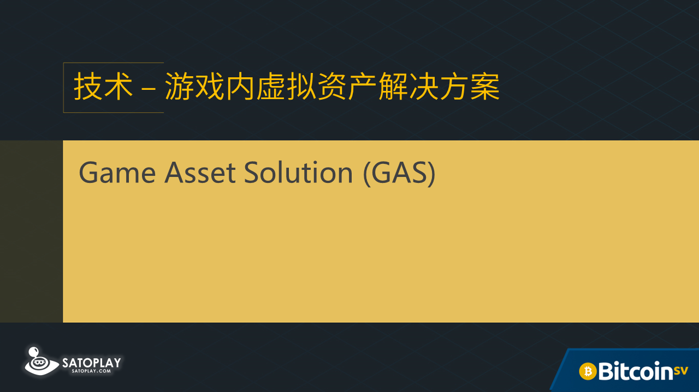

除了svlet，我们自己定义了一个叫GAS的东西，就是 Game Asset Solution，是针对游戏项目里面，它的虚拟资产的一个解决方案。虚拟资产它包括了游戏道具，武器，装备什么的所有的那些你在正常游戏里能看到的那些玩家可以拥有的数据。

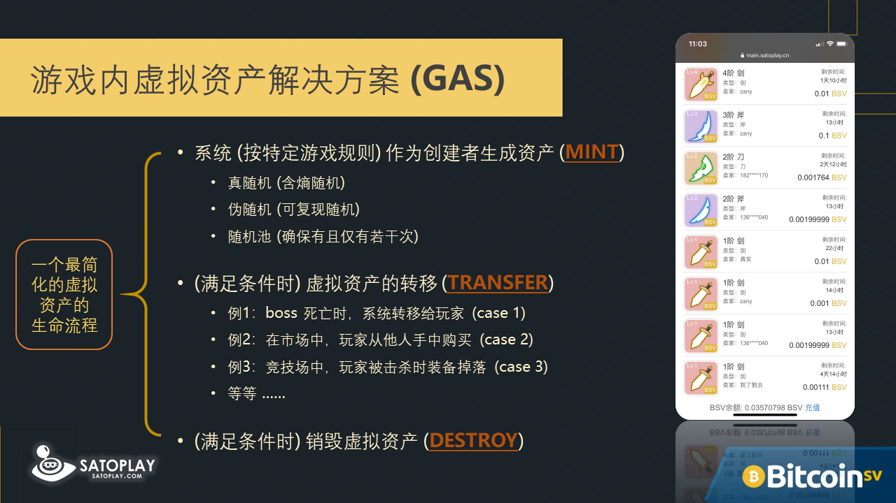

对这些数据我们有一个独立的解决方案，这个方案你在这个右边可以看到，这个图上有我们的游戏里的装备，被封装成虚拟资产了以后，在市场上的一些行为。你可以出售，在游戏里掉落，然后捡取，也可以打造，等等。 

### 最简化的虚拟资产生命流程

这里我列了一个最简单的虚拟资产的生命流程，它其实就包含三个最重要的功能，一个是铸造，一个是转移，一个是销毁，有很多游戏里的行为都可以归纳到转移这里面来。 

转移里面可以分成很多小的情况。比如说我这里举了几个例子，有 boss死亡的时候系统的转移，市场上从其他人手里购买的转移，还有竞技场里掉落的转移，当然还可以举出无数的例子。

可能你会问，这么多重类型的转移，系统当中行为这么复杂，你怎么用非常简单的动作来概括呢？

实际上这个是一个非常关键的事情，就是在区块链这一层，我们不能设计太复杂的行为。对这一点，我的想法是与区块链交互，也就是与虚拟资产交互的这一块，应该尽可能的简单，尽可能单一的动作，而把复杂的业务逻辑留到游戏里去。 

因为在这里你给游戏考虑的越多，那么对游戏的设计者实现者来说，未必是越方便的事，他们很可能会觉得你提供的东西未必适合他们的需要，他们可能会自己另外搞一套，那么你做的越多，可能错的越多。

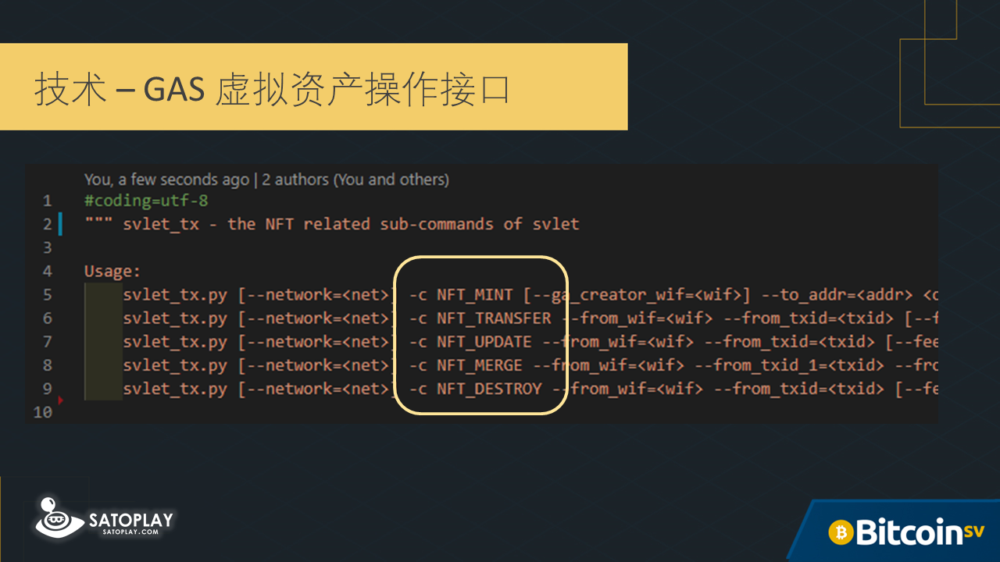

我们在后台也给这个虚拟资产的系统提供一个专门的接口，包含了我们刚说的最简的操作集，可以看到这个操作其实不是很多，而且我们也会非常小心的去维护它，让系统不至于过分的复杂。 

### 为什么我们要做开放平台？

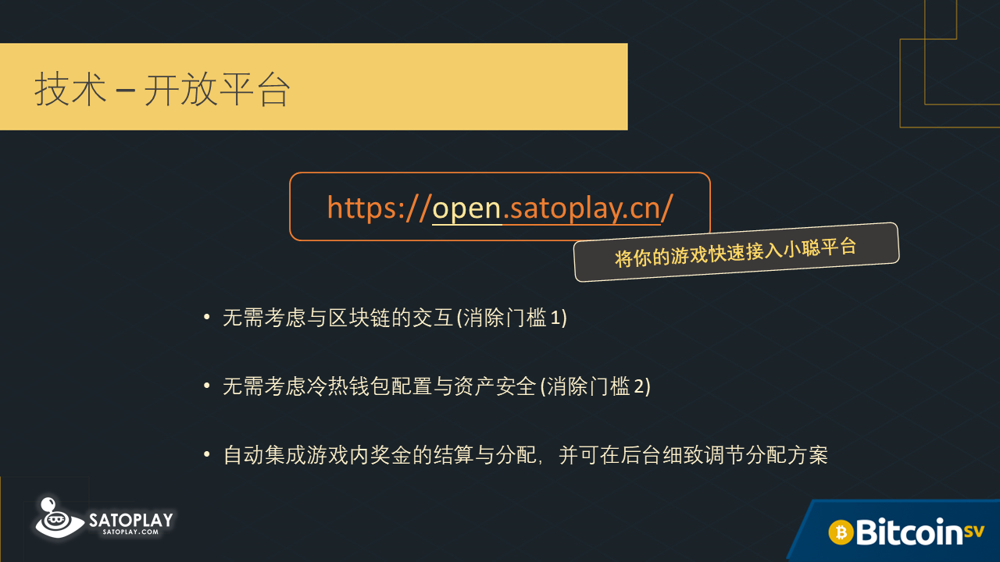

除了刚才说的两样，一个核心工具，一个虚拟资产的管理之外，我们还有一个开放的技术平台，大家可以通过这个网址去访问它。开放平台的作用，主要是帮助开发者把他们的游戏快速的接入小聪平台。

为什么我们要做开放平台呢？

因为作为一个游戏平台来说，我们不能只有自己开发的游戏，我们希望为其他的游戏开发者提供方便。因为对游戏开发者来说，去找到一条路径，把他们的游戏区块链化是比较困难的，因为区块链本身的技术门槛是比较高的，而且还需要去想什么冷热钱包怎么配置安全问题什么的，需要去想这些东西。而我们提供开放平台了之后，这些开发者他就不用去考虑跟区块链的交互了，这是先把第一道门槛消除了，然后也不用去考虑什么冷热钱包，万一服务器被黑了怎么办了，第二个门槛也没了。

那么游戏内的奖金的结算分配，他们可以用他们习惯的方式在后台去配置，这些我们都做了参数化配置，但是很有可能是我们做的东西太基础，他们可能需要更高级的配置，这个是我们平台需要去不断迭代的事情。

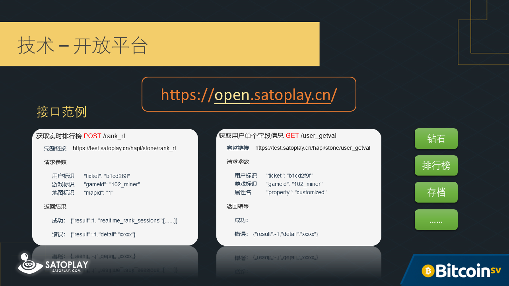

在这里我列了几个接口的范例，范例里面有一些是游戏内的内容，有一些是平台的内容，在列出的这两个范例里可以看到，可以去获取游戏内的排行榜，就是自动生成的排行榜，也可以去获取某个用户的某个资产的情况，在右边可以看到，列出来的钻石、排行榜、存档，等等，这些都是接入了平台以后就自动拥有的功能模块。当然了这些是可选的，可以用也可以不用。

### 一层 Token 和二层自动化

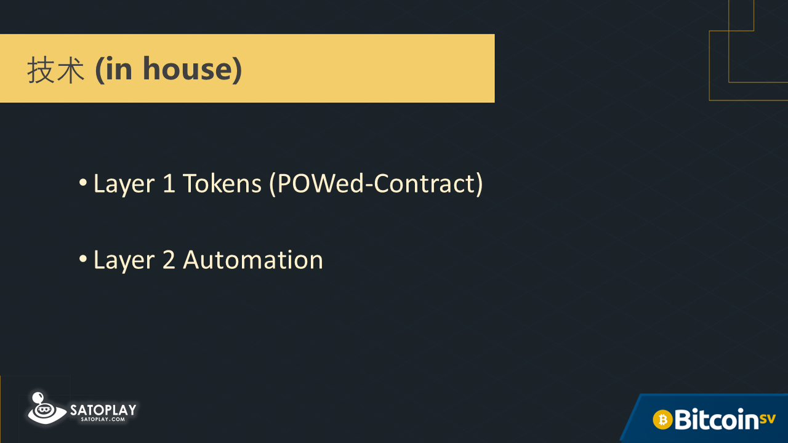

那么除了以上说到这些，还有一些技术我们没有对外，是我们自己在开发中的技术，一个是一层的token，一层的token，实际上在近期的 BSV圈子里是一个比较热的话题，有好几个项目方他们都提出了自己的一层的方案，包括我们自己的刚才说的GAS，就是游戏内虚拟资产的方案，是我们自己实现的一套方案。

除了我们自己定制的方案，如果有可能的话，我们也会去支持其他的那些正在进展中的一层的token协议，其实我们是没有什么排他性的，我们认为不同协议的token是可以共存的，没什么问题。我们的游戏道具左下角是有一个角标的，这个角标上就标明了你这个道具是用什么协议生成的，所以理论上来说什么协议对我们其实关系都不大。

一层token在小聪平台上，其实可以有很多的应用，不仅仅是道具，小聪平台上支持的钻石，实际上也是可以由一层的token来支撑的。钻石相当于是一种同质化的token。

除了一层的token之外，我们还我们还在研究二层的自动化，这一步实际上是我们通过一个外部的库叫operate库来完成的，这个库的设计非常好，以后有机会的话，我会展开成为一个独立的讲解。这个库非常的有用。

## 六、方向：以游戏体验为核心，技术同步进展

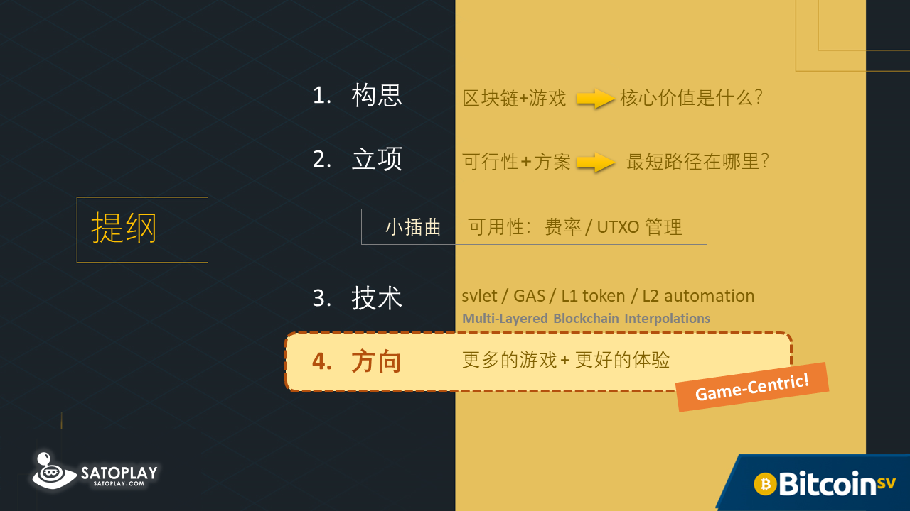

好，现在技术这一块讲完了之后，我们来看一下最后一个小节，就是小聪游戏的方向。我们这个平台将会往哪个方向去？ 

当然，基本点是，我们会添加很多游戏，就是会不断地做新的游戏了。另外就是平台本身的体验，比如说在国外，或者某个地区，非常卡顿，什么游戏匹配的问题，我们会不断的去迭代去改善，但是这些改善都围绕着一个核心，就是 game centric（以游戏本身为核心）。

### 路线图：更多的游戏；更多的技术；取得平衡

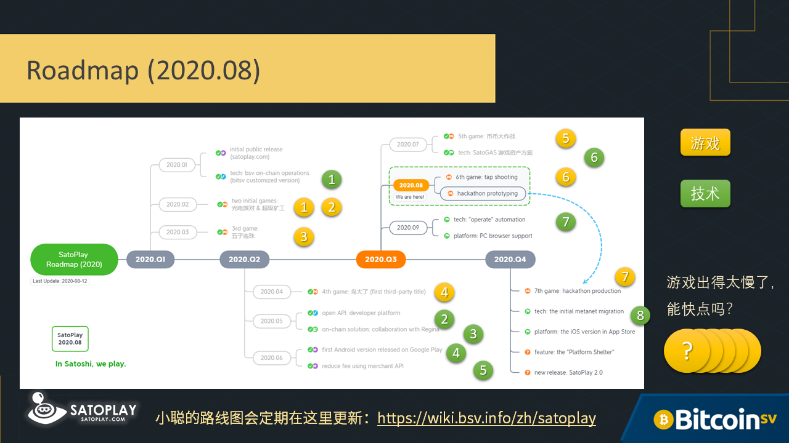

这个图可能大家之前见到过，是我们在2020年这一年每一个季度的规划，上面的字很小，我也不打算一一地说明，但是可以看一个大致的意思。一个是我们游戏开发这块，这是所有黄色的小圆点。可以看到是我们发新游戏的情况，第一个季度我们发了三个游戏，然后二三个季度我们又发了三个游戏，那么在第四个季度我们还会再发一个新游戏。 

除了游戏这块，我们在技术上做了哪些突破？第一个季度、第二个季度、第三个季度，都可以看到，这两个是并行的一个过程，并不会说是我们只做游戏，不管区块链的技术；也不是说我们天天只研究技术，然后不做游戏，这实际上是两条腿走路的。

经常有玩家问我，就是你们游戏出的太慢了，你们能出快点吗？我们之前也的确是因为遇到了一些特殊的情况，我们的游戏的节奏并不是很稳定，有的时候快一点,有的时候慢一点，那么玩家就很关心说，你这个既然是一个平台，游戏当然要越多越好了。那么我们的答案就是，在今年的第4个季度，我们出游戏的速度会显著的加快。 

你可以看到右下角，就是我们计划当中的是一个游戏，但是到现在我们第4个季度很可能会出到圆盘上的数量大概那么多，不会比列出的问号数量更少。

另外我们这个路线图会在wiki上更新。这个链接地址上面的内容，我们会周期性的，大概是两周到一个月的时间周期，会去更新它。如果关心小聪游戏的话，你可以到这个网址去偶尔去看一看。

### 长期规划：以游戏和体验为核心；追求更好的链上互操作性

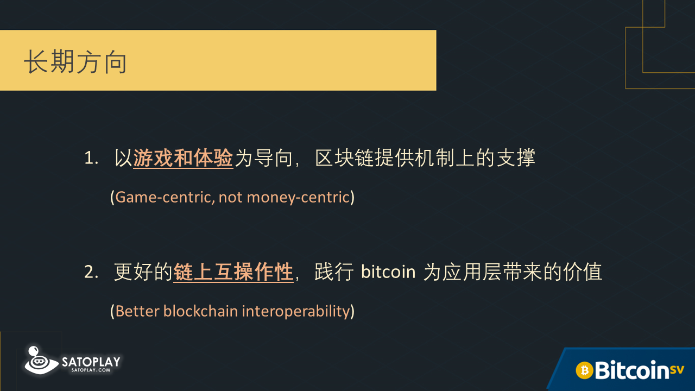

那么从更长远的更长期的角度来看，有两个方向，一个是以游戏和体验为导向，就是始终关注游戏本身。因为我们觉得，你虽然叫一个区块链游戏平台，但是你不能言必提区块链，就是总是在向别人强调，我这个是区块链，怎么怎么样，但实际上区块链，它本身应该只是提供机制上的支撑，它不应该跑到前头去，你真正用户玩的是游戏对吧？用户玩的是游戏，而不是区块链，所以你真正应该做好的是游戏本身，然后区块链能够让你的游戏更好，它应该是一个助推项加分项，它应该是一个对整个系统有放大加成的作用，而不是弄反了，它不应该跳到前头去。 

那么另外一点，更好的链上互操作性，如果我们做不到，如果我们做不到跟区块链更好的交互的话，实际上我们就没办法用区块链来放大这个游戏平台的价值，这是我觉得非常重要的一点。实际上你可以看到，这两点，其实就可以简化成前面图上看到的，一个是游戏，我们在游戏上的研发，一个是技术，我们在技术上的追求，两条腿走路。 

## 七、联系我们

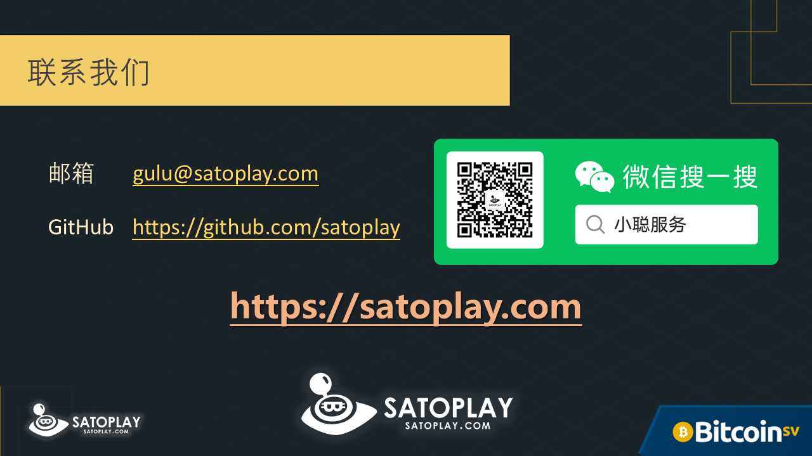

好，那今天的内容我基本上讲的差不多了，这是我们的联系方式，你可以在这些地方通过这些方式来找到我们。不管是游戏也好，你觉得有什么好的游戏想法，或者是技术上你觉得哪些技术非常有价值，值得来尝试，都可以通过这些方式来跟我们交流和沟通。 

以上是我本次演讲的全部内容。非常感谢大家收听，欢迎大家将本次大会推荐给身边的区块链行业的从业者，并且持续关注CSDN上的Bitcoin SV开发者专区，bsv.csdn.net，感谢大家参加本次BSV首届中文开发者大会，后续还有其他的嘉宾带来同样精彩的演讲内容，请大家不要错过，继续收听。 

----------

附：

1. [演讲幻灯片 PDF 全文](./presentation.pdf)
2. [大会页面及视频回放链接](https://bss.csdn.net/m/topic/bsvdevcon)

(全文完)  

----------

- 顾露 (Gu Lu) 于免成居  
- 时间: 2020-08-30
- 编号: P-003-2008
- 本文遵循 [Creative Commons BY-NC-ND 4.0 许可协议](http://creativecommons.org/licenses/by-nc-nd/4.0/)。
- 永久链接 [https://gulu-dev.com/post/2020/2020-08-30-satoplay-production-path](https://gulu-dev.com/post/2020/2020-08-30-satoplay-production-path)
